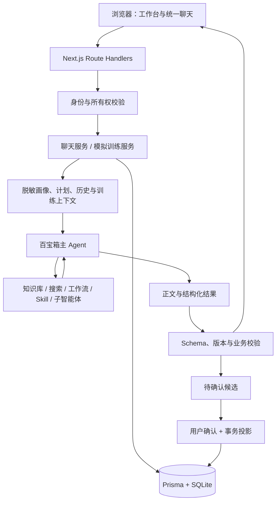

# CareerMate

CareerMate 是面向大学生与职场新人的 AI 职业成长工作台，提供职业画像、方向探索、成长计划、学习资源、模拟训练和长期记忆。项目使用 Next.js App Router、React、TypeScript、Prisma 与 SQLite，通过百宝箱接入 AI 能力。

## 当前功能

| 入口 | 功能 |
|---|---|
| `/chat` | 主聊天、历史会话、引用、待确认候选及独立训练对话 |
| `/dashboard` | 成长概览、能力与目标差距、当前任务 |
| `/path` | 职业计划、学习路线、版本和任务进度 |
| `/simulation` | 推荐/自定义场景、预览和最近训练；开始后进入独立聊天 |
| `/resources` | 学习资源、岗位样本、筛选及任务关联 |
| `/memory` | 记忆管理、待确认建议与能力证据 |
| `/settings` | 账号、隐私与 AI 陪伴形象 |
| `/onboarding`、`/admin` | 画像引导、管理员岗位资料审核 |

模拟训练采用“选场景 → 预览 → 独立聊天 → 评分报告”的流程。训练记录可恢复，至少 3 轮有效回答后可评分，默认最多 6 轮；结束后可在原对话继续讨论报告。AI 生成的画像、计划、学习路线和能力证据候选须经用户确认才进入正式业务数据。

## 本地启动

建议使用 Node.js 22 与 npm。

```bash
npm ci
cp .env.example .env
npm run prisma:generate
node -e "require('node:fs').closeSync(require('node:fs').openSync('prisma/dev.db', 'a'))"
npm run db:migrate:deploy
npm run dev
```

打开 [localhost:3000](http://localhost:3000)。新数据库可直接注册账号；如需演示数据，在**空的开发数据库**上执行 `npm run seed`，然后使用 `student_lin` / `careermate123` 登录。Seed 会重建数据，已有数据库不要运行。

`.env.example` 默认使用 Mock，`CAREERMATE_AGENTIC_V2=false`。真实百宝箱接入需在本地 `.env` 设置 API 模式、Agent ID、密钥及相关开关；配置步骤见 [百宝箱实施指南](docs/tbox/百宝箱优化实施指南.md)。不要把真实 `.env`、数据库或原始个人材料提交到仓库。

已有数据库升级：备份数据库，安装依赖、生成 Prisma Client，再执行 `npm run db:migrate:deploy`。其中模拟聊天迁移只增加关联字段，不清空原训练记录。

## 架构



普通对话使用 SSE；模拟回答复用训练服务，在模型等待期间发送心跳，校验后发送追问并同步聊天记录。服务器保存场景、有效轮次及报告，客户端不能靠切换 URL 改变所属训练。详细数据流和边界见 [技术架构](docs/architecture.md)。

AI 有 `mock`、`manual`、`api` 三种运行模式。降级结果带来源标识，不能据页面有回复就认定真实 AI 链路成功。Agentic V2 默认通过 `question_prefix` 传递快照，也支持显式配置 `business_data`；平台记忆和本地记忆是不同系统。

## 开发与验证

| 命令 | 用途 |
|---|---|
| `npm run dev` / `build` / `start` | 开发、生产构建、生产运行 |
| `npm run verify` | 密钥扫描、lint、类型、单元/集成测试、迁移和构建 |
| `npm run test:e2e` | 基础 Mock 浏览器测试；独立 `e2e.db` 与 3100 端口 |
| `npm run test:e2e:v2` | V2 Mock 浏览器测试 |
| `npm run import:resources` / `import:jobs` | 数据导入，支持 `--dry-run` |
| `npm run tbox:bundle` | 从当前契约生成平台粘贴包 |
| `npm run package:skills` | 从源码生成 Skill ZIP |
| `npm run tbox:probe` | 百宝箱接口探针，使用本地配置 |

浏览器测试本地使用系统 Chrome，CI 安装 Playwright Chromium。Mock 测试验证产品流程，真实百宝箱的模型调用、工作流发布版本和评分质量需单独联调。

## 仓库与文档

- `src/app`：页面、API 和全局样式。
- `src/components`、`src/features`：共享 UI 与业务页面。
- `src/lib`：业务服务、契约、数据访问与百宝箱适配。
- `src/agentic-v2`：可维护的平台提示词、工作流、Skill 与评测集。
- `prisma`：数据库 Schema、迁移和演示数据；`data`：可提交的资源数据。
- `scripts`、`e2e`：导入、导出、诊断及浏览器验证。

维护入口：[文档导航](docs/README.md) · [技术架构](docs/architecture.md) · [接口说明](docs/接口设计文档.md) · [Agentic 交接](AGENTIC_V2_HANDOFF.md)。构建缓存、导出包、临时截图和历史任务中间产物不入库；迁移、源码及可复现测试保留。
