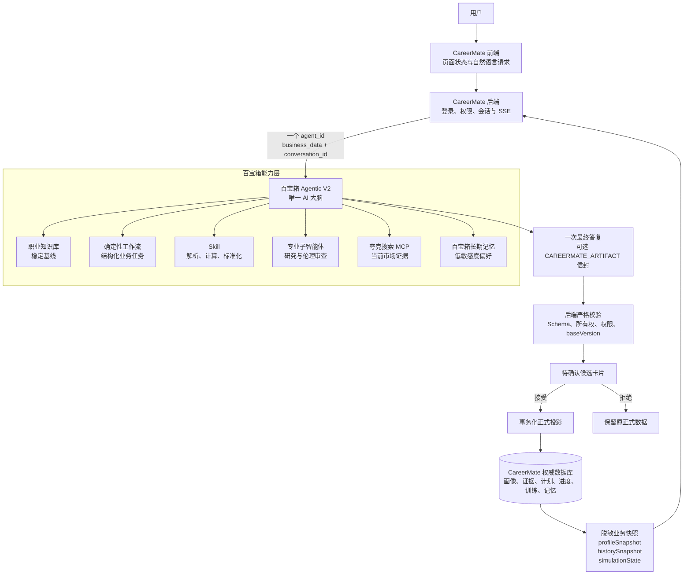

# CareerMate

CareerMate 是一个基于蚂蚁百宝箱 Agentic 应用、Next.js 与 Prisma 构建的长期职业成长伙伴。它将职业探索、能力画像、成长规划、学习路线、职场模拟和持续复盘统一到一个可追踪、可确认、可扩展的产品闭环中。

> 当前仓库包含可本地运行的 Mock 模式，以及对已发布百宝箱 Agentic V2 应用的真实 API 适配。职业类型可扩展，种子职业仅用于演示和回归测试。

## 核心能力

- 开放式职业咨询与可追溯的多会话对话
- 基于个人事实和能力证据的职业画像候选
- 面向任意职业的探索、比较与方向验证
- 个性化 3–5 年职业规划，以及独立、可版本化的学习路线
- 多轮职场情境模拟、评分与能力证据沉淀
- 简历与作品集事实提取、优化和风险检查
- 结合计划、进度、训练和市场变化的持续复盘
- 候选确认、版本冲突保护、跨用户数据隔离
- CareerMate 权威记忆与百宝箱低敏感度偏好记忆协作

## Agentic V2 架构

百宝箱 Agentic V2 是唯一的 AI 决策中枢。前端描述用户请求和页面状态，CareerMate 后端提供经过裁剪和脱敏的业务快照；主 Agent 自主决定是否检索知识库、联网、调用工作流、Skill 或专业子智能体。



### 职责边界

| 层级 | 负责 | 不负责 |
|---|---|---|
| 百宝箱 Agentic V2 | 意图理解、工具路由、联网判断、证据融合、候选生成 | 登录鉴权、直接覆盖正式业务数据 |
| CareerMate 后端 | 用户身份、数据隔离、脱敏快照、会话绑定、Schema/版本校验、确认与正式写入 | 建立第二套 AI 决策逻辑 |
| CareerMate 前端 | 用户交互、页面上下文、流式展示、候选确认 | 指定 Agent 必须调用哪个工作流 |
| CareerMate 数据库 | 保存已确认画像、能力证据、计划、进度、训练和正式记忆 | 将未确认的模型推断视为事实 |

当前真实 API 路径使用以下约定：

- 后端只调用一个 V2 `agent_id`，并按本地会话复用百宝箱 `conversation_id`。
- `business_data` 携带裁剪后的 `profileSnapshot`、`historySnapshot` 和可选 `simulationState`，不携带完整简历、联系方式或无关敏感信息。
- 页面上下文只描述 `surface`、`action` 和可选目标引用，不能覆盖用户自然语言意图。
- `TBOX_SEARCH_ENGINE=false`，避免内置搜索和 Agent 已挂载的夸克搜索 MCP 重复执行。
- `/api/mcp/v2` 与短时签名上下文令牌属于保留的未来基础设施，不是当前聊天主链路的依赖。

## 结构化候选与正式写入

需要用户确认的模型产物必须在正常可读答复末尾附加一个精确信封：

```text
<CAREERMATE_ARTIFACT>
{...AgentArtifactV1...}
</CAREERMATE_ARTIFACT>
```

正式数据的生命周期为：

```text
AI 提案
→ 精确标签提取
→ JSON 与 AgentArtifactV1 Schema 校验
→ 用户所有权、权限和 baseVersion 校验
→ 候选卡片
→ 用户明确接受或拒绝
→ 事务化投影到正式数据库
```

无标签 JSON、多个信封、损坏的 JSON、无效 Schema 或版本冲突只能作为可读文本展示，不能创建正式候选，更不能写入正式数据。

### 已落地的数据闭环

- `AgentArtifactCandidate` 保存待确认候选，并支持按状态和候选类型查询。
- 画像补丁、职业计划、学习路线等产物只有在用户接受后才会进入正式数据。
- `LearningRoute` 是独立于 `CareerPlan` 的版本化模型；新版本生效时归档旧版本，并以用户与版本号的唯一约束避免重复写入。
- 职业计划的接受与拒绝使用带用户条件的原子更新，避免重复操作和跨用户访问。

| 接口 | 作用 |
|---|---|
| `GET /api/agentic-v2/candidates` | 查询当前用户的候选列表，可按状态或类型过滤 |
| `GET /api/agentic-v2/candidates/:candidateId` | 查询候选详情 |
| `POST /api/agentic-v2/candidates/:candidateId/decision` | 接受或拒绝候选 |
| `GET /api/learning-routes/current` | 读取当前用户最新的有效学习路线 |
| `POST /api/plans/:planId/decision` | 接受或拒绝待确认职业计划 |

## 长期记忆

CareerMate 采用分层记忆：

- 百宝箱 `conversation_id` 维持同一远端对话的上下文连续性。
- 百宝箱长期记忆只保存职业方向、学习偏好、时间预算等低敏感度且长期有用的信息。
- CareerMate 数据库保存已确认的画像、能力证据、计划版本、训练记录、成长进度和正式记忆，是权威数据源。
- 新的能力判断、分数、计划或记忆均先形成候选，用户确认后才生效。

## 技术栈

| 领域 | 选型 |
|---|---|
| Web 框架 | Next.js 16（App Router） |
| 语言 | TypeScript 5.9 |
| 前端 | React 19、Tailwind CSS v4、Recharts |
| 数据与 ORM | SQLite、Prisma 6 |
| 运行时校验 | Zod 3 |
| 测试 | Vitest 3、Playwright 1.61 |
| AI 中枢 | 蚂蚁百宝箱 Agentic V2 |
| AI 接入 | 服务端 API、SSE、`business_data` 脱敏快照 |

## 快速开始

前置条件：

- Node.js 20.9+
- npm

```bash
git clone <repository-url>
cd CareerMate
npm install
npm run prisma:generate
npm run db:migrate:deploy
npm run seed
npm run dev
```

运行以上命令前，先创建本地环境文件：

```bat
:: Windows cmd.exe
copy .env.example .env
```

```bash
# macOS / Linux
cp .env.example .env
```

Windows 如果遇到 PowerShell 执行策略限制，可将示例中的 `npm` 替换为 `npm.cmd`。

启动后访问 `http://localhost:3000`。种子脚本只提供虚构的本地测试数据；请在本地环境中查看或自行创建测试账户，不要公开共享账户凭据。

`npm run db:migrate:deploy` 会从空库顺序执行仓库内的 Prisma 迁移，其中包括 `LearningRoute` 表及其用户版本唯一索引。已有本地数据库在迁移前建议先备份 `prisma/dev.db`。

## Mock 与真实百宝箱模式

`.env.example` 默认使用 Mock 模式，不需要外部密钥即可验证主要产品流程：

```env
TBOX_MODE="mock"
CAREERMATE_AGENTIC_V2="false"
```

接入已发布并通过验证的 V2 主 Agent 时，在不会提交的 `.env` 或部署平台环境变量中配置：

```env
TBOX_MODE="api"
TBOX_API_KEY="<tbox-api-key>"
TBOX_AGENT_ID="<tbox-agent-id>"
TBOX_AGENT_VERSION="<validated-agent-version>"
CAREERMATE_AGENTIC_V2="true"
TBOX_CONTEXT_TRANSPORT="business_data"
TBOX_HISTORY_MODE="provider"
STATEFUL_CHAT_TURNS="true"
TBOX_SEARCH_ENGINE="false"
```

`TBOX_API_KEY` 只能存在于服务端环境变量中，禁止添加 `NEXT_PUBLIC_` 前缀，也不要提交 `.env`。切换真实模式前，应先在测试环境固定并验收 `agent_id` 与 `agent_version`。

## 常用命令

```bash
npm.cmd run dev               # 启动开发服务器
npm.cmd run build             # 生产构建
npm.cmd run start             # 启动生产服务器

npm.cmd run test              # 单元与集成测试
npm.cmd run test:watch        # 测试监听模式
npm.cmd run test:e2e          # E2E 测试
npm.cmd run test:migrations   # 数据库迁移冒烟测试

npm.cmd run lint              # ESLint
npm.cmd run typecheck         # TypeScript 类型检查
npm.cmd run secret:scan       # 敏感信息扫描
npm.cmd run verify            # 完整质量门禁

npm.cmd run prisma:generate
npm.cmd run db:migrate
npm.cmd run db:migrate:deploy
npm.cmd run seed
```

## 项目结构

```text
src/
├── agentic-v2/               # 知识库素材、Skill、平台配置稿与评测数据
├── app/
│   └── api/
│       ├── agentic-v2/       # 候选查询、接受与拒绝接口
│       ├── chat/             # 对话、消息与 SSE
│       ├── learning-routes/  # 当前有效学习路线查询
│       ├── mcp/              # 保留的 MCP 兼容与未来 V2 基础设施
│       ├── plans/            # 职业计划业务接口
│       └── profile/          # 画像与证据业务接口
├── components/               # 聊天、候选卡片与产品页面组件
└── lib/
    ├── agentic-v2/           # 契约、信封解析、候选生命周期与正式投影
    ├── chat/                 # 脱敏快照、会话状态、流式处理与持久化
    ├── onboarding-utils.ts   # 客户端安全的 onboarding Schema 与完整度计算
    ├── tbox/                 # 百宝箱客户端、SSE 与响应归一化
    └── ...

prisma/                       # Schema、迁移与虚构种子数据
docs/                         # 产品、接口、评测与设计文档
e2e/                          # 端到端测试
```

## 安全原则

- 密钥只存放在服务端环境变量中，日志和提交内容不得包含真实密钥、Token 或平台 ID。
- 所有业务查询绑定当前登录用户，模型不能通过参数切换用户身份。
- 发送给百宝箱和搜索服务的数据遵循最小必要原则；私人画像原文不得进入联网搜索词。
- AI 只能生成候选，不能绕过用户确认直接修改正式画像、分数、计划或记忆。
- 正式投影使用所有权检查、严格 Schema、幂等处理、版本冲突检测和数据库事务。
- Mock、手工样本或降级结果必须在产品界面中明确标识，不能伪装成实时平台结果。

## 文档

| 文档 | 说明 |
|---|---|
| [Agentic V2 架构交接](AGENTIC_V2_HANDOFF.md) | 当前真实运行链路、平台资源边界和发布清单 |
| [公开 README V2 设计](docs/superpowers/specs/2026-07-23-public-readme-v2-design.md) | 本 README 的信息架构与隐私约束 |
| [百宝箱评测用例](docs/evaluation/tbox-cases.md) | 平台路由、安全与结构化输出评测 |
| [V2 机器可读评测集](src/agentic-v2/evaluation/cases.json) | Agentic V2 自动化评测输入 |
| [产品方案](docs/AI职业导航项目方案.md) | 产品目标和业务范围 |
| [接口设计](docs/接口设计文档.md) | CareerMate 服务端接口说明 |
