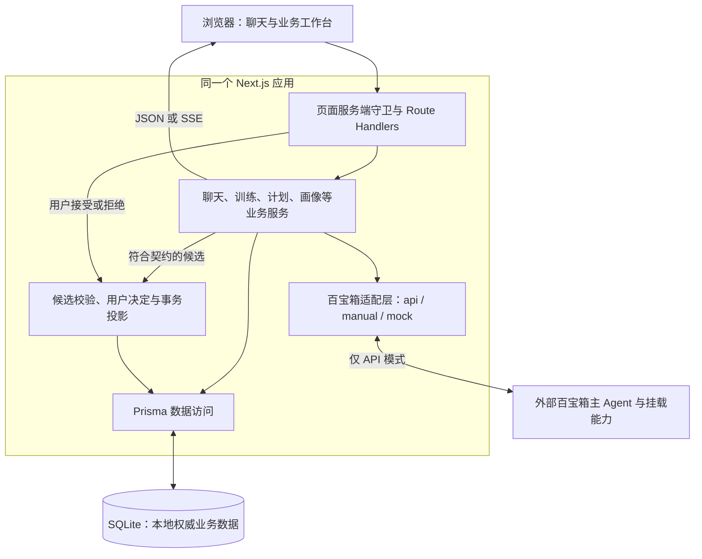

# CareerMate

CareerMate 是面向大学生和职场新人的 AI 职业成长工作台，围绕画像、职业探索、计划、学习资源、模拟训练与成长记录提供持续支持。项目是 **Next.js App Router 全栈应用**：页面和业务 API 在同一应用中运行，Prisma 访问本地 SQLite，真实 AI 能力通过百宝箱接入。

本文与核心文档按 2026-09-12 的仓库源码校准；平台挂载、模型选择和发布版本需要以实际百宝箱环境为准。

## 功能入口

| 路径 | 当前功能 |
|---|---|
| `/`、`/login` | 未登录展示首页；注册、登录；登录后按画像状态跳转 |
| `/onboarding` | 对话采集画像、恢复引导草稿、确认完成 |
| `/chat` | 主聊天、会话历史、引用、业务候选卡片、独立训练聊天 |
| `/dashboard` | 成长概览、能力差距、任务与进度摘要 |
| `/path` | 职业计划、学习路线、历史计划与任务状态 |
| `/simulation` | 推荐/自定义/岗位场景预览、开始与恢复训练 |
| `/resources` | 学习资源与已导入岗位样本、筛选、资源关联候选 |
| `/memory` | 本地记忆、画像和能力候选的查看与确认 |
| `/settings` | 账号、密码、头像、隐私数据与陪伴形象 |
| `/admin` | 管理员岗位草稿编辑、审核与模板维护 |

训练流程为“预览场景 → 开始并固定快照 → 独立聊天 → 完成评分 → 讨论报告”。至少 3 轮有效回答后可评分，轮数上限可设为 3–6，默认 6。推荐及岗位预览可本地构造，自定义预览通过场景生成服务；开始训练并不再调用模型生成开场白，而是保存预览快照中的开场白。

AI 候选与正式业务数据分开保存。用户接受候选后，后端重新核对归属、状态、版本与业务契约再写入；聊天记录、训练过程和报告由各自服务持久化。岗位样本是已导入的数据，不代表实时在招。

## 本地启动

使用 Node.js 22 与 npm。以下步骤针对全新开发环境；已有 `.env` 请保留本地配置。

```bash
npm ci
cp .env.example .env
npm run prisma:generate
node -e "require('node:fs').closeSync(require('node:fs').openSync('prisma/dev.db', 'a'))"
npm run db:migrate:deploy
npm run dev
```

访问 [localhost:3000](http://localhost:3000)。`.env.example` 使用 `DATABASE_URL="file:./dev.db"`，数据库文件位于 `prisma/dev.db`；默认 `TBOX_MODE=mock`、`CAREERMATE_AGENTIC_V2=false`，无需百宝箱凭据即可启动。

可直接注册账号。需要演示数据时在空的开发数据库执行 `npm run seed`，演示账号为 `student_lin` / `careermate123`。**Seed 会删除并重建业务数据，不用于已有数据库升级。** 升级时先备份 SQLite 文件，安装依赖、生成 Prisma Client，再执行 `npm run db:migrate:deploy`。

接入真实百宝箱时，在本地 `.env` 设置 `TBOX_MODE=api`、有效的 `TBOX_API_KEY` 与 `TBOX_AGENT_ID`；接入 V2 主 Agent 时另设 `CAREERMATE_AGENTIC_V2=true`。`TBOX_AGENT_VERSION` 可固定已发布版本。上下文默认通过 `question_prefix` 传送。详见 [百宝箱架构](docs/tbox/百宝箱架构.md)。

## 总体架构

箭头表示请求或数据流；百宝箱只在 API 模式参与实际模型调用。



V2 主聊天以脱敏快照传递个人上下文，过滤回复中的 `CAREERMATE_ARTIFACT` 信封并校验候选。未完成训练通过专用训练服务处理，结束后才转为普通聊天讨论报告。保留的 MCP 接口是独立集成入口，不是当前 V2 主聊天的必经节点。

## 开发命令

| 命令 | 用途 |
|---|---|
| `npm run dev` / `build` / `start` | Webpack 开发、生产构建、生产服务 |
| `npm run lint` / `typecheck` / `test` | ESLint、类型生成与检查、Vitest |
| `npm run test:migrations` | 独立数据库中的迁移冒烟检查 |
| `npm run verify` | 密钥扫描、lint、类型、测试、迁移与构建 |
| `npm run test:e2e` / `test:e2e:v2` | 基础 Mock / V2 Mock 浏览器流程 |
| `npm run import:resources` / `import:jobs` | 导入学习资源或岗位样本，支持 `--dry-run` |
| `npm run tbox:bundle` | 从源码和契约生成平台交付包 |
| `npm run package:skills` | 打包两个可独立运行的 Skill |
| `npm run tbox:probe` | 使用本地配置进行百宝箱契约诊断 |
| `npm run secret:scan` | 扫描仓库中的疑似凭据 |

E2E 服务使用 `prisma/e2e.db`、3100 端口和 Mock；脚本会重建该测试库。本地使用系统 Chrome，CI 使用 Playwright Chromium。Mock 流程、真实 SQLite 契约测试和真实百宝箱验证是不同层次，测试通过不能替代平台发布与联调。

## 仓库与核心文档

| 目录 | 职责 |
|---|---|
| `src/app` | 页面、Route Handlers 与全局样式 |
| `src/components`、`src/features`、`src/hooks` | 共享 UI、业务视图、聊天与页面数据状态 |
| `src/lib` | 业务服务、鉴权、DTO、契约、百宝箱与 MCP 适配 |
| `src/agentic-v2` | 平台提示词、工作流源文件、知识库、Skill 与评测资产 |
| `prisma`、`data` | 数据模型、迁移、Seed 与可提交的资源数据 |
| `scripts`、`e2e` | 数据导入、打包、诊断与浏览器测试 |

- [项目架构](docs/项目架构文档.md)：系统边界、业务模块及功能闭环。
- [技术架构](docs/architecture.md)：运行分层、请求分支、数据关系与并发控制。
- [API 文档](docs/接口设计文档.md)：完整路由、参数、返回值、SSE 与 MCP。
- [百宝箱架构](docs/tbox/百宝箱架构.md)：主 Agent、工作流、证据和本地集成边界。
- [文档导航](docs/README.md)。

环境变量模板以 [.env.example](.env.example) 为准，依赖版本以 [package-lock.json](package-lock.json) 为准。真实 `.env`、数据库、原始个人材料和临时导出包不入库。
