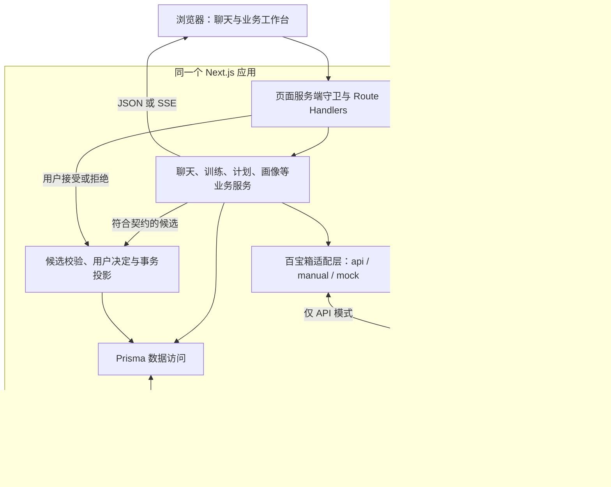

# CareerMate

CareerMate 是面向大学生和职场新人的 AI 职业成长工作台，围绕画像、职业探索、计划、学习资源、模拟训练与成长记录提供持续支持。项目是 **Next.js App Router 全栈应用**：页面和业务 API 在同一应用中运行，Prisma 访问本地 SQLite，真实 AI 能力通过百宝箱接入。

平台挂载、模型选择和发布版本需要以实际百宝箱环境为准。

文档校准日期：2026-10-01，按当前页面、API、服务、Prisma Schema、锁文件与启动/打包脚本核对。

未登录打开根地址 `/`，默认显示介绍页，登录和注册位于 `/login`。介绍页支持节点跳转、能力切换、对话播放、任务进度与训练流程演示；示例只改变本页状态。介绍页、登录页与工作台侧栏共用四瓣品牌图标。默认开启完整装饰动效，遵循系统“减少动态效果”，无动效设置入口；登录和注册调用真实账号接口。

## 比赛交付与一键启动

Windows 双击 `start.bat`，macOS 双击 `start.command`，Linux 执行 `bash start.sh`。脚本自动下载缺失的 Node.js 与锁定依赖，建立独立的 `prisma/review.db`，构建并打开 `http://localhost:3000`。只监听本机；按 Ctrl+C 停止。

全新评审数据库自动创建体验账号 `reviewer / careermate123`。每次启动均按唯一键增量补齐包内的 23 条学习资源和 1213 条公开岗位样本，保留已有目录编辑、账号和成长记录；既有评审库也能获得此前缺失的目录。从仓库启动时，未配置 `.env` 会复制 mock 模板；比赛私有交付包可附带作者提供的真实 API 配置。

制作精简评委包（需要打包机已安装 Node.js 22/24 与 Python 3.9+）：

```bash
python3 scripts/package-submission.py --with-api
```

输出到被 Git 忽略的 `submission/`，包含 ZIP 和 SHA256 校验文件。包内保留必要源码、静态资源、迁移、公共学习/岗位目录的数据源和启动说明，排除开发文档、测试、已安装依赖、构建、Git 历史和个人数据库；打包时会裁减测试与 lint 依赖并重新生成对应锁文件，因此打包机也需要联网访问 npm 官方源。`--with-api` 只将本地 `.env` 中模板定义的应用配置加入压缩包，要求有效的 API 模式配置，不会提交密钥；不传该参数可生成不含密钥的源码包。打包程序不会删除本地资料。正式包应在工作区提交完成后生成，以便 `release-manifest.json` 对应确切提交；有未提交改动时，文件名带 `-preview`，清单标记 `uncommittedChanges: true`。外置 `.zip.sha256` 用于核对传输完整性，不参与启动。

详细评审说明见 [启动说明](scripts/submission/README.md)。已在 Linux 验证全新依赖安装、缺少 Node.js 时的官方下载、数据库初始化、生产启动与真实 API 对话；Windows/macOS 启动器尚未在目标系统实机验证。

2026-09-27 交付审计记录（历史结果，本次文档校准未重新执行漏洞审计）：Next.js 更新到 16.3.3，Sharp 更新到 0.35.4，并更新兼容范围内的受影响间接依赖。当时完整开发依赖报告 `deepmerge-ts` 经 Prisma 配置加载链的 3 个 high 条目，以及 Vitest mock 服务的 2 个 moderate 条目：本项目无 Prisma JS/TS 配置文件、远程配置或来自用户的配置合并输入；Vitest 仅用于本地 `run` 测试，不启动对外 mock 服务。暂不跨主版本升级数据库与测试框架。评委包剔除测试与 lint 工具依赖，服务固定监听本机；后续复查日期为 2026-10-27，新增 Prisma 配置或公开测试服务前需重新评估。

## 功能入口

| 路径 | 当前功能 |
|---|---|
| `/` | 未登录展示介绍页；已登录且画像完成进入 `/chat`，未完成经 `/onboarding` 进入 `/chat?intent=profile` |
| `/login` | 未登录显示登录/注册页；已有登录会话则回到 `/`，由首页守卫决定去向 |
| `/chat?intent=profile`、`/onboarding` | 在主聊天中完善画像；旧引导地址兼容跳转，首次建档支持草稿恢复与确认保存 |
| `/chat` | 主聊天、会话历史、引用、业务候选卡片、独立训练聊天 |
| `/dashboard` | 成长概览、能力差距、任务与进度摘要 |
| `/path` | 职业计划、学习路线、历史计划与任务状态 |
| `/simulation` | 推荐/自定义/岗位场景预览、开始与恢复训练 |
| `/resources` | 学习资源与已导入岗位样本、筛选、资源关联候选 |
| `/memory` | 本地记忆、画像和能力候选的查看与确认 |
| `/settings` | 账号、密码、头像、隐私数据与陪伴形象 |
| `/admin` | 管理员岗位草稿编辑、审核与模板维护 |

训练流程为“预览场景 → 开始并固定快照 → 独立聊天 → 完成评分 → 讨论报告”。至少 3 轮有效回答后可评分，轮数上限可设为 3–6，默认 6。推荐及岗位预览可本地构造，自定义预览通过场景生成服务；开始训练并不再调用模型生成开场白，而是保存预览快照中的开场白。

AI 候选与正式业务数据分开保存。用户接受候选后，后端重新核对归属、状态、版本与业务契约再写入；聊天记录、训练过程和报告由各自服务持久化。岗位样本是已导入的数据，不代表实时在招。

画像入口统一到主聊天：已有画像的用户通过普通会话补充背景和变化，沿用现有画像更新与候选确认能力；首次建档在同一聊天界面中使用 `/api/onboarding/chat`、`/api/onboarding/complete`，仍需草稿完整度达到 80% 并明确确认。旧的未确认草稿可从 `/chat?intent=onboarding` 继续整理；草稿完整度不代表正式画像的完整度。`/onboarding` 只保留兼容跳转，鉴权和其他工作台页面的建档守卫保持原有规则。

## 本地启动

使用 Node.js 22 或 24 与 npm（与 `package.json` 的 engines 一致）。以下步骤针对全新开发环境，示例命令适用于 macOS/Linux；已有 `.env` 请保留本地配置。

```bash
npm ci
cp .env.example .env
npm run prisma:generate
node -e "require('node:fs').closeSync(require('node:fs').openSync('prisma/dev.db', 'a'))"
npm run db:migrate:deploy
npm run dev
```

访问 [localhost:3000](http://localhost:3000)。`.env.example` 使用 `DATABASE_URL="file:./dev.db"`，数据库文件位于 `prisma/dev.db`；默认 `TBOX_MODE=mock`、`CAREERMATE_AGENTIC_V2=false`，无需百宝箱凭据即可启动。

macOS/Linux 可以用项目根目录的脚本在后台管理开发服务；启动脚本会等待服务响应后自动打开默认浏览器：

```bash
chmod +x start-dev.sh stop-dev.sh
./start-dev.sh
./stop-dev.sh
```

启动脚本把 PID 和日志放在被 Git 忽略的 `.careermate/` 目录。可用 `CAREERMATE_PORT=3001 ./start-dev.sh` 修改端口；关闭时使用相同的 `CAREERMATE_RUNTIME_DIR`（如有设置）。

Windows 开发环境在完成依赖、`.env` 和迁移准备后，可运行 `start-dev.bat`；它固定使用 `prisma/dev.db` 并在当前终端前台启动，按 Ctrl+C 停止。开发启动器不自动安装依赖或初始化数据库；需要完整评审初始化时使用前述 `start.bat` / `start.command` / `start.sh`。

可直接注册账号。需要演示数据时在空的开发数据库执行 `npm run seed`，演示账号为 `student_lin` / `careermate123`。**Seed 会删除并重建业务数据，不用于已有数据库升级。** 升级时先备份 SQLite 文件，安装依赖、生成 Prisma Client，再执行 `npm run db:migrate:deploy`。

接入真实百宝箱时，在本地 `.env` 设置 `TBOX_MODE=api`、有效的 `TBOX_API_KEY` 与 `TBOX_AGENT_ID`；接入 V2 主 Agent 时另设 `CAREERMATE_AGENTIC_V2=true`。`TBOX_AGENT_VERSION` 可固定已发布版本。上下文默认通过 `question_prefix` 传送。详见 [百宝箱架构](docs/tbox/百宝箱架构.md)。

配置 `api` 不保证每次结果均来自真实模型：部分适配器在上游失败时会降级到人工样例或本地 mock，上游已产生文本增量后流式请求中途失败则报错。以响应中的 `meta.actualMode`、`degraded`、`fallbackReason` 和 `source` 判断实际来源。`OPEN_CHAT_ENTRY` 目前仅保留配置读取定义，不参与页面路由，设为 `false` 不会恢复旧引导页。

## 总体架构

箭头表示请求或数据流；百宝箱只在 API 模式参与实际模型调用。


```mermaid
flowchart TB
  Browser["浏览器：聊天与业务工作台"]
  subgraph App["同一个 Next.js 应用"]
    Routes["页面服务端守卫与 Route Handlers"]
    Services["聊天、训练、计划、画像等业务服务"]
    AI["百宝箱适配层：api / manual / mock"]
    Candidates["候选校验、用户决定与事务投影"]
    Prisma["Prisma 数据访问"]
  end
  DB[("SQLite：本地权威业务数据")]
  Tbox["外部百宝箱主 Agent 与挂载能力"]
  Browser --> Routes
  Routes --> Services
  Services --> Prisma
  Prisma <--> DB
  Services --> AI
  AI <-->|"仅 API 模式"| Tbox
  Services -->|"符合契约的候选"| Candidates
  Routes -->|"用户接受或拒绝"| Candidates
  Candidates --> Prisma
  Services -->|"JSON 或 SSE"| Browser
```

V2 主聊天以脱敏快照传递个人上下文，过滤回复中的 `CAREERMATE_ARTIFACT` 信封并校验候选。未完成训练通过专用训练服务处理，结束后才转为普通聊天讨论报告。保留的 MCP 接口是独立集成入口，不是当前 V2 主聊天的必经节点。

## 开发命令

| 命令 | 用途 |
|---|---|
| `npm run dev` / `build` / `start` | Webpack 开发、生产构建、生产服务 |
| `npm run lint` / `typecheck` / `test` | ESLint、类型生成与检查、Vitest |
| `npm run test:migrations` | 独立数据库中的迁移冒烟检查 |
| `npm run test:review-setup` | 临时评审数据库初始化、体验账号与重复启动保留数据检查 |
| `npm run verify` | 密钥扫描、lint、类型、单元测试、迁移、评审初始化与构建 |
| `npm run test:e2e` / `test:e2e:v2` | 基础 Mock / V2 Mock 浏览器流程 |
| `npm run import:resources` / `import:jobs` | 导入学习资源或岗位样本，支持 `--dry-run` |
| `npm run tbox:bundle` | 从源码和契约生成平台交付包 |
| `npm run package:skills` | 打包两个可独立运行的 Skill |
| `npm run tbox:probe` | 使用本地配置进行百宝箱契约诊断 |
| `npm run secret:scan` | 扫描仓库中的疑似凭据 |
| `npm run launch` | 评审初始化与生产启动；与跨系统启动器共用 `launch-review.mjs`，需已有 Node.js 22/24 |

E2E 服务使用 `prisma/e2e.db`、3100 端口和 Mock；脚本会重建该测试库，并在项目的 `.next/` 中生成测试构建。本地使用系统 Chrome，CI 使用 Playwright Chromium。Playwright 配置会复用已有 3100 服务；切换基础/V2 测试前须确认该端口实例的配置符合当前测试，避免复用上一轮服务。评审生产服务与 E2E 共用 `.next/`，应分开运行或使用独立副本；当前 Next.js 开发服务使用 `.next/dev/`。Mock 流程、真实 SQLite 契约测试和真实百宝箱验证是不同层次，测试通过不能替代平台发布与联调。

## 仓库与核心文档

| 目录 | 职责 |
|---|---|
| `src/app` | 页面、Route Handlers 与全局样式 |
| `src/components`、`src/features`、`src/hooks` | 共享 UI、业务视图、聊天与页面数据状态 |
| `src/lib` | 业务服务、鉴权、DTO、契约、百宝箱与 MCP 适配 |
| `src/agentic-v2` | 平台提示词、工作流源文件、知识库、Skill 与评测资产 |
| `prisma`、`data` | 数据模型、迁移、Seed 与可提交的资源数据 |
| `scripts`、`e2e` | 数据导入、打包、诊断与浏览器测试 |

- [项目架构](docs/项目架构文档.md)：系统边界、业务模块及功能闭环。
- [技术架构](docs/architecture.md)：运行分层、请求分支、数据关系与并发控制。
- [API 文档](docs/接口设计文档.md)：完整路由、参数、返回值、SSE 与 MCP。
- [百宝箱架构](docs/tbox/百宝箱架构.md)：主 Agent、工作流、证据和本地集成边界。
- [MCP 与外部工具对接协议](docs/MCP与外部工具对接协议.md)：夸克搜索、研究证据交换与业务 MCP V2 接入。
- [文档导航](docs/README.md)。

环境变量模板以 [.env.example](.env.example) 为准，依赖版本以 [package-lock.json](package-lock.json) 为准。真实 `.env`、数据库、原始个人材料和临时导出包不入库。
