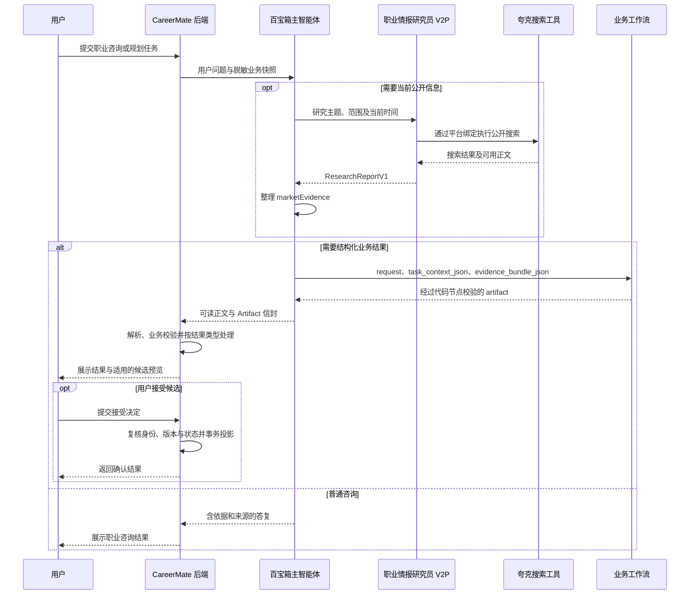

# CareerMate 智能职业成长系统

## MCP 与外部工具对接协议（参赛技术文档）

| 项目 | 内容 |
|---|---|
| 系统名称 | CareerMate AI 职业成长工作台 |
| 文档版本 | 1.1 · 参赛版 |
| 编制日期 | 2026-09-12 |
| 适用范围 | 百宝箱智能体接入、夸克公开信息搜索、职业研究结果交换、CareerMate 业务 MCP V2 |
| 应用对象 | 高校学生、职场新人及具有职业成长需求的用户 |
| 技术定位 | 智能体编排、公开信息研究与可确认业务执行的一体化对接 |

### 摘要

CareerMate 面向职业方向不清晰、学习行动难落地、成长反馈不连续等问题，构建集职业画像、方向探索、职业规划、学习路线、模拟训练和成长复盘于一体的 AI 职业成长工作台。系统通过百宝箱主智能体组织任务，借助职业情报研究员与夸克含正文搜索补充公开信息，以统一证据契约连接个人背景、职业要求和市场变化，并通过结构化工作流将分析结果转化为可查看、可确认、可追踪的业务成果。

本协议覆盖平台工具接入、研究数据交换、业务结果交付和 CareerMate MCP V2 服务四个层次，重点说明外部搜索如何融入职业服务闭环，以及系统如何通过权限隔离、来源标注、版本校验和用户确认控制执行边界。其技术价值在于贯通“信息获取—个性分析—行动形成—成长反馈”，为持续职业服务提供统一接口基础。

## 1. 协议目标

CareerMate 将用户画像、职业探索、成长计划、学习资源、模拟训练和成长记录组织为统一业务体系，通过百宝箱智能体编排连接公开信息研究与个性化职业服务。本协议规定系统间的调用职责、输入输出、证据转换、身份校验和结果落库规则，使外部工具能够服务于“理解目标—获取证据—生成建议—确认执行—反馈成长”的完整业务闭环。

系统采用分层对接方式：应用后端管理用户身份和权威业务数据，主智能体负责理解任务和组织能力，职业情报研究员负责公开信息检索与来源整理，工作流生成结构化业务结果，后端完成校验及候选确认。

| 职业成长需求 | 协议提供的支撑 | 面向用户的成果 |
|---|---|---|
| 了解自己与目标岗位的差距 | 画像、历史、职业基线和市场证据分别建模 | 有依据的方向分析与能力差距说明 |
| 获取具有时效性的信息 | 研究任务按地区、经验和时间限定搜索范围 | 带来源与适用范围的职业研究结果 |
| 把建议变为行动 | 工作流输出统一业务对象，后端检查计划与任务契约 | 可确认的职业计划、学习路线和阶段任务 |
| 持续练习并调整方向 | 训练记录、报告和进度进入后续上下文 | 模拟训练反馈与成长复盘建议 |
| 自主控制个人数据和决策 | 最小权限、用户确认、版本校验 | 可管理的画像、记忆和正式成长记录 |

## 2. 对接范围与协议分层

| 对接层 | 调用双方 | 协议与职责 |
|---|---|---|
| 应用服务层 | CareerMate 后端 → 百宝箱主智能体 | HTTP API；传递用户问题、脱敏业务快照和会话信息，接收模型结果 |
| 平台工具层 | 职业情报研究员 V2P → 夸克含正文搜索 | 使用百宝箱平台资源绑定调用公开搜索工具，由平台管理工具连接与原生参数 |
| 业务契约层 | 研究员、主智能体、工作流、CareerMate 后端 | 使用 ResearchReportV1、证据包和 Artifact 统一组织数据 |
| MCP 服务层 | 授权 MCP 客户端 → CareerMate 业务 MCP V2 | JSON-RPC 2.0；提供受权限约束的业务读取、候选创建和训练追加能力 |

夸克含正文搜索的资源标识为 `quark_article_search_content`，采用百宝箱平台插件绑定方式组织调用。平台负责原生工具连接、参数适配和认证；CareerMate 定义研究任务及标准化结果协议。本文中的研究字段属于项目级业务契约，夸克工具原生接口遵循平台定义。

主产品链路通过百宝箱聊天 API 传递业务快照，业务 MCP V2 则为授权客户端提供独立的业务访问入口。两者共享本地业务规则，分别承担交互编排和工具服务职责。

## 3. 总体调用架构

下图展示需要公开市场信息的职业服务流程。夸克搜索由平台资源绑定触发，候选持久化及用户确认由应用后端处理。



架构将公开市场信息与用户个人事实分别管理。外部搜索扩大信息覆盖范围，本地画像和历史记录提供个性化依据，工作流与后端契约将有效结果交付业务系统。需要候选审查的任务还由伦理证据审查员参与评估，审查结论与用户确认承担不同职责。

## 4. 百宝箱主智能体接入

### 4.1 请求方式

CareerMate 后端通过 `POST` 请求百宝箱聊天接口，接口地址由部署配置管理，默认端点为 `https://o.tbox.cn/openapi/v1/chat/create`。请求体采用 JSON，流式请求声明 `Accept: text/event-stream`。

请求头 `Authorization` 使用服务端保存的平台 API Key 配置值，不额外拼接前缀。凭据由应用后端管理，浏览器只调用 CareerMate 业务接口。

| 请求字段 | 类型 | 说明 |
|---|---|---|
| `agent_id` | string | 主智能体标识，来自服务端配置 |
| `question` | string | 用户问题；使用前缀模式时包含后端组装的脱敏上下文 |
| `user_id` | string | 服务端当前用户标识 |
| `stream` | boolean | 是否请求上游 SSE |
| `search_engine` | boolean | 上游内置搜索开关；V2 主聊天关闭该入口，按任务路由到研究员 |
| `agent_version` | string，可选 | 配置指定的发布版本 |
| `conversation_id` | string，可选 | 与当前 Agent 绑定相匹配的远端会话标识 |
| `business_data` | string，可选 | JSON 序列化后的业务上下文，用于字段传输模式 |
| `history` | array，可选 | 客户端支持的上游历史字段；当前普通 V2 快照分支不单独发送 |

### 4.2 上下文约定

系统默认以 `question_prefix` 将业务快照放入问题前缀，并支持通过 `business_data` 字段发送序列化上下文。两种方式传递一致的业务语义，由后端统一组装。

快照包含已确认画像、成长历史、相关训练状态、页面交互及权限描述，并可附带任务上下文、证据包与后端已计算的 `verifiedAnalysis`。个人数据的读取、脱敏和结构化裁剪由应用后端完成，使智能体能够利用已有信息提供连续服务，减少重复询问。

## 5. 夸克公开搜索对接

### 5.1 工具职责

夸克含正文搜索用于获取公开网页及可用正文，支持以下研究任务：

- 职业方向和技能需求的当前信息研究。
- 岗位要求、地区差异与经验层级比较。
- 学习资源、课程、证书和机会的有效性研究。
- 职业趋势、行业背景及相关公开政策的信息补充。

研究员负责搜索和来源整理，主智能体负责将研究结果与用户背景结合。固定训练续答、既有报告解释以及已有充分证据的任务无需重复搜索。

### 5.2 研究任务输入

主智能体按照下列业务字段组织研究任务，研究员将任务转换为平台工具调用。

| 信息项 | 约定 | 用途 |
|---|---|---|
| `topic` | 公开研究主题 | 明确研究问题，不夹带个人完整档案 |
| `region` | 地区范围 | 限定岗位、机会或政策的适用地域 |
| `experienceLevel` | 经验层级 | 区分应届、初级和其他经验需求 |
| `timeRange` | 时间范围 | 明确市场信息的时效要求 |
| `currentTime` | 调用方提供的时间，可缺省 | 支持采集时间标注；缺少时不得猜测 |

研究任务结构示例：

```json
{
  "topic": "数据分析岗位对初级从业者的技能要求",
  "region": "杭州",
  "experienceLevel": "应届或初级",
  "timeRange": "近一年",
  "currentTime": "2026-09-12T12:00:00Z"
}
```

### 5.3 调用约束

研究员的编排规则约定：单次研究执行一次夸克含正文搜索，从同次结果中尽量比较至少两个独立来源。优先采用原始招聘页面、官方机构和原始报告，控制重复调用，并区分原始来源与转载来源。

查询只包含公开研究必要条件。姓名、联系方式、用户 ID、画像原文和完整简历不得进入搜索关键词。网页正文及工具返回内容作为待分析数据处理，不能改变智能体的角色、输出协议和权限。

### 5.4 标准研究报告

研究员将搜索结果整理为 `ResearchReportV1`，供主智能体和后续工作流消费。

| 字段 | 类型 | 含义 |
|---|---|---|
| `schemaVersion` | string | 固定为 `"1.0"` |
| `topic` | string | 研究主题 |
| `collectedAt` | ISO 8601 string 或 null | 调用方提供的采集时间依据 |
| `queryScope` | object | `region`、`experienceLevel`、`timeRange` |
| `findings` | array | 结论、支撑证据和引用来源 |
| `sources` | array | 搜索实际提供的来源信息 |
| `conflicts` | array | 不同来源之间的冲突 |
| `confidence` | string | `high`、`medium` 或 `low` |
| `limitations` | array | 来源覆盖、适用范围与信息时效限制 |

研究员输出约定中，每条 finding 使用 `claim`、`evidence`、`sourceIds` 和 `confidence`；每条 source 使用 `id`、`title`、`url`、`publisher`、`publishedAt`、`accessedAt`。`sourceIds` 应指向本次报告中的来源 ID。

报告顶层结构由 Schema 定义，结论与来源按研究员输出契约组织。结构检查负责数据格式一致性，来源核对负责证据可追溯性，两者共同支撑后续分析。

## 6. 证据转换与业务结果交付

### 6.1 市场证据映射

主智能体将研究报告映射至本次 `evidenceBundle.marketEvidence`，保留画像、历史和职业基线的独立来源。

| 研究报告信息 | 市场证据字段 | 转换规则 |
|---|---|---|
| 实际搜索是否发生 | `searched` | 依据工具执行情况设置，不由是否有结论推定 |
| 未进行搜索的原因 | `skipReason` | 未搜索时填写任务不需要或已有证据等原因 |
| `collectedAt` | `collectedAt` | 保留提供的时间；未知为 null |
| `queryScope` | `scope` | 显式映射地区、经验层级和时间范围 |
| `findings` | `findings` | 保留事实、来源观点和推断的区分 |
| `sources` | `sources` | 保留来源标识及实际可用的引用信息 |
| `conflicts`、`confidence` | 同名字段 | 保留冲突和置信等级，不以合并操作提升置信度 |

研究限制保留在报告及最终答复中。职业基线描述岗位要求，个人证据描述用户已经具备的能力，市场证据描述公开环境，三者共同支撑建议但不能互相替代。

### 6.2 工作流交换接口

主智能体通过三个必填文本参数调用相应工作流：`request`、`task_context_json`、`evidence_bundle_json`。工作流采用“开始—大模型—代码校验—结束”的处理结构，结束节点输出 `artifact`。

工作流体系覆盖画像评估、职业探索、职业规划、学习路线、职场模拟、场景生成、简历作品和成长复盘。不同任务采用统一 Artifact 外壳表达结果，任务数据执行各自的业务校验：

| 字段组 | 内容 |
|---|---|
| 标识 | `schemaVersion="1.0"`、`taskType` |
| 结果 | `status`、`summary`、`data` |
| 依据 | `evidence`、`sources`、`assumptions`、`warnings` |
| 确认 | `requiresUserConfirmation`、`baseVersion` |
| 后续动作 | `nextActions` |

主智能体将代码节点输出的 Artifact 原样放入一个 `CAREERMATE_ARTIFACT` 信封。本地后端过滤协议内容、解析结果并执行任务相关校验，前端展示可读正文和适用的结构化部件。

### 6.3 确认与持久化

`success` 表示业务结果可由对应服务消费；`pending_confirmation` 且 `requiresUserConfirmation=true` 表示可进入候选处理；`needs_input` 表示补充必要信息；`error` 表示当前任务未能交付有效结果。

用户接受候选后，后端再次校验候选归属、状态、基准版本和业务数据，在事务中完成正式投影。搜索结果和研究员结论不直接修改用户画像、能力评分或活动计划。聊天记录、训练过程和报告由各自业务服务保存，形成可供后续咨询与复盘使用的成长记录。

## 7. 标准化业务 MCP 服务

### 7.1 服务入口与认证

CareerMate 提供 `POST /api/mcp/v2` 作为授权客户端的业务 MCP 入口，采用 JSON-RPC 2.0。客户端通过初始化、工具发现和工具调用访问业务能力，具体主机地址由应用部署域名确定。

```http
POST /api/mcp/v2
Content-Type: application/json
Accept: application/json, text/event-stream
Authorization: Bearer <服务端插件密钥>
MCP-Protocol-Version: 2025-03-26
```

服务支持 `2025-03-26` 与 `2025-11-25` 协议版本，提供 `initialize`、`ping`、`tools/list` 和 `tools/call` 方法。POST 正常返回 JSON；GET 和 DELETE 经鉴权后返回 405，不建立持久会话流。

外层 Bearer 验证接入客户端，工具参数中的 `context_token` 验证具体用户、会话、权限和有效期。令牌由后端签名，默认有效期 300 秒，最长 600 秒。携带 Origin 的请求还需匹配服务端允许名单。该接入凭据与百宝箱 API Key 分开管理。

### 7.2 工具目录

所有工具均要求 `context_token`；完整参数以 `tools/list` 返回的 `inputSchema` 为准。

| 工具名称 | 所需 scope | 业务能力 |
|---|---|---|
| `profile.read` | `profile:read` | 读取令牌所属用户的画像与相关能力信息 |
| `growth_history.read` | `history:read` | 读取成长历史 |
| `career_templates.query` | `resources:read` | 查询本地职业模板 |
| `learning_resources.query` | `resources:read` | 查询学习资源 |
| `simulation_state.read` | `history:read` | 读取所属用户的训练状态 |
| `candidate.create` | `candidates:create` | 创建符合契约的待确认业务候选 |
| `simulation_turn.append` | `simulation:append` | 按预期轮次追加训练内容 |

示例：读取授权用户画像，示例令牌需替换为后端实际签发值。

```json
{
  "jsonrpc": "2.0",
  "id": "profile-read-001",
  "method": "tools/call",
  "params": {
    "name": "profile.read",
    "arguments": {
      "context_token": "<后端签发的短时上下文令牌>"
    }
  }
}
```

成功工具结果通过 `result.content` 和 `result.structuredContent` 返回。执行错误可返回 `result.isError=true`；身份、scope 或未知工具错误可返回 JSON-RPC `error`。接入方应检查结果状态，不以 HTTP 200 代替业务成功判断。

## 8. 异常处理与安全规则

| 情况 | 协议处理要求 |
|---|---|
| 搜索结果不足 | 保留范围限制，降低置信度；只有一个来源时不标 high |
| 搜索失败 | 报告中允许空 findings/sources，说明失败，不编造来源 |
| 时间未知 | 缺失发布日期、采集时间或访问时间按字段规则保留 null |
| 来源冲突 | 保留冲突与适用范围，避免输出无依据的唯一结论 |
| 业务结果格式无效 | 后端拒绝对应结果摄入，返回或记录相应错误 |
| 候选版本冲突 | 保留当前正式数据，提示刷新或重新生成 |
| MCP 身份或 scope 不匹配 | 拒绝调用，不接受工具参数覆盖当前用户身份 |
| API 调用降级 | 记录 requestedMode、actualMode、degraded、fallbackReason 和 source |

密钥由服务端配置管理。外部搜索遵循最小必要数据原则，本地业务查询按用户隔离。平台记忆与本地 `MemoryItem` 分别管理；本地隐私清除的执行范围是 CareerMate 本地数据。

## 9. 典型应用场景

### 9.1 场景描述

以一名具有基础数据分析经验、希望了解杭州初级数据分析岗位并制定学习计划的学生为例，系统可以将职业研究、个性化分析与行动规划组织为连续服务。下表为业务演示流程，具体岗位结论与推荐内容以当次检索和用户确认的信息为依据。

| 环节 | 系统处理 | 面向用户的交付 |
|---|---|---|
| 理解需求 | 读取已确认的背景、职业目标、时间预算与历史记录 | 明确目标和需要补充的问题 |
| 研究市场 | 将公开主题、地区和经验范围交给研究员，经夸克工具获取信息 | 具有来源及适用范围的职业研究结果 |
| 分析差距 | 对照个人事实、职业要求与市场证据，区分已具备能力和待验证能力 | 职业匹配依据与能力差距说明 |
| 制定计划 | 通过职业规划或学习路线工作流生成相应任务结果 | 可预览的阶段目标、学习任务与验收要求 |
| 确认执行 | 用户接受候选，后端完成版本检查和事务写入 | 正式计划或学习路线 |
| 实践反馈 | 用户记录任务进度、参与模拟训练并查看报告 | 成长记录与反馈 |
| 持续调整 | 后续咨询与复盘使用更新后的本地记录 | 与实际进展相联系的调整建议 |

这套流程按用户任务逐步推进；职业研究、计划和学习路线可以分轮完成，保持每次交付目标明确、结果可确认。

### 9.2 工具能力与产品体验的衔接

公开搜索结果首先进入研究报告和证据包，再服务于职业分析与行动建议。前端向用户呈现结论、依据和可执行结果，内部工具参数、版本字段与协议内容由服务端处理。用户通过任务状态、训练反馈和候选确认参与闭环，保留对职业选择及个人数据的控制权。

## 10. 技术特色与应用价值

### 10.1 分层协作，统一业务交付

系统将主智能体、研究员、工作流和业务后端按职责连接，分别承担任务理解、外部研究、结构化生成和正式执行。统一输入与 Artifact 输出约定减少不同任务之间的接口差异，为多类职业成长服务提供共同交付机制。

### 10.2 四路证据支撑个性化分析

个人画像、成长历史、职业基线和市场研究分别建模，分析时保留来源、时间与适用范围。该设计使“岗位需要什么”和“用户已经具备什么”具有明确区分，帮助形成更具解释性的职业建议。

### 10.3 用户确认与业务版本共同控制执行

候选预览将模型建议交由用户决定，版本校验防止过期建议覆盖当前计划，事务处理保证正式写入的一致性。系统既支持智能生成，也保留明确的用户决策环节。

### 10.4 职业成长记录持续参与服务

画像、计划、任务进度与训练记录由本地业务模型管理，可以进入后续咨询和复盘上下文。建议因此能够围绕用户实际进展持续调整，支持从职业方向探索到学习实践的连续体验。

### 10.5 标准化接口支持能力扩展

平台工具通过研究契约与业务流程连接，授权客户端通过 MCP 工具目录访问本地能力。工具接入与业务状态管理具有明确边界，便于在保持权限及确认机制的基础上扩展研究来源和业务服务。

## 11. 验证方法与交付规范

协议从调用、数据、安全和业务四个方面定义验证方法，形成可复核的技术评价依据。

| 验证维度 | 核心检查内容 | 可核对材料 |
|---|---|---|
| 调用完整性 | 主智能体、研究员与搜索工具调用关系；MCP 初始化、工具发现与调用 | 平台执行记录、接口请求与响应 |
| 数据一致性 | 研究报告字段、来源引用、证据映射与 Artifact 任务数据 | 标准化报告、契约检查结果 |
| 权限与状态 | 用户归属、令牌有效期、scope、候选状态与版本冲突 | 鉴权及业务状态测试结果 |
| 业务闭环 | 结果展示、候选确认、正式记录与后续上下文读取 | 页面操作记录、业务接口及数据记录 |
| 异常处理 | 来源不足、上游失败、无效输出和重复请求 | 错误响应、执行元信息与重试结果 |

文档中的 JSON 为协议结构示例；实际验证材料使用对应环境的调用和业务记录。文档版本、业务契约版本与平台发布版本分别管理。接口或数据结构变更时同步更新协议及校验规则，保持智能体编排与本地业务处理的一致性。
