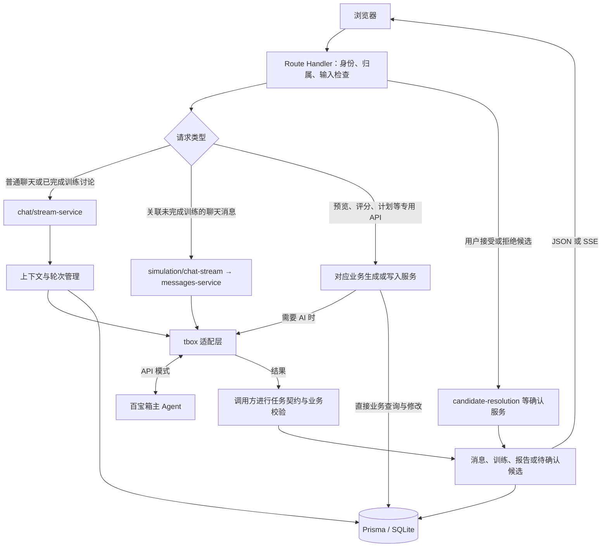
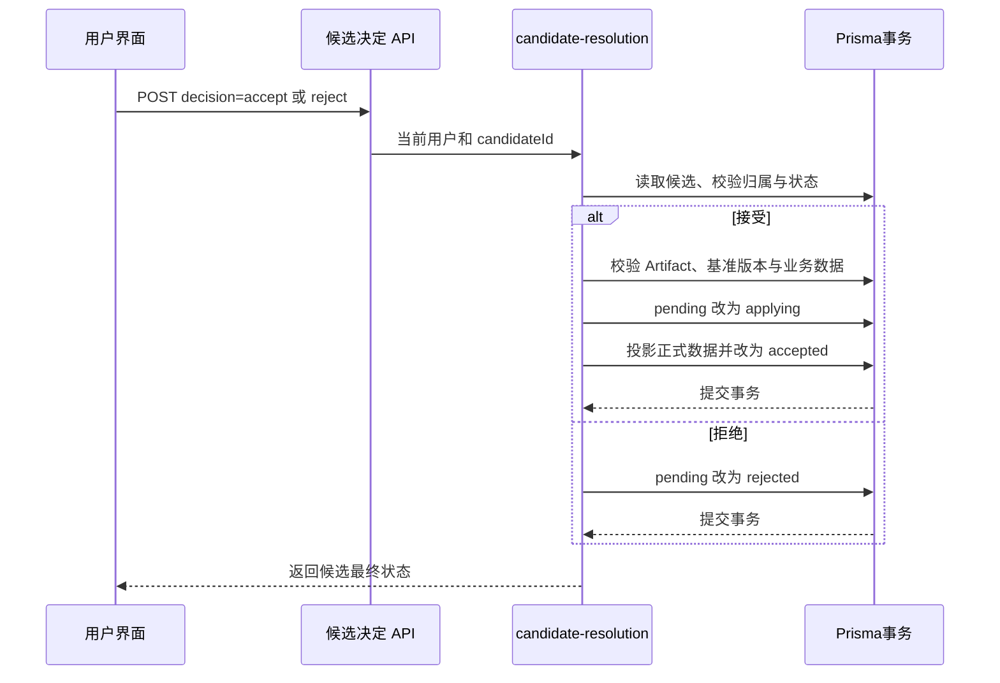
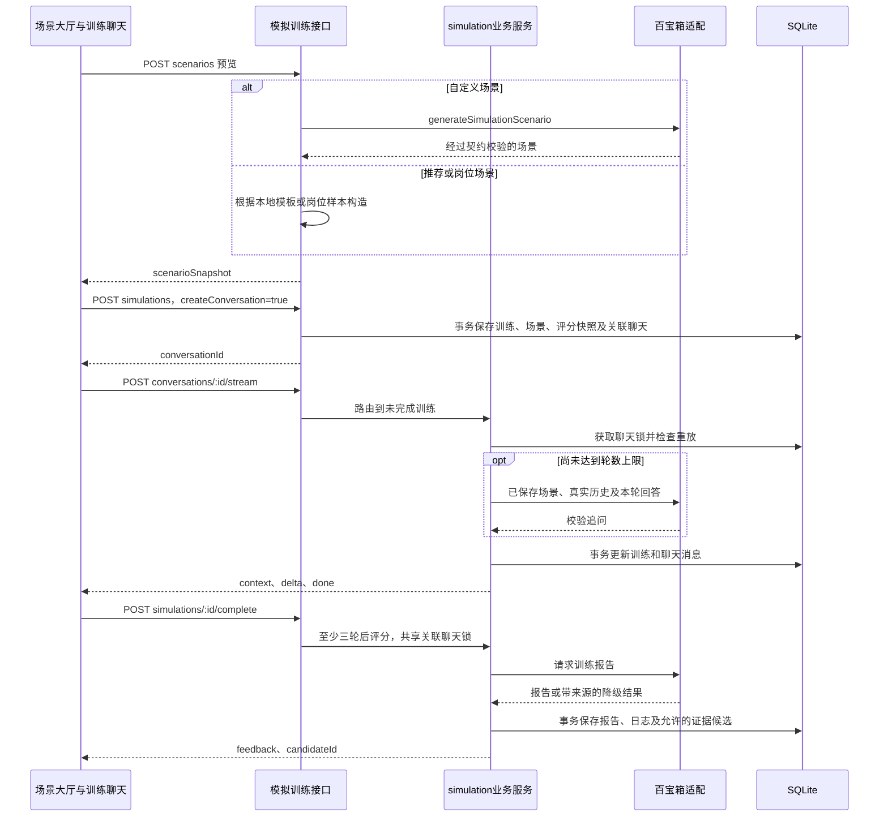
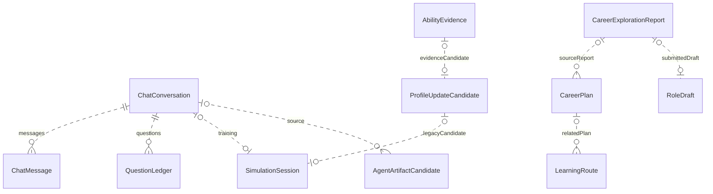

# CareerMate 技术架构

校准日期：2026-09-12。依据当前路由、业务服务、Prisma Schema、平台契约与测试描述实现，不将历史平台日志作为当前部署证明。产品模块见 [项目架构](项目架构文档.md)。

## 运行形态与源码分层

项目使用 Next.js App Router，服务端页面守卫和 Route Handlers 与前端同仓、同应用部署。Node.js 服务通过 Prisma Client 读写 SQLite；模型调用发生在服务端，浏览器不持有百宝箱 API Key。

| 层 | 主要源码 | 实际职责 |
|---|---|---|
| 页面和守卫 | `src/app/**/page.tsx`、`src/components/workspace-page.tsx` | 登录、引导和管理员访问判断 |
| 共享外壳 | `src/app/layout.tsx`、`src/components/chat/`、`src/components/shell/` | AssistantProvider、浮动助手、陪伴形象与侧栏 |
| 业务视图 | `src/features/`、`src/components/workspace.tsx` | 画像、概览、路径、资源、训练、记忆、设置与管理 |
| 客户端状态 | `src/hooks/`、`src/lib/assistant-store.ts`、`src/lib/client-api.ts` | 聊天状态、SSE、模块数据加载和局部刷新 |
| HTTP 边界 | `src/app/api/**/route.ts` | 身份、参数与所有权检查，JSON/SSE/JSON-RPC 响应 |
| 业务层 | `src/lib/chat/`、`simulation/`、`plans/`、`profile/`、`agentic-v2/` 等 | 会话轮次、生成、候选、确认与事务写入 |
| AI 适配 | `src/lib/tbox/` | 请求构建、上游 SSE、结果归一化、检索与模式降级 |
| 数据层 | `src/lib/prisma.ts`、`prisma/schema.prisma`、`src/lib/dto.ts` | Prisma 单例、模型与 JSON 字符串到 DTO 的转换 |
| 平台运行资产 | `src/agentic-v2/` | 提示词、工作流、知识库、可执行 Skill 与评测集 |

锁文件中的版本为 Next.js 16.2.10、React 19.2.7、TypeScript 5.9.3、Prisma/Client 6.19.3、Zod 3.25.76、Tailwind CSS 4.3.2；`package.json` 的范围声明与实际锁定版本不是同一个概念。构建脚本显式使用 Webpack。

工作台先请求 `/api/me`，再按 `view-modules.ts` 加载共享的计划及候选模块与当前页模块。这里是**数据请求按需加载**，`workspace.tsx` 对业务视图仍使用静态 import。`/chat` 使用独立聊天主界面，与浮动助手共用 Provider/控制器，而不是通过 Workspace 渲染。

## 主请求分支

图中的 `Validate` 和 `Store` 是各服务内部处理步骤，不是单独部署的服务。普通聊天可以只有正文，推荐场景预览等分支可以完全本地完成。MCP 保留入口不在这条主产品调用链中。

## 普通聊天的轮次与 V2 数据流

1. `POST /api/chat/conversations/:id/stream` 读取当前用户并检查会话归属，以数据库中的训练关联决定走哪个服务；客户端 `interaction` 不能替代训练归属。
2. `STATEFUL_CHAT_TURNS=true` 时由 `turn-service.ts` 在短事务内取得会话轮次，记录用户消息及助手占位，处理 `(conversationId, clientRequestId, role)` 幂等。已有完成结果可以重放，同一会话的并发轮次受锁约束。关闭开关仍保留 legacy 流程，两者不能混称同一实现。
3. 普通 V2 聊天通过 `agentic-v2-snapshot.ts` 读取用户画像、能力证据、当前计划和路线、近期进度与训练、确认记忆、会话历史等，再做字段选择与脱敏。`agentic-v2-platform-context.ts` 构建任务上下文及证据包，`verified-analysis.ts` 调用仓库内两个 Skill 核心函数计算可解释的证据/成长摘要。
4. `buildAgenticV2BusinessData` 生成快照对象，包含 `profileSnapshot`、`historySnapshot`、`simulationState`、`interaction`、权限及可选任务/证据字段。它不签发 MCP token。内部协议为 `BusinessDataV1.schemaVersion="1"`，Artifact 的版本则为 `"1.0"`。
5. 默认 `question_prefix` 在用户问题前附带序列化快照。24,000 是**快照 JSON 的字符预算**，不包含额外提示语和用户问题，也不是字节数或整个请求上限。先裁剪对象、数组与字符串，再序列化；仍超限时抛出 `ContextBudgetError`，不截断出半个 JSON。普通 V2 非前缀分支通过 `context` 交给客户端编码为字符串 `business_data`，不传 provider history。
6. V2 关闭主请求内置搜索与旧 hybrid 预检索，由平台提示词按需选择研究员。远端会话 ID 需匹配本地绑定的 Agent ID/版本；有状态 V2 会尝试复用有效绑定，即使通用 `TBOX_REUSE_REMOTE_CONVERSATION_ID=false`，也不能描述为“一律不复用”。
7. 上游文字经 `artifact-stream-filter.ts` 过滤，信封外安全正文通过 SSE 增量显示；完整回复再由信封/任务 Schema 解析。过滤器和严格校验是两步，单有文字回复不说明候选有效。
8. 只有满足任务映射且 `status=pending_confirmation`、`requiresUserConfirmation=true` 的结果进入 `AgentArtifactCandidate`。随后完成聊天轮次，保存正文、引用、执行元信息与候选部件。长模型调用不放进数据库事务；候选摄入和聊天完成也不应声称是一个总事务。

SSE 的正常结束以 `done` 为准，错误使用 `error`，等待时有 `heartbeat`；流开始前的鉴权/输入错误仍可能是 JSON HTTP 错误。普通 V2 快照加载失败分支返回 502 `{error:{code,message}}`，并不经过统一 `fail()` 包装。

## 候选确认与投影

事务中任何一步失败会回滚。重复的相同决定可以返回已处理结果；冲突决定或过期版本需要重新处理，不能覆盖当前数据。

| 候选类型 | 投影目标 |
|---|---|
| `profile_patch`、`profile_assessment` | 允许的画像字段、画像版本；综合评估还可写已确认能力证据 |
| `ability_evidence` | `AbilityEvidence`；不能等同于直接替换全部能力分数 |
| `career_plan`、`growth_replan` | 新版 `CareerPlan`，旧活动计划失活；重规划保留父计划信息 |
| `learning_route` | `LearningRoute`，检查计划基准和路线基准、任务及每周预算 |
| `memory_item` | 记忆开启时写入已确认 `MemoryItem` |
| `career_template_draft` | 待管理员审核的 `RoleDraft` |

兼容路径仍有 `ProfileUpdateCandidate` 和存为 `CareerPlan.pending_confirmation` 的计划候选；分别由对应的画像/计划服务处理。不是所有候选都存进 `AgentArtifactCandidate`。

## 独立模拟训练

- 场景预览不创建训练。开始时保存 `scenarioSnapshot`、`scoringSnapshot` 和开场白，创建请求通过 `(userId, creationRequestId)` 去重。
- `SimulationSession.conversationId` 可空且唯一，物理删除聊天时设空，不级联删除训练。旧训练恢复会创建/恢复聊天并按稳定消息标识导入 transcript。
- transcript 和 `turnCount` 是训练事实源，ChatMessage 是显示记录。关联聊天回答与评分共享 `activeTurnId` 互斥锁；兼容直接消息 API 使用版本条件更新，不应宣称每个入口都取得同一个锁。
- 消息服务只接受 5–4000 字符的有效回答，每次计一轮。最后一轮到达上限时使用本地结束提示，不再调用模型追问。未到上限且关联聊天的 API 追问降级/无效时返回失败，不计入进度。
- 训练 SSE 在模型等待期间发心跳，保存后一次发送完整追问 `delta`；它不是逐 token 的训练模型转发，心跳可能早于 `context`。
- 完成服务校验报告与场景，按用户实际回答匹配支持证据；非降级且有受支持的更新才派生能力证据候选。V2 候选 ID 存在 `feedback.artifactCandidateId`；旧 `candidateId` 外键仍指向 `ProfileUpdateCandidate`。
- 完成后在原聊天讨论报告时走普通聊天，附带报告上下文，不再计轮或重复评分。

## 数据结构与关系

当前 Schema 有 22 个模型。大部分数组/复杂对象用 SQLite `String` 保存 JSON，由 DTO 与 Zod 在边界解析。任务、报告反馈和部分关联引用不是独立关系表。

用户与画像为一对零或一，用户与登录会话、聊天、计划、路线、训练、候选、记忆及能力证据等为一对多。下图聚焦业务对象之间的真实外键子集：`o|` 表示零或一，`o{` 表示零或多，父端的 `||` 表示子记录必须具有一个父记录；虚线表示非标识关系，子记录使用自己的主键。

`OperationExecution.userId/conversationId`、`CareerPlan.parentPlanId`、`ProgressLog.relatedPlanId/relatedTaskId`、`MemoryItem.sourceConversationId/sourceMessageId` 是标识字段，Schema 没有相应外键，故图中不虚构关系。`ResourceItem`、`JobSample`、`RoleTemplate` 和 `ManualAiSample` 为独立内容模型；另有引导、探索报告和草稿审核关系，完整定义以 [schema.prisma](../prisma/schema.prisma) 为准。

关键唯一约束包括用户下的计划/路线版本、会话内消息请求 ID 与角色、候选的用户/来源会话/幂等键，以及成长日志的用户/去重键。它们与业务条件更新共同工作，不能仅凭前端按钮禁用保证幂等。

## 鉴权、隐私与集成边界

密码使用 bcryptjs。登录生成 32 字节随机 token，数据库只保存 SHA-256 hash；Cookie 为 `careermate_session`，有效期七天，`httpOnly`、`sameSite=lax`，生产设置 `secure`。受保护页面和各 API 各自检查身份；没有统一认证中间件替代逐路由检查。管理员接口另查 `role=admin`。

数据导出不应暴露密码 hash 和会话 token。`DELETE /api/privacy/account-data` 以 `CLEAR_MY_DATA` 确认词清空成长数据并重置画像，保留账号；它不是注销账号，也不调用百宝箱删除平台数据。

MCP V2 的外层 Bearer、Origin 与协议校验见 `mcp-v2-handler.ts`，工具参数还需短时签名 `context_token`，据此确定用户、会话和 scope。主 V2 快照链路没有调用该签发流程。旧 MCP 使用静态插件 token 和服务器端用户绑定，不能与 Cookie 登录或 V2 token 混用。

## 运行与验证

环境变量见 [.env.example](../.env.example) 和 `src/lib/env.ts`。普通聊天、结构化生成和训练有各自的降级规则，统一记录 `requestedMode`、`actualMode`、`degraded`、`fallbackReason`、`source`。不能把 HTTP 200、模型正文、Mock 完成与正式业务成功等同。

生产服务需要可写且持久化的 SQLite 文件。数据库迁移使用版本化 SQL；Seed 是重建数据工具。单应用不等于已经具备多实例写入或弹性扩容能力，仓库没有实现分布式队列和锁服务。

`npm run verify` 执行密钥扫描、lint、类型、Vitest、迁移与生产构建。`npm run test:e2e` 和 `test:e2e:v2` 分别验证基础 Mock 和 V2 Mock。候选矩阵、上下文、平台代码节点、并发及训练恢复有对应源码测试；实际执行结果按本轮命令输出判断，不写死历史通过数量。百宝箱部署、工具实际执行和生成质量仍需真实环境验证。
