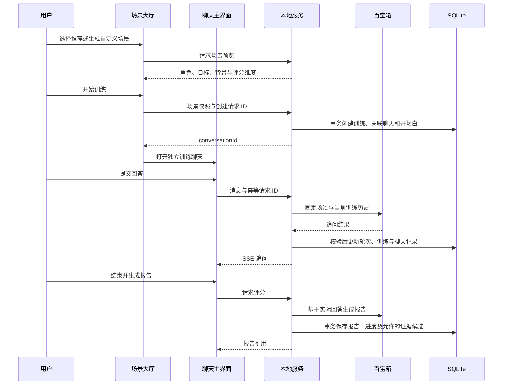

# CareerMate 技术架构

校准日期：2026-09-11。本文描述当前源码；百宝箱历史运行截图不能代表当前发布渠道状态。

## 运行形态

项目是 Next.js App Router 全栈应用，没有独立部署的前端和业务后端。React 页面通过 Route Handlers 调用服务，Prisma 访问 SQLite。数据库承担账号、画像、会话、计划、训练、候选与记忆的持久化；百宝箱提供模型、知识库、搜索和工作流编排。

`src/components/workspace.tsx` 按页面加载需要的业务模块。`AssistantProvider` 和 `src/lib/assistant-store.ts` 跨工作台页面共享聊天状态；主界面使用 `ChatHomePage`，浮动助手复用同一控制器。陪伴形象仅影响外观，不决定 AI 运行模式。

## 普通聊天与业务候选

1. 用户发送消息到 `/api/chat/conversations/:id/stream`，服务端验证登录、所有权和输入。
2. 聊天服务处理请求幂等、会话锁、消息保存和远端会话绑定，读取当前用户的画像、计划、记忆及历史。
3. V2 快照限制字段、数量与字节预算。默认 `question_prefix` 将业务上下文置于用户不可见的问题前缀；只有配置为 `business_data` 才使用该字段。
4. 百宝箱主 Agent 按任务选择知识库、联网搜索、子工作流、Skill 或子智能体。平台运行能力的具体选择受配置、发布版本与权限影响。
5. 正文通过 SSE 增量显示，`CAREERMATE_ARTIFACT` 信封被过滤，不直接显示给用户。解析器执行 JSON、Schema 和任务相关校验。
6. 需要确认的有效结果保存为 `AgentArtifactCandidate`；用户接受时再次校验所有权、状态和基准版本，并在事务内投影到正式数据。普通问答、补问信息及错误结果不应生成业务候选。

`UNKNOWN_EVENT` 等兼容性诊断不等于业务失败；`INVALID_WORKFLOW_INPUT`、`INVALID_ARTIFACT_SCHEMA` 则表示对应工作流或业务结果未通过校验。HTTP 200 或模型有文字输出不证明计划、画像已保存。

## 独立模拟训练

- `SimulationSession.conversationId` 是可空且唯一的关联，删除聊天不会级联删除训练。旧会话首次恢复时创建关联并导入原始问答；软删除聊天可从训练大厅恢复。
- 创建请求通过 `(userId, creationRequestId)` 去重。训练回答经聊天入口按数据库关联路由，复用 `src/lib/simulation/messages-service.ts`，不会同时调用普通聊天和模拟模型。
- 场景快照和训练 transcript 以训练记录为准，聊天消息是持久化显示记录。回答保存与消息同步在同一事务中进行；稳定的消息标识支持重放。
- 回答与评分共享会话互斥锁；有效轮次默认最多 6，至少 3 轮才能评分。关联聊天的真实 API 追问失败不计入轮次，用户可重试。
- 评分复用 `complete-service.ts`，校验场景和结构，并筛除不能在实际回答中支持的证据。降级评分带来源标记，不据此生成正式能力候选。
- 完成后按普通聊天处理报告讨论，附带已完成报告和历史上下文；不继续计轮或重新评分。再次训练创建新的独立会话。

## 计划、学习与资源

`CareerPlan` 保存版本化职业计划，`LearningRoute` 保存学习路线；任务统一映射后供概览、路径和资源关联使用。更新任务仍需校验计划归属、当前版本和允许状态。`ResourceItem`、岗位样本和模板提供学习/岗位上下文；导入脚本支持 dry-run，不把本地原始招聘材料或私人资料作为公开仓库内容。

## 数据与安全边界

| 领域 | 主要模型 |
|---|---|
| 身份与画像 | User、UserProfile、AuthSession、OnboardingConversation |
| 会话与幂等 | ChatConversation、ChatMessage、OperationExecution、QuestionLedger |
| 成长 | CareerPlan、LearningRoute、ProgressLog、AbilityEvidence |
| 训练 | SimulationSession，与 ChatConversation 可选一对一关联 |
| 候选与记忆 | AgentArtifactCandidate、ProfileUpdateCandidate、MemoryItem |
| 内容 | ResourceItem、JobSample、RoleTemplate、RoleDraft、CareerExplorationReport |

密码使用 bcrypt，登录态由 httpOnly Cookie 和数据库中的 token hash 验证。业务查询绑定当前用户；管理员接口单独检查角色。复杂字段以 JSON 字符串保存，通过 DTO 和 Zod 契约转换。用户确认用于正式画像、计划、路线和候选证据投影；训练过程、会话及报告可由对应业务服务保存，不能笼统说“AI 结果完全不写数据库”。

平台长期记忆不是 `MemoryItem`。本地隐私导出与清空也不代表清理远端百宝箱数据。配置、数据库和个人原始资料不入 Git；公开文档不记录真实凭据。

## 运维与验证

依赖与命令以 `package.json`、锁文件和 `.env.example` 为准。升级先备份数据库，再执行已有迁移；禁止用 seed 替代迁移。生产运行需要持久化 SQLite 文件与可写目录，多实例部署前需单独设计数据库与并发策略。

`npm run verify` 覆盖扫描、lint、类型、单元/集成测试、迁移和构建。Playwright 使用独立 E2E 数据库验证基础 Mock 与 V2 Mock。真实百宝箱验证需确认 API 渠道上架版本、三个输入字段绑定、模型输出及业务候选状态，不能把 Mock 成功写为真实链路成功。

兼容入口 `/api/tbox/*`、`/api/mcp/*` 仍存在，未作为废弃文件删除；产品普通聊天与训练以当前主入口为准。

### Mock 验收口径

基础 Mock 的旧操作协议支持模拟画像/计划候选。当前 V2 普通聊天 Mock 只返回演示正文，不合成 ArtifactV1，因此其浏览器用例验证无意外业务写入；V2 候选生成、确认、版本冲突和投影由真实 SQLite 契约集成测试覆盖。不得把两个 Mock 的行为等同，或将它们描述为真实平台候选联调。
