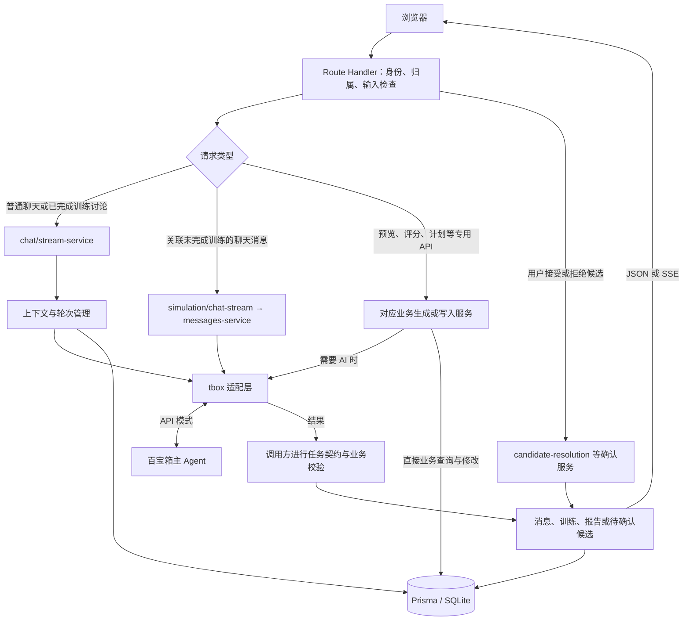
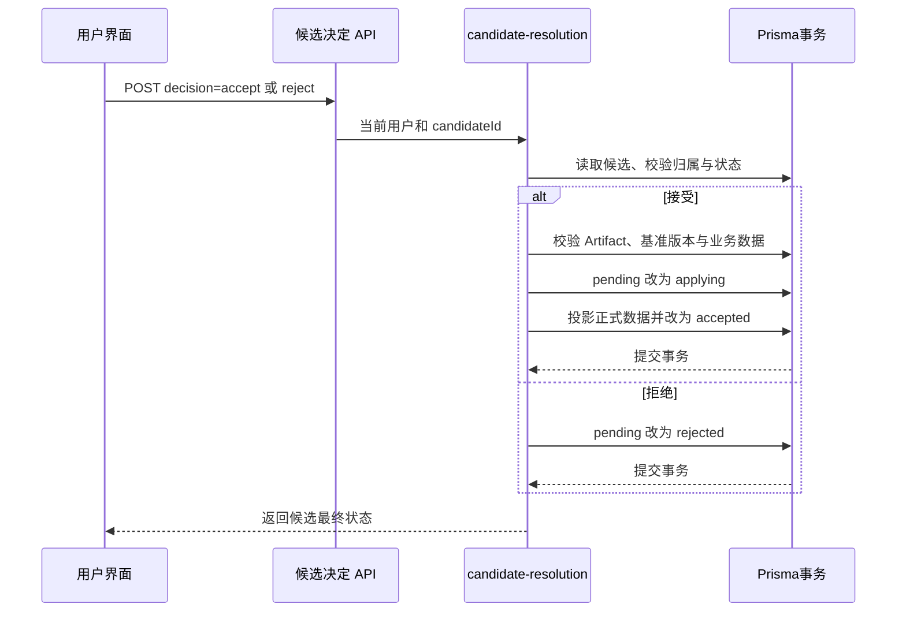
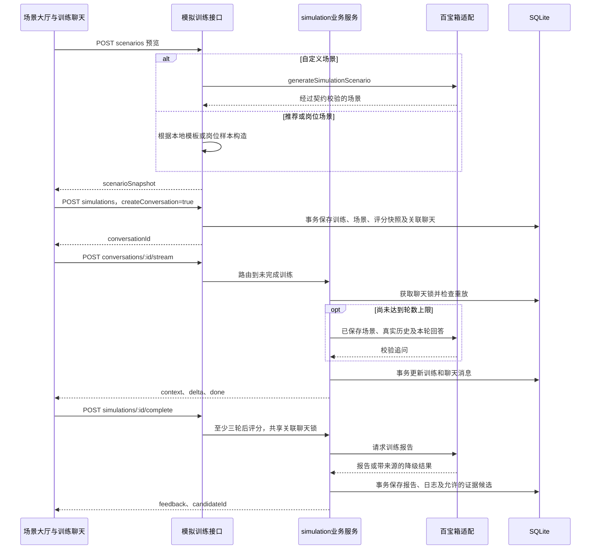
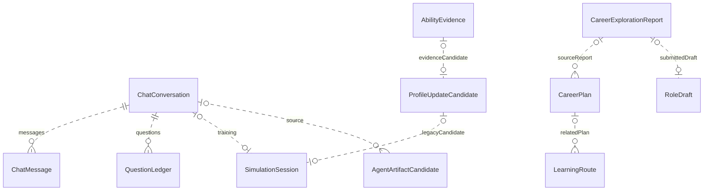

# CareerMate 技术架构

校准日期：2026-10-01。依据当前路由、业务服务、Prisma Schema、锁文件、平台契约与测试源码描述实现，不将历史测试结果或平台日志作为当前部署证明。产品模块见 [项目架构](项目架构文档.md)。

## 运行形态与源码分层

项目使用 Next.js App Router，服务端页面守卫和 Route Handlers 与前端同仓、同应用部署。Node.js 服务通过 Prisma Client 读写 SQLite；模型调用发生在服务端，浏览器不持有百宝箱 API Key。

| 层 | 主要源码 | 实际职责 |
|---|---|---|
| 页面和守卫 | `src/app/**/page.tsx`、`src/components/workspace-page.tsx` | 登录、引导和管理员访问判断 |
| 公开介绍与登录 | `src/components/careermate-landing/`、`careermate-login/`、`marketing/`、`brand-mark.tsx` | 当前公开页面、本地演示、真实鉴权表单、共享插画动效与品牌标识 |
| 共享外壳 | `src/app/layout.tsx`、`src/components/chat/`、`src/components/shell/` | AssistantProvider、浮动助手、陪伴形象与侧栏 |
| 业务视图 | `src/features/`、`src/components/workspace.tsx` | 画像、概览、路径、资源、训练、记忆、设置与管理 |
| 客户端状态 | `src/hooks/`、`src/lib/assistant-store.ts`、`src/lib/client-api.ts` | 聊天状态、SSE、模块数据加载和局部刷新 |
| HTTP 边界 | `src/app/api/**/route.ts` | 身份、参数与所有权检查，JSON/SSE/JSON-RPC 响应 |
| 业务层 | `src/lib/chat/`、`simulation/`、`plans/`、`profile/`、`agentic-v2/` 等 | 会话轮次、生成、候选、确认与事务写入 |
| AI 适配 | `src/lib/tbox/` | 请求构建、上游 SSE、结果归一化、检索与模式降级 |
| 数据层 | `src/lib/prisma.ts`、`prisma/schema.prisma`、`src/lib/dto.ts` | Prisma 单例、模型与 JSON 字符串到 DTO 的转换 |
| 百宝箱配置与 Skill 源码 | `src/agentic-v2/` | 待导出并在平台配置的提示词、工作流、知识库，以及本地也会调用的 Skill 核心函数与评测集 |

当前 [package-lock.json](../package-lock.json) 锁定 Next.js 16.3.3、React 19.2.7、TypeScript 5.9.3、Prisma/Client 6.19.3、Zod 3.25.76、Tailwind CSS 4.3.2、GSAP 3.15.0；[package.json](../package.json) 要求 Node.js 22 或 24，其依赖范围声明与实际锁定版本不是同一个概念。开发和生产构建脚本均显式使用 Webpack。

工作台先请求 `/api/me`，再按 `view-modules.ts` 加载共享的计划及候选模块与当前页模块。这里是**数据请求按需加载**，`workspace.tsx` 对业务视图仍使用静态 import。`/chat` 使用独立聊天主界面，与浮动助手共用 Provider/控制器，而不是通过 Workspace 渲染。

## 页面入口、画像与公开演示

| 请求或入口 | 当前处理 |
|---|---|
| 未登录 `GET /` | 渲染新 `careermate-landing/LandingPage` 介绍页 |
| 已登录 `GET /` | `homeDestination` 按 `onboardingCompleted` 跳转 `/chat` 或 `/onboarding` |
| `GET /login` | 未登录渲染新 `careermate-login/LoginForm`；已登录跳回 `/` |
| `GET /onboarding` | 始终重定向 `/chat?intent=profile`；随后由聊天页检查登录身份 |
| `GET /chat?intent=profile` | 未完成画像使用 `ProfileOnboardingChat`；已完成画像进入普通聊天的画像补充入口 |
| `GET /chat?intent=onboarding` | 强制恢复兼容首次画像对话流程；正式保存仍受服务端完成条件约束 |
| 其他工作台页面 | `WorkspacePage` 检查登录及画像完成状态；`/admin` 另检查管理员身份 |

首次画像仍调用 `/api/onboarding/chat` 与 `/api/onboarding/complete`，沿用草稿恢复；界面由用户点击确认保存，完成接口检查会话归属、活动状态、草稿 Schema 和完整度至少 80%。`/onboarding` 已不直接渲染旧工作台引导组件。`OPEN_CHAT_ENTRY` 虽仍保留于配置与辅助函数中，当前页面守卫没有调用该函数，设为 `false` 不会把入口切回旧引导。

介绍页的工作台卡片与训练播放只是本地页面演示，没有调用真实业务 API。登录注册表单沿用原鉴权接口：注册成功先到 `/`；登录成功按接口返回的 `/` 或 `/onboarding` 跳转，再由页面守卫继续路由。公开页共用 `GrowthScene` 和 `initMarketingMotion`，默认完整装饰动效并尊重系统减少动态偏好；工作台与公开页的四瓣标识共用 `BrandMark`。当前入口不引用旧 `src/components/landing-page.tsx`、`src/components/login-form.tsx`。

上述分支见 [page.tsx](../src/app/page.tsx)、[onboarding-routing.ts](../src/lib/onboarding-routing.ts)、[chat-home.tsx](../src/components/chat/chat-home.tsx) 和 [profile-onboarding-chat.tsx](../src/components/chat/profile-onboarding-chat.tsx)。

## 主请求分支

```mermaid
flowchart TB
  Browser["浏览器"] --> Routes["Route Handler：身份、归属、输入检查"]
  Routes --> Kind{"请求类型"}
  Kind -->|"普通聊天或已完成训练讨论"| Chat["chat/stream-service"]
  Kind -->|"关联未完成训练的聊天消息"| Training["simulation/chat-stream → messages-service"]
  Kind -->|"预览、评分、计划等专用 API"| Business["对应业务生成或写入服务"]
  Chat --> Context["上下文与轮次管理"]
  Context --> Adapter["tbox 适配层"]
  Training --> Adapter
  Business -->|"需要 AI 时"| Adapter
  Adapter <-->|"API 模式"| Tbox["百宝箱主 Agent"]
  Adapter -->|"结果"| Validate["调用方进行任务契约与业务校验"]
  Validate --> Store["消息、训练、报告或待确认候选"]
  Routes -->|"用户接受或拒绝候选"| Resolve["candidate-resolution 等确认服务"]
  Resolve --> Store
  Context --> DB[("Prisma / SQLite")]
  Store --> DB
  Business -->|"直接业务查询与修改"| DB
  Store -->|"JSON 或 SSE"| Browser
```

图中的 `Validate` 和 `Store` 是各服务内部处理步骤，不是单独部署的服务。普通聊天可以只有正文，推荐场景预览等分支可以完全本地完成。MCP 保留入口不在这条主产品调用链中。

## 普通聊天的轮次与 V2 数据流

1. `POST /api/chat/conversations/:id/stream` 读取当前用户并检查会话归属，以数据库中的训练关联决定走哪个服务；客户端 `interaction` 不能替代训练归属。
2. `STATEFUL_CHAT_TURNS=true` 时由 `turn-service.ts` 在短事务内取得会话轮次，记录用户消息及助手占位，处理 `(conversationId, clientRequestId, role)` 幂等。已有完成结果可以重放，同一会话的并发轮次受锁约束。流处理每两秒尝试保存已显示正文并续租会话锁；Route Handler 通过 Next.js `after()` 保持已接受的普通聊天工作在响应断开后继续处理。关闭开关仍保留 legacy 流程，两者不能混称同一实现。
3. 普通 V2 聊天通过 `agentic-v2-snapshot.ts` 读取用户画像、已确认能力证据、活动计划和路线、近期进度、最近完成的训练、开启记忆时的确认记忆、会话摘要及关联训练报告上下文，并按字段与数量裁剪。`historySnapshot` 不等于完整普通聊天逐条历史。`agentic-v2-platform-context.ts` 构建任务上下文及证据包，`verified-analysis.ts` 直接调用仓库内两个 Skill 核心函数计算证据/成长摘要；其成长输入是活动计划和近期记录，不是全部历史计划或完整历史分数序列。
4. `buildAgenticV2BusinessData` 生成业务对象，包含 `profileSnapshot`、`historySnapshot`、`simulationState`、`interaction`、权限及可选任务/证据字段；加载结果还提供 `contextCoverage`，标注纳入、裁剪和缺失项目。它不签发 MCP token。内部协议为 `BusinessDataV1.schemaVersion="1"`，Artifact 的版本则为 `"1.0"`。
5. 快照加载器先将返回对象控制在 **49,152 个 UTF-8 字节**内，逐级缩减后仍超限则抛出 `SNAPSHOT_TOO_LARGE`。默认有状态 `question_prefix` 分支再把业务对象附于问题前，另有 **24,000 个字符的业务 JSON 预算**，不包含额外提示语和用户问题，也不是整个请求上限。先裁剪对象、数组与字符串，再序列化；仍超限时抛出 `ContextBudgetError`，不截断出半个 JSON。有状态普通 V2 的非前缀分支通过 `context` 交给客户端编码为字符串 `business_data`，不传 provider history；关闭轮次服务的 legacy V2 分支直接使用 `context` 传输，未套用这一前缀构建。
6. V2 关闭主请求内置搜索与旧 hybrid 预检索，由平台提示词按需选择研究员。远端会话 ID 需匹配本地绑定的 Agent ID/版本；有状态 V2 会尝试复用有效绑定，即使通用 `TBOX_REUSE_REMOTE_CONVERSATION_ID=false`，也不能描述为“一律不复用”。
7. 上游文字经 `artifact-stream-filter.ts` 过滤，信封外安全正文通过 SSE 增量显示；完整回复再由信封/任务 Schema 解析。过滤器和严格校验是两步，单有文字回复不说明候选有效。
8. 只有满足任务映射且 `status=pending_confirmation`、`requiresUserConfirmation=true` 的结果进入 `AgentArtifactCandidate`。随后完成聊天轮次，保存正文、引用、执行元信息与候选部件。长模型调用不放进数据库事务；候选摄入和聊天完成也不应声称是一个总事务。

SSE 的正常结束以 `done` 为准，错误使用 `error`，等待时有 `heartbeat`；流开始前的鉴权/输入错误仍可能是 JSON HTTP 错误。普通 V2 快照加载失败分支返回 502 `{error:{code,message}}`，并不经过统一 `fail()` 包装。

## 候选确认与投影

```mermaid
sequenceDiagram
  participant U as 用户界面
  participant API as 候选决定 API
  participant R as candidate-resolution
  participant DB as Prisma事务
  U->>API: POST decision=accept 或 reject
  API->>R: 当前用户和 candidateId
  R->>DB: 读取候选、校验归属与状态
  alt 接受
    R->>DB: 校验 Artifact、基准版本与业务数据
    R->>DB: pending 改为 applying
    R->>DB: 投影正式数据并改为 accepted
    DB-->>R: 提交事务
  else 拒绝
    R->>DB: pending 改为 rejected
    DB-->>R: 提交事务
  end
  R-->>U: 返回候选最终状态
```

事务中任何一步失败会回滚。重复的相同决定可以返回已处理结果；冲突决定或过期版本需要重新处理，不能覆盖当前数据。

| 候选类型 | 投影目标 |
|---|---|
| `profile_patch`、`profile_assessment` | 允许的画像字段、画像版本；综合评估还可写已确认能力证据 |
| `ability_evidence` | `AbilityEvidence`；不能等同于直接替换全部能力分数 |
| `career_plan`、`growth_replan` | 新版 `CareerPlan`，旧活动计划失活；重规划保留父计划信息 |
| `learning_route` | `LearningRoute`，检查计划基准和路线基准、任务及每周预算 |
| `memory_item` | 记忆开启时写入已确认 `MemoryItem` |
| `career_template_draft` | 待管理员审核的 `RoleDraft` |

兼容路径仍有 `ProfileUpdateCandidate` 和状态为 `pending` 的 `CareerPlan` 计划候选；分别由对应的画像/计划服务处理。`pending_confirmation` 是 Artifact 信封状态，不能当成 `CareerPlan.status`。不是所有候选都存进 `AgentArtifactCandidate`。`PLAN_V2_WRITE` 控制旧聊天操作及兼容计划候选的 V2 写入分支，V2 Artifact 候选接受服务没有读取该开关，不能将它解释为所有 V2 正式计划写入的统一开关。

## 独立模拟训练

```mermaid
sequenceDiagram
  participant UI as 场景大厅与训练聊天
  participant API as 模拟训练接口
  participant S as simulation业务服务
  participant AI as 百宝箱适配
  participant DB as SQLite
  UI->>API: POST scenarios 预览
  alt 自定义场景
    API->>AI: generateSimulationScenario
    AI-->>API: 经过契约校验的场景
  else 推荐或岗位场景
    API->>API: 根据本地模板或岗位样本构造
  end
  API-->>UI: scenarioSnapshot
  UI->>API: POST simulations，createConversation=true
  API->>DB: 事务保存训练、场景、评分快照及关联聊天
  API-->>UI: conversationId
  UI->>API: POST conversations/:id/stream
  API->>S: 路由到未完成训练
  S->>DB: 获取聊天锁并检查重放
  opt 尚未达到轮数上限
    S->>AI: 已保存场景、真实历史及本轮回答
    AI-->>S: 校验追问
  end
  S->>DB: 事务更新训练和聊天消息
  S-->>UI: context、delta、done
  UI->>API: POST simulations/:id/complete
  API->>S: 至少三轮后评分，共享关联聊天锁
  S->>AI: 请求训练报告
  AI-->>S: 报告或带来源的降级结果
  S->>DB: 事务保存报告、日志及允许的证据候选
  S-->>UI: feedback、candidateId
```

- 场景预览不创建训练。开始时保存 `scenarioSnapshot`、`scoringSnapshot` 和开场白，不重新调用模型生成开场白；`roundLimit` 可为 3–6，默认 6。提供 `requestId` 的创建请求通过 `(userId, creationRequestId)` 去重。
- `SimulationSession.conversationId` 可空且唯一，物理删除聊天时设空，不级联删除训练。旧训练恢复会创建/恢复聊天并按稳定消息标识导入 transcript。
- transcript 和 `turnCount` 是训练事实源，ChatMessage 是显示记录。关联聊天回答与评分共享 `activeTurnId` 互斥锁；兼容直接消息 API 使用版本条件更新，不应宣称每个入口都取得同一个锁。
- 消息服务只接受 5–4000 字符的有效回答，每次计一轮。最后一轮到达上限时使用本地结束提示，不再调用模型追问。未到上限且关联聊天的 API 追问降级/无效时返回失败，不计入进度。
- 训练 SSE 在模型等待期间发心跳，保存后一次发送完整追问 `delta`；它不是逐 token 的训练模型转发，心跳可能早于 `context`。
- 完成服务校验报告与场景，按用户实际回答匹配支持证据；非降级且有受支持的更新才派生能力证据候选。V2 候选 ID 存在 `feedback.artifactCandidateId`；旧 `candidateId` 外键仍指向 `ProfileUpdateCandidate`。
- 完成后在原聊天讨论报告时走普通聊天，附带报告上下文，不再计轮或重复评分。

训练的专用生成、追问和评分通过 [generation.ts](../src/lib/simulation/generation.ts) 实现；API 模式直接使用 `CAREERMATE_ARTIFACT` 信封及训练契约，与普通聊天的 `CAREERMATE_AGENTIC_V2` 分支开关分开。关联聊天锁与保存链路见 [chat-stream.ts](../src/lib/simulation/chat-stream.ts)、[messages-service.ts](../src/lib/simulation/messages-service.ts) 和 [complete-service.ts](../src/lib/simulation/complete-service.ts)。

专用追问和评分向平台发送精简的训练状态、权限、历史及问题中的固定场景，不自动携带普通 V2 聊天的完整 `taskContext` / `evidenceBundle` 或三个工作流开始输入；自定义场景生成才显式构建这组三输入契约。本地输出校验不能证明平台已经补齐工作流输入或实际执行了相应代码节点，仍需平台联调记录。

## 数据结构与关系

当前 Schema 有 22 个模型。大部分数组/复杂对象用 SQLite `String` 保存 JSON，由 DTO 与 Zod 在边界解析。任务、报告反馈和部分关联引用不是独立关系表。

用户与画像为一对零或一，用户与登录会话、聊天、计划、路线、训练、候选、记忆及能力证据等为一对多。下图聚焦业务对象之间的真实外键子集：`o|` 表示零或一，`o{` 表示零或多，父端的 `||` 表示子记录必须具有一个父记录；虚线表示非标识关系，子记录使用自己的主键。

```mermaid
erDiagram
  ChatConversation ||..o{ ChatMessage : messages
  ChatConversation ||..o{ QuestionLedger : questions
  ChatConversation o|..o| SimulationSession : training
  ChatConversation o|..o{ AgentArtifactCandidate : source
  CareerPlan o|..o{ LearningRoute : relatedPlan
  ProfileUpdateCandidate o|..o| SimulationSession : legacyCandidate
  AbilityEvidence o|..o| ProfileUpdateCandidate : evidenceCandidate
  CareerExplorationReport o|..o{ CareerPlan : sourceReport
  CareerExplorationReport o|..o| RoleDraft : submittedDraft
```

`OperationExecution.userId/conversationId`、`CareerPlan.parentPlanId`、`ProgressLog.relatedPlanId/relatedTaskId`、`MemoryItem.sourceConversationId/sourceMessageId` 是标识字段，Schema 没有相应外键，故图中不虚构关系。`ResourceItem`、`JobSample`、`RoleTemplate` 和 `ManualAiSample` 为独立内容模型；另有引导、探索报告和草稿审核关系，完整定义以 [schema.prisma](../prisma/schema.prisma) 为准。

关键唯一约束包括用户下的计划/路线版本、会话内消息请求 ID 与角色、候选的用户/来源会话/幂等键，以及成长日志的用户/去重键。它们与业务条件更新共同工作，不能仅凭前端按钮禁用保证幂等。

成长概览的雷达图和成长参考分来自已保存 `UserProfile.abilityScores` 与岗位权重。接受 `ability_evidence` 候选只新增已确认 `AbilityEvidence`，不会直接改写画像全部能力分；画像综合评估才有相应分数字段投影。雷达图对缺失或无效分数保留“待评估”，只有全部维度已评估时闭合为多边形。参见 [dashboard/model.ts](../src/lib/dashboard/model.ts)、[dashboard/radar.ts](../src/lib/dashboard/radar.ts) 与 [candidate-resolution.ts](../src/lib/agentic-v2/candidate-resolution.ts)。

## 鉴权、隐私与集成边界

密码使用 bcryptjs。登录生成 32 字节随机 token，数据库只保存 SHA-256 hash；Cookie 为 `careermate_session`，有效期七天，`httpOnly`、`sameSite=lax`，生产设置 `secure`。受保护页面和各 API 各自检查身份；没有统一认证中间件替代逐路由检查。管理员接口另查 `role=admin`。

数据导出通过 `buildPrivacyExport` 排除用户密码 hash，返回对象不含 `AuthSession` 及会话 token。`DELETE /api/privacy/account-data` 以 `CLEAR_MY_DATA` 确认词清空成长数据并重置画像，保留账号；它不是注销账号，也不调用百宝箱删除平台数据。

MCP V2 的外层 Bearer、Origin 与协议校验见 `mcp-v2-handler.ts`，工具参数还需短时签名 `context_token`，据此确定用户、会话和 scope。主 V2 快照链路没有调用该签发流程。旧 MCP 使用静态插件 token 和服务器端用户绑定，不能与 Cookie 登录或 V2 token 混用。

## 运行与验证

环境变量见 [.env.example](../.env.example) 和 `src/lib/env.ts`。普通聊天、结构化生成和训练有各自的降级规则，统一记录 `requestedMode`、`actualMode`、`degraded`、`fallbackReason`、`source`。不能把 HTTP 200、模型正文、Mock 完成与正式业务成功等同。

生产服务需要可写且持久化的 SQLite 文件，数据库迁移使用版本化 SQL。开发用 `npm run seed` 会重建目标数据库：非 E2E 的生产环境禁止执行，E2E 模式还要求目标文件名为 `e2e.db` 或 `e2e-test.db`；普通开发环境不限制数据库文件名。评委启动器运行的是独立 `prisma/review-seed.ts`，只对无账号的评委库初始化体验账号和计划；每次启动都由 `prisma/review-catalog.ts` 增量补齐公共学习/岗位目录，按唯一键仅新增缺失条目，保留已有编辑和成长记录，两者不可混用。

跨系统入口 `start.sh`、`start.command`、`start.bat` 汇合到 `scripts/launch-review.mjs`。共用启动器强制使用 `file:./review.db`（相对 Prisma 目录），安装锁定依赖、生成 Client、部署迁移、初始化空库账号并增量补齐公共目录、构建并监听 `127.0.0.1`；指纹未变且文件齐备时复用依赖和构建。个人开发库、依赖与构建产物不进入源码评委包。交付说明见 [scripts/submission/README.md](../scripts/submission/README.md)。单应用不等于已经具备多实例写入或弹性扩容能力，仓库没有实现分布式队列和锁服务。

`npm run verify` 执行密钥扫描、lint、类型、Vitest、迁移烟测、评委初始化烟测与生产构建。`npm run test:e2e` 和 `test:e2e:v2` 分别验证基础 Mock 和 V2 Mock，E2E 服务使用独立 `e2e.db`。候选矩阵、上下文、平台代码节点、并发及训练恢复有对应源码测试；实际执行结果按执行时的命令输出判断，不写死历史通过数量。本次文档校准核对源码和文档链接，未据此重新宣称构建、E2E 或真实平台测试已通过。百宝箱部署、工具实际执行和生成质量仍需真实环境验证。
