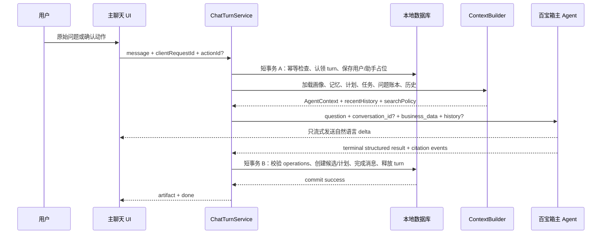

# CareerMate 开放式主聊天与混合记忆实施计划

> **For agentic workers:** REQUIRED SUB-SKILL: Use `superpowers:executing-plans` to implement this plan task-by-task. Steps use checkbox (`- [ ]`) syntax for tracking.

**Goal:** 将 CareerMate 从“三职业 onboarding + 远端会话 ID 维持上下文”的演示形态，升级为以百宝箱主 Agent 为唯一智能生成来源、以本地数据库为权威状态源、支持任意职业、可恢复上下文、确认式画像/记忆/规划写入的开放式主聊天。

**Architecture:** 百宝箱主 Agent 负责理解、推理、职业调研、自然语言回答和专业规划内容；本地 Next.js 应用负责会话状态、画像、长期记忆、问题账本、数据协议校验、确认策略、持久化、引用真实性和 UI。每轮请求都以本地状态重建隐藏上下文，`conversation_id` 只作为百宝箱的短期连续性缓存，不能作为唯一记忆来源。

**Tech Stack:** Next.js 16 App Router、React 19、TypeScript 5.9、Prisma 6、SQLite、Zod 3、Vitest 3、Playwright 1.61、百宝箱 Agent/OpenAPI/知识库/联网搜索。

---

## 0. 执行边界与基线

### 0.1 当前基线

- 计划基于分支 `Xiaoxiao/careermate-p0-init`、提交 `76a8365` 编写。
- 当前同类文档位于 `docs/tbox/`。提交 `813a85f` 已明确删除 `docs/superpowers/`，不要重新创建该目录。
- 当前主聊天入口是 `src/app/page.tsx` → `src/components/chat/chat-home.tsx` → `/api/chat/conversations/[id]/stream`。
- `src/features/chat/chat-view.tsx` → `/api/tbox/chat/stream` 是旧链路，不能继续绕过新状态层。
- 上一次审查中 `npm.cmd run verify` 通过；Claude 开始实施前仍必须在当前树上重新运行基线，不得复用旧结果。

### 0.2 不可违反的约束

1. 只能使用百宝箱 Agent/API/知识库/联网搜索，不接 GPT、Claude、Gemini、DeepSeek 或其他模型/搜索 API。
2. 不把百宝箱逻辑替换成本地职业内容模板；本地只统一协议和状态，不统一不同职业的专业内容。
3. 不读取、打印或提交 `.env.local` 的密钥值。
4. 不把 `manual/mock` 输出描述成百宝箱真实生成。
5. 不把 `actualMode=api` 当成“搜索、知识库或工具一定执行过”的证据。
6. Agent 不能直接修改正式画像、长期记忆或 active plan；最终写入策略由本地代码决定。
7. 自然语言正文即使结构化结果失败也必须保留；结构化结果失败时零业务写入。
8. 不用 `as any`、`z.any()`、关闭 ESLint 或放松 Schema 来绕过协议错误。
9. 不删除旧计划列、`OnboardingConversation` 或 `onboardingCompleted`；本轮采用加法迁移和双读兼容。
10. 每个 Task 必须先 RED、再 GREEN、再单独提交；禁止 `git add .`。

### 0.3 目标调用链



核心原则：数据库最终提交成功之前，不向前端发送成功 `done`。

---

## 1. 文件结构规划

### 1.1 新建文件

| 文件 | 单一职责 |
|---|---|
| `src/lib/roles/identity.ts` | 任意职业名称规范化、别名解析、稳定 role key、资料覆盖等级 |
| `src/lib/roles/identity.test.ts` | DBA 别名、中文哈希碰撞、动态模板识别测试 |
| `src/lib/chat/agent-protocol.ts` | 版本化 AgentResponse、operation、question、sourceRef Zod 协议 |
| `src/lib/chat/agent-protocol.test.ts` | 终端结构校验、正文 JSON 零副作用、非法 operation 测试 |
| `src/lib/chat/conversation-state.ts` | `ChatConversation.state` 的解析、迁移和更新 |
| `src/lib/chat/conversation-state.test.ts` | currentTask、awaitingQuestion、quick action 状态测试 |
| `src/lib/chat/question-ledger.ts` | 问题规范键、asked/answered/skipped/obsolete 状态和重复拦截 |
| `src/lib/chat/question-ledger.test.ts` | 刷新、短回答、岗位版本变化后的问题行为 |
| `src/lib/chat/history.ts` | 本地完成消息 → 百宝箱 history/上下文历史的排序与裁剪 |
| `src/lib/chat/history.test.ts` | failed/streaming/current turn 过滤与字符预算测试 |
| `src/lib/chat/context-builder.ts` | 构建权威 AgentContext、最小上下文范围、搜索策略 |
| `src/lib/chat/context-builder.test.ts` | DBA、普通问题、隐私过滤、上下文裁剪测试 |
| `src/lib/chat/turn-service.ts` | claim → Agent → finalize/fail/replay 的轮次生命周期 |
| `src/lib/chat/turn-service.test.ts` | 幂等、会话锁、事务边界、失败释放和重放测试 |
| `src/lib/tbox/citations.ts` | 百宝箱 citation 事件归一化与 sourceRef 真实性绑定 |
| `src/lib/tbox/citations.test.ts` | 真实 URL、知识库来源、伪造 URL 降级测试 |
| `src/lib/profile/profile-patch.ts` | 原子画像 patch Schema，尤其是目标岗位 key/label 成对更新 |
| `src/lib/profile/profile-mutation-service.ts` | 自动写入与候选确认的本地策略 |
| `src/lib/profile/profile-mutation-service.test.ts` | 空字段、冲突、推断、版本冲突、原子更新测试 |
| `src/lib/memory/proposal-service.ts` | 长期记忆提议、确认、拒绝和上下文失效 |
| `src/lib/memory/proposal-service.test.ts` | 明确“记住”、敏感内容、普通问答和禁用记忆测试 |
| `src/lib/plans/schema-v2.ts` | 灵活周期、灵活阶段的 Plan V2 领域 Schema |
| `src/lib/plans/schema-v2.test.ts` | 8 周/6 月/3 年计划、阶段数、重复 ID 测试 |
| `src/lib/plans/compatibility.ts` | CareerPlan V1/V2 双读与任务状态更新 |
| `src/lib/plans/compatibility.test.ts` | 旧 36 月计划和新 V2 计划兼容测试 |
| `src/components/chat/memory-proposal-card.tsx` | 记忆确认、编辑后确认、忽略 |
| `src/components/chat/quick-actions.tsx` | 持久化快捷动作按钮与已处理状态 |
| `src/app/api/memory/[id]/decision/route.ts` | 记忆提议 decision API |
| `src/app/api/plans/[planId]/decision/route.ts` | 计划 accept/reject API |
| `scripts/tbox-chat-contract-probe.ts` | 脱敏验证百宝箱 history/business_data/结构结果/搜索/citation |
| `e2e/chat-context-continuity.spec.ts` | DBA 全对话、刷新恢复、普通问题和确认 E2E |

### 1.2 重点修改文件

- `prisma/schema.prisma` 与两个新增迁移。
- `src/lib/profile-defaults.ts`、`src/lib/dto.ts`、`src/lib/types.ts`。
- `src/app/page.tsx`、`src/components/workspace-page.tsx`、注册与清空数据路由。
- `src/lib/onboarding.ts` 与 onboarding 两个 API 路由，仅保留为可选引导兼容层。
- `src/lib/chat/{schemas,repository,service,server,context,stream-service,artifact-service,persistence,artifacts}.ts`。
- `src/lib/tbox/{types,client,streaming,sse,result,structured-result,capability-schemas,plan,fixtures}.ts`。
- `src/components/chat/{chat-home,chat-thread,message-parts,plan-summary-card,growth-profile-drawer}.tsx`。
- `src/features/path/path-view.tsx`、资源中心和职业探索服务。
- `docs/tbox/main-agent.md`、`docs/tbox/百宝箱配置清单.md`、`docs/tbox/acceptance-evidence.md`、`docs/evaluation/tbox-cases.md`、`.env.example`。

---

## Phase 0：先锁定真实百宝箱契约

### Task 1：重新建立自动化基线并记录禁止回归项

**Files:**
- Modify: `docs/tbox/acceptance-evidence.md`
- Test: existing full suite

- [ ] **Step 1: 检查工作树和当前提交**

```bat
git status --short --branch
git rev-parse --short HEAD
```

Expected：实施开始时没有 Claude 未知的改动；若存在用户改动，记录文件并避开，不得 reset。

- [ ] **Step 2: 运行完整本地基线**

```bat
npm.cmd run verify
npm.cmd run test:e2e
```

Expected：两条命令 exit code 0。任何失败先定位到当前基线，不得把它混进开放聊天改造。

- [ ] **Step 3: 记录当前已知缺口，而不是改写为“已通过”**

在 `docs/tbox/acceptance-evidence.md` 增加一个日期为 `2026-07-15` 的基线小节，明确记录：

```md
- 本地自动化：记录真实命令和结果。
- 真实百宝箱 history：未验证。
- 真实百宝箱 business_data：字段可发送，但语义未验证。
- 真实百宝箱联网搜索/citation：未验证。
- 当前产品请求：依赖 conversation_id，未发送本地 history/context。
```

- [ ] **Step 4: 提交基线证据**

```bat
git add docs/tbox/acceptance-evidence.md
git commit -m "docs: record open chat baseline"
```

### Task 2：建立脱敏的百宝箱在线契约探针

**Files:**
- Create: `scripts/tbox-chat-contract-probe.ts`
- Modify: `package.json`
- Modify: `src/lib/env.ts`
- Modify: `src/lib/env.test.ts`
- Modify: `src/lib/tbox/types.ts`
- Modify: `.env.example`
- Modify: `docs/tbox/acceptance-evidence.md`
- Test: `src/lib/tbox/client.test.ts`, `src/lib/tbox/sse.test.ts`, `src/lib/tbox/normalization.test.ts`

- [ ] **Step 1: 先为探针的脱敏报告写失败测试**

在 `src/lib/tbox/client.test.ts` 或独立的纯函数测试中断言报告只包含以下结构，不包含 prompt、Authorization 或完整 payload：

```ts
interface SafeProbeResult {
  name: string;
  status: "pass" | "fail" | "blocked";
  httpOk: boolean;
  actualMode: "api" | "manual" | "mock";
  eventNames: string[];
  hasConversationId: boolean;
  hasText: boolean;
  hasStructuredResult: boolean;
  citationCount: number;
  note: string;
}
```

Expected RED：当前没有探针与报告生成函数。

- [ ] **Step 2: 创建探针，固定使用一次性非个人数据**

探针必须覆盖以下矩阵：

| 名称 | 输入 | 成功标准 | 失败后的代码决策 |
|---|---|---|---|
| `basic_sse` | 普通 Markdown 问答 | API 模式、有正文、有终止事件 | 先修 SSE，不继续依赖结构结果 |
| `conversation_id` | 连续三轮 | 同一远端 ID，第三轮能引用第一轮代号 | 本地历史成为唯一恢复方式 |
| `history` | 新远端会话，只通过 history 传 `CM-HISTORY-731` | Agent 能复述代号 | 设置 `TBOX_HISTORY_MODE=context_only` |
| `business_data` | 隐藏 DBA/10 小时/实践偏好 | 回答正确使用但不泄露内部字段名 | 设置 `TBOX_CONTEXT_TRANSPORT=question_prefix` |
| `text_and_result` | 正文 + `agent_response` | 正文与 `variables.result` 同轮可得 | 若失败，第二次仍只调用同一个百宝箱 Agent 获取 operation JSON |
| `search_and_citation` | DBA 当前职责/变化 | 有工具记录、citation、HTTP(S) URL | 不显示“实时联网调研” |
| `invalid_conversation` | 伪造远端 ID | 得到可识别错误形态 | 只针对该形态执行一次本地重建重试 |
| `context_size` | 逐步增加非敏感上下文 | 记录平台上限或错误 | 将预算固定在通过值的 80% |

固定测试文本：

```text
历史探针：请记住一次性测试代号 CM-HISTORY-731，只用于本次契约测试。
上下文探针：目标岗位数据库运维（DBA），每周 10 小时，偏好动手实践。
联网探针：请调研 DBA 当前常见职责、入门技能和岗位变化，区分外部事实与 AI 推断。
```

探针必须使用 `probe-${Date.now()}` 作为 `user_id`，不得使用真实用户 ID。

- [ ] **Step 3: 增加显式脚本命令**

`package.json` 增加：

```json
"tbox:probe": "tsx scripts/tbox-chat-contract-probe.ts"
```

探针发现 `actualMode !== "api"` 时必须把该项记为 `blocked`，不能把 fallback 当成功。

- [ ] **Step 4: 运行探针和解析器测试**

```bat
set TBOX_MODE=api&& set TBOX_SEARCH_ENGINE=true&& npm.cmd run tbox:probe
npm.cmd run test -- src/lib/env.test.ts src/lib/tbox/client.test.ts src/lib/tbox/sse.test.ts src/lib/tbox/normalization.test.ts src/lib/tbox/result.test.ts src/lib/tbox/structured-result.test.ts
npm.cmd run secret:scan
```

Expected：探针生成安全摘要；每项为 pass/fail/blocked；测试与密钥扫描 exit code 0。

- [ ] **Step 5: 固定传输决策**

按探针结果在 `src/lib/env.ts`、`src/lib/tbox/types.ts` 和 `.env.example` 中增加且只允许以下值：

```env
TBOX_HISTORY_MODE="provider"
TBOX_CONTEXT_TRANSPORT="business_data"
TBOX_STRUCTURED_MODE="terminal"
```

分支规则：

- history 不通过：`TBOX_HISTORY_MODE="context_only"`，最近消息仍放入 `business_data.recentMessages`。
- business_data 不通过：`TBOX_CONTEXT_TRANSPORT="question_prefix"`，服务端使用用户不可见的上下文前缀，数据库仍只保存原始用户问题。
- 同轮结构结果不通过但第二次百宝箱结构调用通过：`TBOX_STRUCTURED_MODE="followup"`。
- 两种结构方式都不通过：保留正文、零业务写入，并把结构化能力标记 blocked。

- [ ] **Step 6: 提交探针与真实契约摘要**

```bat
git add scripts/tbox-chat-contract-probe.ts package.json .env.example docs/tbox/acceptance-evidence.md src/lib/env.ts src/lib/env.test.ts src/lib/tbox
git commit -m "test: lock tbox open chat contract"
```

---

## Phase 1：开放入口、真实空画像与任意职业

### Task 3：定义版本化 Agent、会话状态与 Plan V2 领域协议

**Files:**
- Create: `src/lib/chat/agent-protocol.ts`
- Create: `src/lib/chat/agent-protocol.test.ts`
- Create: `src/lib/chat/conversation-state.ts`
- Create: `src/lib/chat/conversation-state.test.ts`
- Create: `src/lib/plans/schema-v2.ts`
- Create: `src/lib/plans/schema-v2.test.ts`

- [ ] **Step 1: 写协议失败测试**

测试必须先覆盖：

```ts
expect(agentResponseSchema.safeParse({ schemaVersion: 1, intent: "general", operations: [], questions: [] }).success).toBe(true);
expect(agentResponseSchema.safeParse({ schemaVersion: 1, operations: [{ type: "profile_patch", field: "passwordHash" }] }).success).toBe(false);
expect(aiCareerPlanV2Schema.safeParse(eightWeekDbaPlan).success).toBe(true);
expect(aiCareerPlanV2Schema.safeParse(threeYearFivePhasePlan).success).toBe(true);
expect(aiCareerPlanV2Schema.safeParse(planWithDuplicateActionIds).success).toBe(false);
```

Expected RED：对应 Schema 尚不存在。

- [ ] **Step 2: 定义会话状态，不创建独立 Task 表**

`conversation-state.ts` 对外类型固定为：

```ts
export interface QuickAction {
  id: string;
  label: string;
  value: string;
}

export interface AwaitingQuestion {
  id: string;
  normalizedKey: string;
  text: string;
  profileField?: "educationStage" | "major" | "targetRole" | "weeklyAvailableHours" | "learningPreference" | "experienceSummary" | "constraints";
  answerKind: "free_text" | "number" | "single_choice" | "confirmation";
  actions: QuickAction[];
  askedAt: string;
}

export interface ConversationTask {
  kind: "idle" | "profile_guidance" | "career_research" | "plan_generation" | "plan_revision" | "general";
  status: "idle" | "collecting" | "ready" | "waiting_confirmation" | "completed";
  goal?: string;
  answers: Record<string, string>;
}

export interface ConversationState {
  schemaVersion: 1;
  currentTask: ConversationTask;
  awaitingQuestion: AwaitingQuestion | null;
}
```

解析损坏 JSON 时回退到 `idle`，不能抛错导致聊天不可用。

- [ ] **Step 3: 定义灵活 Plan V2**

`schema-v2.ts` 必须实现以下领域结构：

```ts
export interface PlanDuration {
  value: number;
  unit: "day" | "week" | "month" | "year";
}

export interface PlanActionV2 {
  id: string;
  title: string;
  description: string;
  type: "learning" | "practice" | "project" | "review" | "application";
  status: "not_started" | "in_progress" | "done" | "delayed";
  estimatedHours?: number;
  cadence?: string;
  resources: string[];
}

export interface PlanPhaseV2 {
  id: string;
  title: string;
  objective: string;
  duration: PlanDuration;
  skills: string[];
  actions: PlanActionV2[];
  outputs: string[];
  evaluationCriteria: string[];
  risks: string[];
}

export interface AiCareerPlanV2 {
  schemaVersion: 2;
  title: string;
  targetRole: { key: string; label: string };
  summary: string;
  horizon: PlanDuration;
  phases: PlanPhaseV2[];
  immediateActions: PlanActionV2[];
  assumptions: string[];
  riskNotes: string[];
  evidenceRefs: string[];
}
```

Zod 只限制合法性和资源上限：`phases` 1–8、每阶段 actions 1–20、immediateActions 1–8、字符串长度和全局 action ID 唯一；不得固定 3/12/36。

- [ ] **Step 4: 定义 AgentResponse**

`agent-protocol.ts` 的终端结构固定为：

```ts
export interface AgentQuestion {
  id: string;
  normalizedKey: string;
  text: string;
  profileField?: AwaitingQuestion["profileField"];
  answerKind: AwaitingQuestion["answerKind"];
  actions: QuickAction[];
}

export type AgentOperation =
  | {
      id: string;
      type: "profile_patch";
      patch: Record<string, unknown>;
      sourceKind: "explicit" | "inferred";
      confidence: number;
      evidenceExcerpt: string;
      reason: string;
      sensitive: boolean;
    }
  | {
      id: string;
      type: "memory_proposal";
      content: string;
      kind: "career_fact" | "preference" | "constraint" | "goal";
      sourceKind: "explicit_remember" | "agent_proposal";
      confidence: number;
      reason: string;
      sensitive: boolean;
    }
  | { id: string; type: "plan_draft"; plan: AiCareerPlanV2 }
  | { id: string; type: "exploration_report"; report: unknown };

export interface AgentSourceRef {
  id: string;
  kind: "citation" | "ai_inference";
  citationIndex?: number;
  note?: string;
}

export interface AgentResponse {
  schemaVersion: 1;
  intent: "career_advice" | "career_research" | "profile_guidance" | "plan_generation" | "plan_revision" | "general" | "privacy";
  task: { kind: ConversationTask["kind"]; status: ConversationTask["status"]; goal?: string };
  questions: AgentQuestion[];
  operations: AgentOperation[];
  sourceRefs: AgentSourceRef[];
}
```

`questions` 最大 1 项。`exploration_report.report` 必须在联合 Schema 中接入现有严格报告 Schema，不能最终保留 `unknown`。

- [ ] **Step 5: 运行协议测试并提交**

```bat
npm.cmd run test -- src/lib/chat/agent-protocol.test.ts src/lib/chat/conversation-state.test.ts src/lib/plans/schema-v2.test.ts
npm.cmd run typecheck
git add src/lib/chat/agent-protocol.ts src/lib/chat/agent-protocol.test.ts src/lib/chat/conversation-state.ts src/lib/chat/conversation-state.test.ts src/lib/plans/schema-v2.ts src/lib/plans/schema-v2.test.ts
git commit -m "feat: define open chat domain contracts"
```

### Task 4：执行开放画像、会话状态和问题账本的加法迁移

**Files:**
- Modify: `prisma/schema.prisma`
- Create: `prisma/migrations/20260715100000_open_chat_state/migration.sql`
- Modify: `src/lib/chat/prisma-schema.test.ts`

- [ ] **Step 1: 先扩展 Prisma Schema 测试**

断言下列字段和唯一索引存在；运行后应 RED：

```text
UserProfile.version / introStatus / nullable core fields
RoleTemplate.aliases
ProfileUpdateCandidate.patch / baseProfileVersion / resolvedAt
MemoryItem.kind / scope / reason / sourceConversationId / sourceMessageId / expiresAt
ChatConversation.state / contextVersion / activeTurnId / activeTurnStartedAt / summary / lastSummarizedMessageId / remoteContextVersion
ChatMessage.turnId / clientRequestId
QuestionLedger unique(conversationId, normalizedQuestionKey, profileVersion)
```

- [ ] **Step 2: 修改 Prisma 模型**

核心字段必须为：

```prisma
model UserProfile {
  // 保留已有 id/userId/JSON 字段和关系
  educationStage       String?
  major                String?
  targetRole           String?
  targetRoleLabel      String?
  weeklyAvailableHours Int?
  version              Int      @default(1)
  introStatus          String   @default("not_started")
  onboardingCompleted  Boolean  @default(false)
}

model ChatConversation {
  // 保留已有字段
  state                   String   @default("{}")
  contextVersion          Int      @default(1)
  activeTurnId            String?
  activeTurnStartedAt     DateTime?
  summary                 String   @default("")
  lastSummarizedMessageId String?
  remoteContextVersion    Int?
  questionLedger          QuestionLedger[]
}

model ChatMessage {
  // 保留已有字段
  turnId          String?
  clientRequestId String?

  @@unique([conversationId, clientRequestId, role])
  @@index([conversationId, turnId])
}

model QuestionLedger {
  id                    String   @id @default(cuid())
  conversationId        String
  normalizedQuestionKey String
  profileVersion        Int
  questionText          String
  profileField          String?
  status                String
  answerSummary         String   @default("")
  askedAt               DateTime @default(now())
  answeredAt            DateTime?
  createdAt             DateTime @default(now())
  updatedAt             DateTime @updatedAt
  conversation          ChatConversation @relation(fields: [conversationId], references: [id], onDelete: Cascade)

  @@unique([conversationId, normalizedQuestionKey, profileVersion])
  @@index([conversationId, status])
}
```

同时增加：

```prisma
// RoleTemplate
aliases String @default("[]")

// ProfileUpdateCandidate
patch              String    @default("{}")
baseProfileVersion Int?
resolvedAt         DateTime?

// MemoryItem
kind                 String    @default("career_fact")
scope                String    @default("career")
confidence           Float?
reason               String    @default("")
sourceConversationId String?
sourceMessageId      String?
expiresAt            DateTime?
```

- [ ] **Step 3: 生成并检查 SQLite 迁移**

```bat
npx.cmd prisma migrate dev --name open_chat_state --create-only
```

如果 Prisma 生成的时间戳不同，保留生成时间戳，不手工伪造 migration history。检查迁移使用表重建来放宽 nullability，且没有删除历史用户、消息、计划和候选。

- [ ] **Step 4: 只清理完全匹配的注册假画像**

迁移 SQL 在新表就绪后执行以下等价条件；不得清理已完成 onboarding 或任一字段不同的用户：

```sql
UPDATE "UserProfile"
SET "educationStage" = NULL,
    "major" = NULL,
    "targetRole" = NULL,
    "targetRoleLabel" = NULL,
    "weeklyAvailableHours" = NULL,
    "learningPreference" = '[]',
    "experienceSummary" = '',
    "interestTags" = '[]',
    "abilityScores" = '{}',
    "introStatus" = 'not_started'
WHERE "onboardingCompleted" = 0
  AND "educationStage" = 'junior'
  AND "major" = ''
  AND "targetRole" = 'ai_product_manager'
  AND "targetRoleLabel" = 'AI 产品经理'
  AND "weeklyAvailableHours" = 5
  AND "learningPreference" = '["project","practice"]'
  AND "experienceSummary" = '新用户，等待 CareerMate 完成画像采集。'
  AND "interestTags" = '["AI 工具","职业探索"]'
  AND "constraints" = '[]'
  AND "abilityScores" = '{"aiTooling":45,"roleFoundation":35,"dataAnalysis":35,"businessProduct":40,"communication":45,"projectPractice":30}';
```

- [ ] **Step 5: 验证迁移并提交**

```bat
npm.cmd run prisma:generate
npm.cmd run test -- src/lib/chat/prisma-schema.test.ts
npm.cmd run test:migrations
npm.cmd run typecheck
git add prisma src/lib/chat/prisma-schema.test.ts
git commit -m "feat: persist open chat state and question ledger"
```

### Task 5：取消强制 onboarding 和注册假事实

**Files:**
- Create: `src/lib/profile-defaults.test.ts`
- Create: `src/lib/career.test.ts`
- Create: `src/lib/profile/completeness.ts`
- Create: `src/lib/profile/completeness.test.ts`
- Create: `src/app/api/auth/register/route.test.ts`
- Modify: `src/lib/profile-defaults.ts`
- Modify: `src/lib/types.ts`
- Modify: `src/lib/dto.ts`
- Modify: `src/lib/env.ts`
- Modify: `src/lib/env.test.ts`
- Modify: `.env.example`
- Modify: `src/app/api/auth/register/route.ts`
- Modify: `src/app/page.tsx`
- Modify: `src/components/workspace-page.tsx`
- Modify: `src/app/api/me/route.ts`
- Modify: `src/lib/career.ts`
- Modify: `src/components/workspace.tsx`
- Modify: `src/features/resources/resource-view.tsx`
- Modify: `src/lib/tbox/plan.ts`
- Modify: `src/lib/tbox/fixtures.ts`
- Modify: `src/lib/plans/generation-service.ts`
- Modify: `src/app/api/plans/generate/route.ts`
- Modify: `src/lib/chat/artifact-service.ts`
- Modify: `src/features/memory/memory-view.tsx`
- Test: corresponding route/unit tests

- [ ] **Step 1: 写空画像与直接进入聊天的失败测试**

测试必须断言：

```ts
expect(createIncompleteProfileDefaults()).toMatchObject({
  educationStage: null,
  targetRole: null,
  targetRoleLabel: null,
  weeklyAvailableHours: null,
  onboardingCompleted: false,
  introStatus: "not_started",
});
expect(registerResponse.data.nextPath).toBe("/");
expect(await calculateMatch(profileWithoutTargetRole)).toBeNull();
```

并为 `src/app/page.tsx`/路由行为增加：已登录、未 onboarding 用户不会重定向到 `/onboarding`。

- [ ] **Step 2: 将默认画像改为真实空值**

`createIncompleteProfileDefaults()` 返回：

```ts
return {
  educationStage: null,
  major: null,
  targetRole: null,
  targetRoleLabel: null,
  weeklyAvailableHours: null,
  learningPreference: toJson([]),
  experienceSummary: "",
  interestTags: toJson([]),
  constraints: toJson([]),
  onboardingCompleted: false,
  introStatus: "not_started",
  abilityScores: toJson({}),
};
```

同步把 `ProfileDto` 的四个核心字段改为可空，把 `abilityScores` 改为 `Partial<AbilityScores>`；所有 UI 必须显式显示“待补充”，不能用 AI 产品经理或 5 小时兜底。

为仍要求完整目标和时间的旧计划兼容代码增加类型守卫：

```ts
export type PlanReadyProfile = ProfileDto & {
  targetRole: string;
  targetRoleLabel: string;
  weeklyAvailableHours: number;
};

export function isPlanReadyProfile(profile: ProfileDto): profile is PlanReadyProfile {
  return Boolean(
    profile.targetRole?.trim() &&
    profile.targetRoleLabel?.trim() &&
    Number.isInteger(profile.weeklyAvailableHours) &&
    Number(profile.weeklyAvailableHours) > 0,
  );
}
```

`generatePlanWithTbox()`、旧 mock fixture 和 `buildCareerPlan()` 暂时只接受 `PlanReadyProfile`。计划 API/service 和聊天计划 artifact 在调用前必须守卫；缺失时返回 `PLAN_CONTEXT_INSUFFICIENT` 或让主聊天继续追问，不能传 null 也不能补假值。这样 Task 5 完成后必须能独立通过 typecheck，不把 nullable 修复拖到 Task 17。

- [ ] **Step 3: 开放首页与工作台**

- 注册 API 返回 `nextPath: "/"`。
- `src/app/page.tsx` 删除 onboarding redirect。
- `workspace-page.tsx` 只保留登录和 admin 守卫。
- `/onboarding` 页面继续保留为用户主动选择的“完善画像”入口。
- 清空成长数据后跳转 `/`，提示“已清空，可以继续聊天或重新完善画像”。
- 新用户欢迎区只做可跳过的引导：提供“直接提问”和“用 2 分钟完善画像”两个动作；任何情况下都不阻止自由输入。画像引导最终在 Task 19 接入主聊天的 `profile_guidance` task，而不是重新强制跳转旧 onboarding。

增加服务端开关：

```env
OPEN_CHAT_ENTRY="true"
```

开关为 false 时仅用于部署回滚到旧引导入口；默认 true。环境解析必须有单元测试，客户端不得读取该变量。

- [ ] **Step 4: 修复匹配度和工作台空值**

`calculateMatch()` 在以下任一条件不满足时返回 `null`：目标岗位、岗位模板/合法权重、至少一个能力证据。未知职业不得回退 `roleFallbackWeights.ai_product_manager`。

- [ ] **Step 5: 运行聚焦测试并提交**

```bat
npm.cmd run test -- src/lib/profile-defaults.test.ts src/lib/profile/completeness.test.ts src/app/api/auth/register/route.test.ts src/app/api/me/route.test.ts src/lib/career.test.ts src/lib/privacy.test.ts src/lib/env.test.ts src/lib/tbox/plan.test.ts src/lib/plans/generation-service.test.ts src/app/api/plans/generate/route.test.ts src/lib/chat/artifact-service.test.ts
npm.cmd run typecheck
git add src/lib/profile-defaults.ts src/lib/profile-defaults.test.ts src/lib/profile/completeness.ts src/lib/profile/completeness.test.ts src/lib/types.ts src/lib/dto.ts src/lib/env.ts src/lib/env.test.ts .env.example src/app/api/auth/register/route.ts src/app/api/auth/register/route.test.ts src/app/page.tsx src/components/workspace-page.tsx src/app/api/me/route.ts src/app/api/me/route.test.ts src/lib/career.ts src/lib/career.test.ts src/components/workspace.tsx src/features/resources/resource-view.tsx src/lib/tbox/plan.ts src/lib/tbox/plan.test.ts src/lib/tbox/fixtures.ts src/lib/plans/generation-service.ts src/lib/plans/generation-service.test.ts src/app/api/plans/generate/route.ts src/app/api/plans/generate/route.test.ts src/lib/chat/artifact-service.ts src/lib/chat/artifact-service.test.ts src/features/memory/memory-view.tsx src/lib/privacy.test.ts
git commit -m "feat: make guided profile optional"
```

### Task 6：实现任意职业身份解析，三职业仅作为种子资料

**Files:**
- Create: `src/lib/roles/identity.ts`
- Create: `src/lib/roles/identity.test.ts`
- Create: `src/lib/tbox/capability-schemas.test.ts`
- Modify: `src/lib/admin-role-draft.ts`
- Modify: `src/lib/careers/exploration-service.ts`
- Modify: `src/lib/tbox/capability-schemas.ts`
- Modify: `src/lib/types.ts`

- [ ] **Step 1: 写 DBA 与中文稳定 key 的失败测试**

```ts
expect(resolveSeedRoleAlias("DBA")).toEqual({
  key: "database_administrator",
  label: "数据库管理员（DBA）",
});
expect(resolveSeedRoleAlias("数据库运维")?.key).toBe("database_administrator");
expect(stableCustomRoleKey("用户体验设计师")).toBe(stableCustomRoleKey(" 用户体验设计师 "));
expect(stableCustomRoleKey("用户体验设计师")).not.toBe(stableCustomRoleKey("供应链分析师"));
```

`resolveCareerSources()` 测试必须证明：数据库中已审核的动态 `RoleTemplate` 被视为已知职业，不依赖三个静态 key。

- [ ] **Step 2: 实现角色身份类型和别名**

```ts
export const roleCoverageValues = [
  "verified_template",
  "knowledge_base_supported",
  "live_research",
  "unverified",
] as const;

export interface RoleIdentity {
  key: string;
  label: string;
  normalizedLabel: string;
  coverage: (typeof roleCoverageValues)[number];
  templateId?: string;
}
```

DBA 种子别名必须包括：`DBA`、`数据库管理员`、`数据库运维`、`数据库运维工程师`、`database administrator`。别名用于规范化，不是白名单。

未知岗位 key 使用：

```ts
const normalized = roleName.normalize("NFKC").trim().toLocaleLowerCase();
return `custom_${createHash("sha256").update(normalized).digest("hex").slice(0, 12)}`;
```

- [ ] **Step 3: 移除静态职业判断**

- `roleKeyFromName()` 改用相同稳定 key，不再让所有纯中文岗位变成 `custom_ai`。
- `resolveCareerSources()` 先查询实际 `RoleTemplate.roleKey/roleName/aliases`。
- `roleMatchResultSchema.matches` 从 `.length(3)` 改为 `.min(1).max(8)`。
- `supportedRoleKeys` 重命名为 `seedRoleKeys`，不得再用于 API 校验任意用户职业。

- [ ] **Step 4: 运行测试并提交**

```bat
npm.cmd run test -- src/lib/roles/identity.test.ts src/lib/admin-role-draft.test.ts src/lib/careers/exploration-service.test.ts src/lib/tbox/capability-schemas.test.ts
npm.cmd run typecheck
git add src/lib/roles src/lib/admin-role-draft.ts src/lib/admin-role-draft.test.ts src/lib/careers src/lib/tbox/capability-schemas.ts src/lib/tbox/capability-schemas.test.ts src/lib/types.ts
git commit -m "feat: resolve arbitrary career roles"
```

### Task 7：修复可选 onboarding 的自由回答兼容，锁住 DBA 原始复现

**Files:**
- Modify: `src/lib/onboarding.ts`
- Modify: `src/lib/onboarding.test.ts`
- Modify: `src/app/api/onboarding/chat/route.ts`
- Modify: `src/app/api/onboarding/chat/route.test.ts`
- Modify: `src/app/api/onboarding/complete/route.ts`
- Modify: `src/app/api/onboarding/complete/route.test.ts`

- [ ] **Step 1: 写完整 DBA 对话回放失败测试**

逐轮回放：

```text
我是大二的学生，专业是数据科学与大数据技术
我想做数据库运维方面的
DBA
10个小时吧
喜欢动手实践的学习
学过 SQL，能写基本的增删改查，上过数据库原理的课程，但是学得很浅，会一点 NoSQL
最近2个月挺闲，电脑可以安装虚拟机创建 Linux 环境，预算暂时没限制，不要太贵
生成职业规划
```

最终断言 draft 包含：`sophomore`、专业、`database_administrator`、DBA label、10、practice、完整经历摘要和限制摘要；`nextOnboardingQuestion()` 不得再次询问目标岗位或时间。

- [ ] **Step 2: 开放 Draft Schema**

`targetRole` 从三值 enum 改为长度 1–120 的规范化字符串；`targetRoleLabel` 仍必需与 key 成对出现。`nextQuestions.targetRole` 改为：

```text
你目前最想探索或发展的岗位是什么？任何职业都可以；如果还没想好，也可以先聊兴趣和优势。
```

显式职业文本至少支持以下受控表达：`我想做 X`、`目标岗位是 X`、`想往 X 方向发展`。对“我想做数据库运维方面的”应先去掉“方面的/方向/岗位”等尾缀，再交给 `resolveSeedRoleAlias()` 或稳定 custom key；不得把整句当岗位名。

- [ ] **Step 3: 只在当前等待字段时解释短回答**

`extractOnboardingDraftForTurn()` 必须支持：

- awaiting targetRole + `DBA` → 角色别名。
- awaiting weeklyAvailableHours + `10个小时吧` → 10。
- awaiting experienceSummary + 自由文本 → 原文摘要。
- awaiting constraints + 自由文本 → 原文限制。

普通开放聊天中相同文本不得被 onboarding 解析器自动写入画像；此逻辑仅是可选 `/onboarding` 兼容层。

- [ ] **Step 4: 删除完成接口的假值回退**

`complete` 只能写入 draft 实际存在的字段；缺失字段保持 `NULL/空值`，不得回退注册默认事实。完成动作递增 profile version。

- [ ] **Step 5: 运行测试并提交**

```bat
npm.cmd run test -- src/lib/onboarding.test.ts src/app/api/onboarding/chat/route.test.ts src/app/api/onboarding/complete/route.test.ts
npm.cmd run typecheck
git add src/lib/onboarding.ts src/lib/onboarding.test.ts src/app/api/onboarding
git commit -m "fix: accept open career answers in guided profile"
```

---

## Phase 2：本地权威上下文、问题账本与幂等轮次

### Task 8：实现 QuestionLedger 和会话任务状态

**Files:**
- Create: `src/lib/chat/question-ledger.ts`
- Create: `src/lib/chat/question-ledger.test.ts`
- Create: `src/lib/chat/repository.test.ts`
- Modify: `src/lib/chat/conversation-state.ts`
- Modify: `src/lib/chat/repository.ts`
- Modify: `src/lib/chat/service.ts`

- [ ] **Step 1: 写重复问题与短回答测试**

必须覆盖：

```ts
// profile version 1 已问并回答目标岗位
expect(await shouldAsk("profile:targetRole", version1)).toBe(false);
// 刷新后结果不变
expect(await reloadAndShouldAsk("profile:targetRole", version1)).toBe(false);
// 用户明确换目标方向、旧 targetRole 问题被标为 obsolete 后，允许确认新目标
expect(await shouldAsk("profile:targetRole", version2)).toBe(true);
```

`10个小时吧` 在 `awaitingQuestion.profileField="weeklyAvailableHours"` 时必须把 ledger 标为 answered，并把原始答案放入 `currentTask.answers`。普通画像字段更新虽然会增加 profile version，但不得自动让所有已回答问题重新变为可问；`shouldAsk()` 要跨版本查找最近的非 obsolete 记录。只有目标字段被明确失效或用户主动重开引导时，才把对应旧记录标为 obsolete。

- [ ] **Step 2: 规范问题键**

画像问题固定使用：

```text
profile:educationStage
profile:major
profile:targetRole
profile:weeklyAvailableHours
profile:learningPreference
profile:experienceSummary
profile:constraints
```

非画像问题使用 Agent 提供的稳定 `normalizedKey`，本地只允许 `[a-z0-9:_-]{3,120}`；非法 key 丢弃 question operation，不落库。

- [ ] **Step 3: 定义 ledger 状态**

允许值仅为 `asked | answered | skipped | obsolete`。用户回答“暂时不想说/跳过/不知道”时标为 `skipped`，本次任务中不得立即重问；画像版本或用户主动“重新完善画像”后可重新提问。

- [ ] **Step 4: 在 repository/service 增加原子 API**

```ts
recordQuestion(input: { conversationId: string; profileVersion: number; question: AgentQuestion }): Promise<void>;
answerAwaitingQuestion(input: { conversationId: string; userMessage: string; answeredAt: Date }): Promise<ConversationState>;
listAnsweredQuestionKeys(conversationId: string, profileVersion: number): Promise<string[]>;
```

`recordQuestion` 使用 unique key 幂等；重复写入不得刷新 askedAt 造成无限循环。

- [ ] **Step 5: 运行测试并提交**

```bat
npm.cmd run test -- src/lib/chat/question-ledger.test.ts src/lib/chat/conversation-state.test.ts src/lib/chat/repository.test.ts src/lib/chat/service.test.ts
npm.cmd run typecheck
git add src/lib/chat/question-ledger.ts src/lib/chat/question-ledger.test.ts src/lib/chat/conversation-state.ts src/lib/chat/conversation-state.test.ts src/lib/chat/repository.ts src/lib/chat/service.ts src/lib/chat/*.test.ts
git commit -m "feat: track answered chat questions"
```

### Task 9：构建本地权威 AgentContext 和受控历史

**Files:**
- Create: `src/lib/chat/history.ts`
- Create: `src/lib/chat/history.test.ts`
- Create: `src/lib/chat/context-builder.ts`
- Create: `src/lib/chat/context-builder.test.ts`
- Modify: `src/lib/chat/context.ts`
- Modify: `src/lib/chat/server.ts`
- Modify: `src/lib/chat/types.ts`

- [ ] **Step 1: 写 DBA 上下文和普通问题最小化测试**

DBA 场景断言：

```ts
expect(context.profile).toMatchObject({
  targetRole: "database_administrator",
  targetRoleLabel: "数据库管理员（DBA）",
  weeklyAvailableHours: 10,
  learningPreference: ["practice"],
});
expect(context.conversation.answeredQuestionKeys).toContain("profile:targetRole");
```

普通问题“Python 列表推导式是什么”断言：`scope="general_minimal"`，不包含 active plan、长期记忆、能力分；仍允许百宝箱正常回答。

- [ ] **Step 2: 定义 AgentContext**

```ts
export interface AgentContext {
  schemaVersion: 1;
  contextVersion: number;
  profileVersion: number;
  scope: "career_full" | "career_minimal" | "general_minimal" | "privacy";
  profile: {
    educationStage?: string;
    major?: string;
    targetRole?: string;
    targetRoleLabel?: string;
    weeklyAvailableHours?: number;
    learningPreference: string[];
    experienceSummary?: string;
    constraints: string[];
  } | null;
  memories: Array<{ id: string; kind: string; content: string }>;
  activePlan: { id: string; targetRole: string; summary: string; immediateActions: string[] } | null;
  conversation: {
    summary: string;
    currentTask: ConversationTask;
    awaitingQuestion: AwaitingQuestion | null;
    answeredQuestionKeys: string[];
    recentMessages: Array<{ role: "user" | "assistant"; content: string }>;
  };
  policy: {
    confirmationRequiredFor: string[];
    unrelatedQuestionsMayBeAnswered: true;
    memoryWritesAllowed: boolean;
  };
  searchPolicy: "off" | "allowed" | "required";
}
```

- [ ] **Step 3: 实现范围选择**

顺序固定为：

1. 当前有 awaitingQuestion/currentTask 时使用 `career_full`，即使消息只有 `1`、`DBA` 或 `10个小时吧`。
2. 隐私/删除/记忆开关问题使用 `privacy`。
3. 明显职业、计划、学习、岗位、简历、面试问题使用 `career_full`。
4. 其他问题使用 `general_minimal`。

无关问题不进入长期职业记忆；但百宝箱仍可回答，用户已接受其专业度可能一般。普通问题若用户明确要求“查一下/联网搜索”或内容明显具有时效性，也允许使用百宝箱自身搜索能力，但仍保持 `general_minimal` 且拒绝职业画像、记忆、计划 operation。

- [ ] **Step 4: 实现明确预算**

- recent completed messages：最多 12 条、合计 8,000 字符。
- summary：最多 2,000 字符。
- confirmed normal memories：最多 5 条、每条 400 字符。
- business_data 序列化后：不超过 Phase 0 探针通过上限的 80%；探针 blocked 时先用 12,000 字符硬上限。
- 裁剪优先级：问题状态 > 已确认画像 > 当前任务 > active plan > confirmed memory > summary > 较旧消息。

failed/streaming 消息、敏感记忆、已删除记忆和当前用户问题不得进入 history；当前问题只放 `question` 一次。

- [ ] **Step 5: 停止把完整上下文拼进用户问题**

生产 API 请求应发送原始 `message`。`buildCareerChatPrompt()` 只保留给 Phase 0 确认的 `question_prefix` 兼容传输，不作为默认路径。

- [ ] **Step 6: 运行测试并提交**

```bat
npm.cmd run test -- src/lib/chat/history.test.ts src/lib/chat/context-builder.test.ts src/lib/chat/context.test.ts src/lib/chat/server.test.ts
npm.cmd run typecheck
git add src/lib/chat/history.ts src/lib/chat/history.test.ts src/lib/chat/context-builder.ts src/lib/chat/context-builder.test.ts src/lib/chat/context.ts src/lib/chat/context.test.ts src/lib/chat/server.ts src/lib/chat/server.test.ts src/lib/chat/types.ts
git commit -m "feat: build authoritative agent context"
```

### Task 10：实现服务端幂等、会话锁和两段短事务

**Files:**
- Create: `src/lib/chat/turn-service.ts`
- Create: `src/lib/chat/turn-service.test.ts`
- Modify: `src/lib/chat/schemas.ts`
- Modify: `src/lib/env.ts`
- Modify: `src/lib/env.test.ts`
- Modify: `.env.example`
- Modify: `src/lib/chat/repository.ts`
- Modify: `src/lib/chat/service.ts`
- Modify: `src/lib/chat/stream-service.ts`
- Modify: `src/app/api/chat/conversations/[id]/stream/route.ts`
- Modify: corresponding tests

- [ ] **Step 1: 写轮次生命周期失败测试**

必须证明：

- 同一 `clientRequestId` 两次请求只产生一组 user/assistant 消息且只调用一次 Agent。
- 同会话不同 request ID 并发时第二次返回 `409 TURN_IN_PROGRESS`。
- 用户消息在 ContextBuilder 和 TBox 调用前已提交。
- TBox 失败保留用户消息、助手变 `failed`、释放锁。
- finalize DB 失败时前端收不到成功 `done`。
- 非法 structured result 保留正文但零候选/计划/报告写入。

- [ ] **Step 2: 扩展请求 Schema**

```ts
export const sendMessageInputSchema = z.object({
  message: z.string().trim().min(1).max(8_000),
  clientRequestId: z.string().uuid(),
  actionId: z.string().trim().min(1).max(120).optional(),
}).strict();
```

前端升级与 API 升级必须在同一 Phase 合并；不存在 request ID 的旧内部调用在调用点生成 UUID，不能让服务端为重试请求随机生成。

同时增加服务端开关：

```env
STATEFUL_CHAT_TURNS="true"
```

开关关闭时只用于 Phase 2 部署回滚到旧编排；Task 21 收口唯一聊天链路后，回滚方式改为部署上一版本，不再长期维护双实现。

- [ ] **Step 3: 定义 TurnService 接口**

```ts
export interface ChatTurnService {
  begin(input: {
    userId: string;
    conversationId: string;
    message: string;
    clientRequestId: string;
    actionId?: string;
  }): Promise<{ kind: "new"; turn: ClaimedTurn } | { kind: "replay"; turn: PersistedTurn }>;

  finalize(input: {
    turn: ClaimedTurn;
    assistantText: string;
    agentResponse?: AgentResponse;
    citations: NormalizedCitation[];
    remoteConversationId?: string;
    executionMeta: AiExecutionMeta;
    warnings: string[];
  }): Promise<FinalizedTurn>;

  fail(input: { turn: ClaimedTurn; partialText: string; code: string; executionMeta?: AiExecutionMeta }): Promise<void>;
}
```

- [ ] **Step 4: 实现短事务 A：claim**

同一个 Prisma transaction 内完成：

1. 校验会话归属。
2. 查 `(conversationId, clientRequestId, role="user")`；存在则返回 replay/in-progress。
3. 用 `updateMany` 在 `activeTurnId IS NULL` 或锁已超过 2 分钟时原子认领；不能先查后改。
4. 创建 user completed 与 assistant streaming，共用 `turnId`。
5. 回答当前 awaitingQuestion，并更新 ledger/task state。
6. 更新 lastMessageAt 与首条标题。

网络调用期间不得持有 transaction。

- [ ] **Step 5: 实现短事务 B：finalize**

同一个 transaction 内完成：

1. 再次确认 `activeTurnId === turn.id`。
2. 运行本地 operation policy。
3. 创建 pending candidate/memory/plan/report。
4. 写 assistant completed + parts + contextMeta + executionMeta。
5. 写 remoteConversationId/remoteContextVersion、QuestionLedger、state。
6. 清空 activeTurnId/activeTurnStartedAt。

非法结构化结果应在进入事务前降为 `agentResponse=undefined`，然后以“正文成功、零 artifact、带 warning”的方式完成消息。若事务内某个 artifact 持久化发生意外错误，先整体回滚，再执行一次“正文-only finalize”释放锁并写 `ARTIFACT_UNAVAILABLE`；只有连正文完成状态也无法持久化时才调用 `fail()`。任何分支都不得留下孤立 candidate 或 plan。

- [ ] **Step 6: 实现 replay SSE**

同一 request ID 已完成时不再调用百宝箱，按顺序重放：`context` → 单个 `delta`（完整正文）→ 已持久化 artifact → `done`。仍在 streaming 时返回 409。

- [ ] **Step 7: 运行测试并提交**

```bat
npm.cmd run test -- src/lib/chat/turn-service.test.ts src/lib/chat/stream-service.test.ts src/lib/chat/repository.test.ts src/lib/chat/service.test.ts src/app/api/chat/conversations/[id]/stream/route.test.ts
npm.cmd run typecheck
git add src/lib/chat src/lib/env.ts src/lib/env.test.ts .env.example src/app/api/chat/conversations/[id]/stream
git commit -m "feat: make chat turns idempotent"
```

### Task 11：把本地 history/business_data 真正发送给百宝箱并安全恢复远端会话

**Files:**
- Modify: `src/lib/tbox/types.ts`
- Modify: `src/lib/tbox/client.ts`
- Modify: `src/lib/tbox/streaming.ts`
- Modify: `src/lib/tbox/errors.ts`
- Create: `src/lib/tbox/errors.test.ts`
- Modify: `src/lib/chat/turn-service.ts`
- Test: corresponding TBox/chat tests

- [ ] **Step 1: 写请求体和恢复失败测试**

断言真实请求体包含：

```ts
{
  question: "生成职业规划",
  conversation_id: "remote-1",
  history: [{ role: "user", content: "..." }, { role: "assistant", content: "..." }],
  business_data: JSON.stringify(agentContext),
  search_engine: true,
}
```

`question` 不得包含重复画像 Prompt。business_data 只能序列化一次。

- [ ] **Step 2: 收紧 TBox 输入类型**

```ts
export interface TboxHistoryMessage {
  role: "user" | "assistant";
  content: string;
}

export interface ChatInput {
  question: string;
  userId: string;
  conversationId?: string;
  history?: TboxHistoryMessage[];
  context?: AgentContext;
  searchEngine?: boolean;
}
```

`client.ts` 使用 `input.searchEngine ?? config.searchEngine`，允许按轮决定是否联网。映射固定为：`searchPolicy="off"` → false；`allowed|required` → true。是否真的执行搜索仍以 tool/citation 证据为准。

映射规则固定为：`searchPolicy="off"` → false；`allowed|required` → true。是否真的执行搜索仍以 tool/citation 证据为准。

- [ ] **Step 3: 按 Phase 0 结果选择 transport**

- `provider`：发送 Phase 0 已验证形态的 history。
- `context_only`：省略 history，但 `AgentContext.conversation.recentMessages` 仍存在。
- `business_data`：原始 question + JSON business_data。
- `question_prefix`：只在探针证明 business_data 不生效时，生成用户不可见的上下文前缀；数据库和 UI 始终保存原始 message。

- [ ] **Step 4: 实现一次性远端恢复**

只对 Phase 0 真实确认的“远端会话无效”错误：

1. 清空本地 remoteConversationId。
2. 保留本地 AgentContext/history。
3. 不带 conversation_id 重试一次。
4. 成功后保存新远端 ID，execution meta 标记 `remoteRecovered: true`。
5. 再次失败进入现有显式降级；禁止无限重试。

- [ ] **Step 5: 运行测试并提交**

```bat
npm.cmd run test -- src/lib/tbox/client.test.ts src/lib/tbox/streaming.test.ts src/lib/tbox/errors.test.ts src/lib/chat/turn-service.test.ts
npm.cmd run typecheck
git add src/lib/tbox src/lib/chat/turn-service.ts src/lib/chat/turn-service.test.ts
git commit -m "feat: send local history and context to tbox"
```

---

## Phase 3：主 Agent 协议、真实引用与开放职业调研

### Task 12：主聊天只信任显式终端 AgentResponse

**Files:**
- Modify: `src/lib/tbox/structured-result.ts`
- Modify: `src/lib/tbox/capability-schemas.ts`
- Modify: `src/lib/chat/agent-protocol.ts`
- Modify: `src/lib/chat/stream-service.ts`
- Modify: `src/lib/env.ts`
- Modify: `src/lib/env.test.ts`
- Modify: `.env.example`
- Modify: `docs/tbox/main-agent.md`
- Modify: `docs/tbox/百宝箱配置清单.md`
- Test: protocol/structured/stream tests

- [ ] **Step 1: 写“正文 JSON 零副作用”失败测试**

以下正文可展示，但不能创建任何业务记录：

````text
```json
{"type":"profile_patch","patch":{"targetRole":"database_administrator"}}
```
````

只有 SSE completion 的 `variables.result` 或 Phase 0 确认的 followup 结构响应可以进入 `agentResponseSchema`。

- [ ] **Step 2: 增加 chat 专用终端解析器**

```ts
export function parseTerminalAgentResponse(
  result: NormalizedAssistantResult,
): { response?: AgentResponse; warnings: string[] } {
  if (result.structured === undefined) return { warnings: result.warnings };
  const parsed = agentResponseSchema.safeParse(result.structured);
  return parsed.success
    ? { response: parsed.data, warnings: result.warnings }
    : { warnings: [...result.warnings, "AGENT_RESPONSE_SCHEMA_MISMATCH"] };
}
```

现有从正文提取 JSON 的函数可保留给明确的旧专用路径，但主聊天不得调用它产生写操作。

增加：

```env
AGENT_OPERATIONS_V1="true"
```

开关关闭时仍显示百宝箱自然语言正文，但不执行任何 Agent operation。

- [ ] **Step 3: 更新百宝箱主 Agent Prompt**

`docs/tbox/main-agent.md` 必须完整包含：

- 任何职业都可回答，三个种子岗位不是白名单。
- `business_data` 中已确认画像、本地任务和 answeredQuestionKeys 的优先级高于远端记忆。
- 已回答字段不得重复询问，除非发现明确冲突；每轮最多问一个关键问题。
- 用户输入 `1` 或点击动作时，根据 awaitingQuestion/actions 解析，不重新启动画像流程。
- 职业内问题可深度回答；普通问题也可正常回答，但不能生成职业画像或长期记忆操作。
- 事实、知识库资料、联网资料和 AI 推断必须区分。
- 计划周期和阶段由 Agent 根据岗位与用户情况决定，不固定 3/12/36。
- 自然语言正文正常输出；业务操作只放终端 `variables.result` 的 `AgentResponse`。

- [ ] **Step 4: 发布百宝箱主 Agent 配置**

把更新后的 Prompt 和结构协议发布到百宝箱主 Agent，记录 Agent 版本、发布时间和一次平台运行 ID。若 Claude 无法操作百宝箱后台，将该平台步骤标记 `blocked` 并请用户完成，不得把只修改本地 Markdown 说成 Agent 已更新。

- [ ] **Step 5: 配置 followup 的安全行为**

仅当 Phase 0 选择 `TBOX_STRUCTURED_MODE=followup`：正文流结束后，使用同一个百宝箱主 Agent、同一 turn 的脱敏上下文发起一次 operation-only 请求。第二次请求失败时保留正文、零写入，不再降级到本地模板。

- [ ] **Step 6: 运行测试并提交**

```bat
npm.cmd run test -- src/lib/chat/agent-protocol.test.ts src/lib/tbox/structured-result.test.ts src/lib/tbox/capability-schemas.test.ts src/lib/chat/stream-service.test.ts
npm.cmd run typecheck
git add src/lib/chat src/lib/tbox/structured-result.ts src/lib/tbox/structured-result.test.ts src/lib/tbox/capability-schemas.ts src/lib/tbox/capability-schemas.test.ts src/lib/env.ts src/lib/env.test.ts .env.example docs/tbox/main-agent.md docs/tbox/百宝箱配置清单.md
git commit -m "feat: validate terminal agent operations"
```

### Task 13：绑定百宝箱 citation，未知职业才可声明实时调研

**Files:**
- Create: `src/lib/tbox/citations.ts`
- Create: `src/lib/tbox/citations.test.ts`
- Modify: `src/lib/tbox/types.ts`
- Modify: `src/lib/tbox/sse.ts`
- Modify: `src/lib/tbox/result.ts`
- Modify: `src/lib/chat/artifact-service.ts`
- Modify: `src/lib/careers/exploration-service.ts`
- Modify: `src/lib/careers/exploration-schema.ts`
- Modify: `src/lib/chat/persistence.ts`

- [ ] **Step 1: 写伪造来源失败测试**

必须覆盖：

- Agent structured payload 自报 `https://example.com/fake`，但 citation 事件为空 → 不能显示“实时联网调研”，URL 丢弃或标 AI 推断。
- citation 事件有合法 HTTP(S) URL、标题和来源 → 可生成实时来源卡。
- citation 无 URL 但明确来自已挂载知识库 → 标“已核验职业库”。
- citationIndex 越界 → sourceRef 无效，不生成来源。

- [ ] **Step 2: 定义可信引用类型**

```ts
export interface NormalizedCitation {
  id: string;
  title: string;
  source: string;
  url?: string;
  accessedAt: string;
  label: "已核验职业库" | "实时联网调研";
  providerIndex: number;
}
```

模型不允许在 sourceRef 中提交 URL；它只能引用 `citationIndex`，URL 必须来自百宝箱 citation 事件。

- [ ] **Step 3: 实现来源绑定**

`artifact-service` 改为接收 `assistantResult.citations` 的归一化结果；探索报告和计划中的 `evidenceRefs` 只能绑定存在的 citation 或显式 `ai_inference`。不存在真实 citation 时，未知职业仍可回答，但只能标“AI分析与推断”。

- [ ] **Step 4: 按轮设置 searchPolicy**

- 未知岗位、市场/薪资/趋势、用户明确要求搜索：`required`。
- 已确认画像整理、确认按钮、隐私设置：`off`。
- 其他职业建议：`allowed`。
- 普通问题中明确要求联网或明显时效信息：`required`，但 scope 保持 `general_minimal`、业务写操作保持禁用。

`required` 但没有搜索工具/citation 时，正文可以保留，同时明确“未取得实时来源”；不能伪造链接。

- [ ] **Step 5: 修改职业探索已知判断**

`resolveCareerSources()` 先检查实际 RoleTemplate 和真实 citation；空 sources 不得返回“实时联网调研”。

- [ ] **Step 6: 运行测试并提交**

```bat
npm.cmd run test -- src/lib/tbox/citations.test.ts src/lib/tbox/sse.test.ts src/lib/tbox/result.test.ts src/lib/chat/artifact-service.test.ts src/lib/careers/exploration-service.test.ts src/lib/careers/exploration-schema.test.ts
npm.cmd run typecheck
git add src/lib/tbox src/lib/chat/artifact-service.ts src/lib/chat/artifact-service.test.ts src/lib/chat/persistence.ts src/lib/careers
git commit -m "feat: bind tbox citations to career evidence"
```

### Task 14：移除计划、资源和管理端残余三职业校验

**Files:**
- Modify: `src/app/api/plans/generate/route.ts`
- Modify: `src/app/api/resources/route.ts`
- Modify: `src/features/resources/resource-view.tsx`
- Modify: `src/lib/careers/exploration-service.ts`
- Modify: `src/lib/admin-role-draft.ts`
- Test: corresponding tests

- [ ] **Step 1: 写开放 roleKey API 失败测试**

```ts
expect((await requestResources("database_administrator")).status).toBe(200);
expect((await requestPlan("database_administrator")).status).not.toBe(400);
```

缺少目标岗位时计划 API 返回 `409 PLAN_CONTEXT_INSUFFICIENT`，不能回退 AI 产品经理。

- [ ] **Step 2: 放开参数但保留安全长度**

计划和资源查询使用：

```ts
const roleKeySchema = z.string().trim().min(1).max(120).regex(/^[a-z0-9_:-]+$/i);
```

资源 UI 的岗位选项来自当前画像 + 实际资源 roleKey 去重集合；种子职业只作为初始选项。当 `profile.targetRole` 为空时，筛选初值使用 `"all"`，不得把 nullable 值直接传给 `<select value>` 或回退到种子职业。

- [ ] **Step 3: 运行测试并提交**

```bat
npm.cmd run test -- src/app/api/plans/generate/route.test.ts src/app/api/resources/route.test.ts src/lib/resources.test.ts src/lib/careers src/lib/admin-role-draft.test.ts
npm.cmd run typecheck
git add src/app/api/plans/generate src/app/api/resources src/features/resources src/lib/resources.ts src/lib/resources.test.ts src/lib/careers src/lib/admin-role-draft.ts src/lib/admin-role-draft.test.ts
git commit -m "feat: remove remaining career whitelist gates"
```

---

## Phase 4：画像/记忆确认策略与灵活 Plan V2

### Task 15：统一画像 patch、自动写入和冲突确认

**Files:**
- Create: `src/lib/profile/profile-patch.ts`
- Create: `src/lib/profile/profile-mutation-service.ts`
- Create: `src/lib/profile/profile-mutation-service.test.ts`
- Create: `src/app/api/profile/candidates/route.test.ts`
- Modify: `src/lib/profile/candidate-service.ts`
- Modify: `src/lib/chat/artifact-service.ts`
- Modify: `src/app/api/profile/candidates/route.ts`
- Modify: `src/components/chat/profile-candidate-card.tsx`

- [ ] **Step 1: 写本地策略失败测试**

测试矩阵：

| 当前值 | operation | 结果 |
|---|---|---|
| targetRole 为空，用户原文明确说 DBA | explicit patch | 原子写入 key+label，version +1 |
| weekly hours 为空，原文 `10个小时吧` 且正在回答该问题 | explicit patch | 自动写 10 |
| 当前 DBA，再次写同义 DBA | explicit patch | no-op |
| 当前 DBA，用户明确说改 UX | explicit patch | pending candidate，正式画像不变 |
| 任意字段，Agent 推断 | inferred patch | pending candidate |
| evidenceExcerpt 不在本轮原文 | explicit patch | 按 inferred 处理 |
| candidate.baseProfileVersion 过期 | accept | `409 STALE_CANDIDATE` |

- [ ] **Step 2: 定义原子 Patch Schema**

```ts
export const profilePatchSchema = z.object({
  educationStage: z.string().trim().min(1).max(120).nullable().optional(),
  major: z.string().trim().min(1).max(160).nullable().optional(),
  targetRole: z.object({
    key: z.string().trim().min(1).max(120),
    label: z.string().trim().min(1).max(160),
  }).nullable().optional(),
  weeklyAvailableHours: z.number().int().min(1).max(168).nullable().optional(),
  learningPreference: z.array(z.string().trim().min(1).max(80)).max(12).optional(),
  experienceSummary: z.string().trim().max(2_000).optional(),
  interestTags: z.array(z.string().trim().min(1).max(80)).max(20).optional(),
  constraints: z.array(z.string().trim().min(1).max(240)).max(12).optional(),
}).strict();
```

目标岗位作为一个对象，不再生成两个互相独立的 candidate。

- [ ] **Step 3: 本地决定 auto/candidate/no-op**

自动写入必须同时满足：字段为空、sourceKind explicit、evidenceExcerpt 是当前原文子串、非敏感、不是对已有目标岗位的修改。其他情况生成 `ProfileUpdateCandidate.patch`，并记录 `baseProfileVersion`。

历史 candidate 兼容规则：当 `patch` 为 `{}` 时，从旧 `field/newValue` 解码；新 candidate 一律写 `patch`。现有 `abilityScores.*` 候选继续走能力证据路径并始终确认，不强行塞入核心事实 patch，也不能因本轮改造失效。卡片需要显示整个 patch 摘要，目标岗位 key/label 作为一项呈现。

- [ ] **Step 4: 候选确认事务**

同一 transaction：读取 pending → 校验 base version → 校验整个 patch → 原子更新 profile/version → candidate accepted/resolvedAt。reject 只改变候选状态。已处理请求应返回当前结果，改为幂等成功或明确 409，但前端不能重复修改画像。

- [ ] **Step 5: 运行测试并提交**

```bat
npm.cmd run test -- src/lib/profile/profile-mutation-service.test.ts src/lib/profile/candidate-service.test.ts src/lib/chat/artifact-service.test.ts src/app/api/profile/candidates/route.test.ts
npm.cmd run typecheck
git add src/lib/profile src/lib/chat/artifact-service.ts src/lib/chat/artifact-service.test.ts src/app/api/profile/candidates src/components/chat/profile-candidate-card.tsx
git commit -m "feat: enforce profile confirmation policy"
```

### Task 16：补齐长期记忆提议和确认卡

**Files:**
- Create: `src/lib/memory/proposal-service.ts`
- Create: `src/lib/memory/proposal-service.test.ts`
- Create: `src/components/chat/memory-proposal-card.tsx`
- Create: `src/app/api/memory/[id]/decision/route.ts`
- Create: `src/app/api/memory/[id]/decision/route.test.ts`
- Create: `src/app/api/memory/[id]/route.test.ts`
- Create: `src/app/api/memories/route.test.ts`
- Modify: `src/lib/chat/persistence.ts`
- Modify: `src/lib/chat/artifacts.ts`
- Modify: `src/components/chat/message-parts.tsx`
- Modify: `src/app/api/memories/route.ts`
- Modify: `src/app/api/memory/[id]/route.ts`

- [ ] **Step 1: 写记忆策略失败测试**

- 用户明确说“请记住我每周只能学习 10 小时”，正常职业信息 → confirmed。
- Agent 认为某偏好值得长期保存，但用户未明确要求 → pending + 卡片。
- 敏感内容 → pending，即使用户说记住。
- `intent=general` 的代码/天气/闲聊 → operation 被拒绝，不创建 MemoryItem。
- memoryEnabled=false → 不创建、不读取。
- 删除 confirmed memory → 本地上下文版本增加、相关远端会话 ID 清空。

- [ ] **Step 2: 增加消息部件**

```ts
z.object({
  type: z.literal("memory_ref"),
  memoryId: z.string().trim().min(1).max(100),
})
```

卡片支持 `accept | edit | reject`；edit 必须重新校验内容和 sensitivity。

- [ ] **Step 3: 实现 Proposal Service**

```ts
export interface MemoryProposalInput {
  userId: string;
  conversationId: string;
  sourceMessageId: string;
  content: string;
  kind: "career_fact" | "preference" | "constraint" | "goal";
  sourceKind: "explicit_remember" | "agent_proposal";
  confidence: number;
  reason: string;
  sensitivity: "normal" | "sensitive";
}
```

只有 `confirmed`、`scope=career`、未过期、非敏感且 memoryEnabled 的记录进入 AgentContext。

- [ ] **Step 4: 运行测试并提交**

```bat
npm.cmd run test -- src/lib/memory/proposal-service.test.ts src/app/api/memories/route.test.ts src/app/api/memory/[id]/route.test.ts src/app/api/memory/[id]/decision/route.test.ts src/lib/chat/persistence.test.ts src/components/chat
npm.cmd run typecheck
git add src/lib/memory src/app/api/memories src/app/api/memory src/lib/chat/persistence.ts src/lib/chat/persistence.test.ts src/lib/chat/artifacts.ts src/components/chat
git commit -m "feat: add confirmable long term memory"
```

### Task 17：存储和生成灵活 Plan V2，保留 V1 双读

**Files:**
- Modify: `prisma/schema.prisma`
- Create: `prisma/migrations/20260715150000_flexible_plan_v2/migration.sql`
- Create: `src/lib/plans/compatibility.ts`
- Create: `src/lib/plans/compatibility.test.ts`
- Modify: `src/lib/tbox/plan.ts`
- Modify: `src/lib/tbox/schemas.ts`
- Modify: `src/lib/tbox/capability-schemas.ts`
- Modify: `src/lib/tbox/fixtures.ts`
- Modify: `src/lib/plans/generation-service.ts`
- Modify: `src/lib/plans/replan-service.ts`
- Modify: `src/lib/chat/artifact-service.ts`
- Modify: `src/lib/types.ts`
- Modify: `src/lib/dto.ts`
- Modify: `src/lib/env.ts`
- Modify: `src/lib/env.test.ts`
- Modify: `.env.example`

- [ ] **Step 1: 写 V1/V2 双读与失败降级测试**

必须覆盖：

- 旧 V1 的 years/quarters/months 可继续读取和更新任务。
- 新 V2 只读 `content`，阶段数和周期自由。
- API 请求模式下 Agent/TBox 失败，不保存通用 36 月计划。
- `TBOX_MODE=mock` 可以保存明确标注 mock 的 fixture，用于 E2E，不得在 UI 标成真实规划。
- pending V2 创建后 active V1/V2 不变。
- `replan-service` 不再把 milestones 塞进旧 `months`。

- [ ] **Step 2: 加法迁移 CareerPlan**

```prisma
schemaVersion   Int       @default(1)
content         String    @default("{}")
targetRoleLabel String?
parentPlanId    String?
activatedAt     DateTime?

@@index([parentPlanId])
```

旧列全部保留。新计划写 `schemaVersion=2`、`content=JSON.stringify(plan)`，旧时间线列保持空数组；不得批量伪转换历史计划。

- [ ] **Step 3: 修改百宝箱计划要求**

Prompt 必须表达：

```text
请根据目标岗位、用户当前阶段、已有基础、每周时间和现实约束，自主决定规划周期、阶段数量、每阶段目标、实践项目、产出与评估方式。不同职业必须使用符合该职业实际成长逻辑的内容。不要为了填满固定月份而重复任务。只输出符合 Plan V2 的结构结果。
```

删除“必须 3 years / 12 quarters / 36 months”。

- [ ] **Step 4: 统一计划来源**

- 主聊天的合法 `plan_draft` 直接保存为 pending，不触发第二次生成。
- 路径页主动生成仍调用同一个百宝箱主 Agent，要求 Plan V2。
- requestedMode=api 但 actualMode!=api 或 Schema 失败：generation_failed，active 不变。
- 本地 `buildCareerPlan()` 只能保留给明确 mock fixture，生产 API 路径不得调用。
- 创建 pending 时设置 `parentPlanId=当前 active plan.id`（若存在）并分配下一个 version；确认时校验 parent 仍是当前 active，避免把过期候选覆盖到更新后的计划上。

增加：

```env
PLAN_V2_WRITE="true"
```

开关关闭时禁止创建新 V2，但 V1/V2 读取保持可用。

- [ ] **Step 5: 运行迁移和测试并提交**

```bat
npm.cmd run prisma:generate
npm.cmd run test -- src/lib/plans/schema-v2.test.ts src/lib/plans/compatibility.test.ts src/lib/plans/generation-service.test.ts src/lib/plans/replan-service.test.ts src/lib/tbox/plan.test.ts src/lib/tbox/schemas.test.ts src/lib/chat/artifact-service.test.ts src/app/api/plans
npm.cmd run test:migrations
npm.cmd run typecheck
git add prisma src/lib/plans src/lib/tbox/plan.ts src/lib/tbox/plan.test.ts src/lib/tbox/schemas.ts src/lib/tbox/schemas.test.ts src/lib/tbox/capability-schemas.ts src/lib/tbox/fixtures.ts src/lib/chat/artifact-service.ts src/lib/chat/artifact-service.test.ts src/lib/types.ts src/lib/dto.ts src/lib/env.ts src/lib/env.test.ts .env.example src/app/api/plans
git commit -m "feat: add flexible career plan v2"
```

### Task 18：Plan V2 页面、确认/拒绝/继续调整

**Files:**
- Create: `src/app/api/plans/[planId]/decision/route.ts`
- Create: `src/app/api/plans/[planId]/decision/route.test.ts`
- Modify: `src/components/chat/plan-summary-card.tsx`
- Modify: `src/components/chat/message-parts.tsx`
- Modify: `src/features/path/path-view.tsx`
- Modify: `src/lib/path.ts`
- Modify: `src/app/api/plans/[planId]/tasks/[taskId]/route.ts`
- Modify: `src/app/api/plans/[planId]/accept-replan/route.ts`
- Test: component/route/path tests

- [ ] **Step 1: 写计划决策和刷新恢复测试**

- `accept`：事务中归档旧 active、激活 pending、写 activatedAt；重复 accept 幂等。
- `reject`：pending → rejected，旧 active 不变。
- `continue_editing`：不改变计划状态，前端把带 planId 的调整请求送回聊天。
- 页面刷新后 pending 卡仍可操作。
- V2 action 状态写回 `content.phases[].actions[]`；V1 继续写 months。

- [ ] **Step 2: 定义 decision API**

```ts
const decisionSchema = z.object({
  action: z.enum(["accept", "reject"]),
}).strict();
```

“继续调整”不是数据库 decision：UI 发送 `请基于计划 ${planId} 继续调整：...`，ContextBuilder 只暴露该用户自己的计划摘要。

- [ ] **Step 3: 改造计划 UI**

V2 展示 title、horizon、phases、immediateActions、assumptions、risks 和真实 evidence；不得显示固定“3 年/QN/第 N 月”。V1 使用现有兼容视图，并标为旧版计划。

卡片按钮固定为：`采用此规划`、`继续调整`、`暂不采用`、`查看完整规划`。

- [ ] **Step 4: 运行测试并提交**

```bat
npm.cmd run test -- src/app/api/plans/[planId]/decision/route.test.ts src/app/api/plans/[planId]/tasks/[taskId]/route.test.ts src/app/api/plans/[planId]/accept-replan/route.test.ts src/lib/path.test.ts src/components/chat
npm.cmd run typecheck
git add src/app/api/plans/[planId] src/components/chat/plan-summary-card.tsx src/components/chat/message-parts.tsx src/features/path/path-view.tsx src/lib/path.ts src/lib/path.test.ts
git commit -m "feat: add confirmable plan proposals"
```

---

## Phase 5：前端恢复、快捷动作、摘要与最终收口

### Task 19：稳定前端 request ID、快捷动作和失败恢复

**Files:**
- Create: `src/components/chat/quick-actions.tsx`
- Create: `src/components/chat/quick-actions.test.tsx`
- Create: `src/components/chat/chat-home.test.tsx`
- Modify: `src/lib/chat/persistence.ts`
- Modify: `src/lib/chat/artifacts.ts`
- Modify: `src/components/chat/chat-home.tsx`
- Modify: `src/components/chat/chat-thread.tsx`
- Modify: `src/components/chat/message-parts.tsx`
- Modify: `src/lib/chat/schemas.ts`
- Modify: `src/lib/tbox/frontend-sse.ts`
- Test: frontend/component/SSE tests

- [ ] **Step 1: 写网络异常、消息 ID 和快捷动作测试**

- fetch 在获得 Response 之前抛错：`isStreaming` 必须在 finally 恢复，输入保留。
- `context` SSE 返回真实 user/assistant IDs 后替换 temp IDs。
- 双击同一按钮复用同一 clientRequestId，不产生重复 turn。
- 409 TURN_IN_PROGRESS 显示“当前回复仍在生成，请稍候”，不创建第二个乐观助手消息。
- action button 发送稳定 actionId；用户手输 `1` 时，后端根据 awaiting actions 解析同一选择。
- 切换会话后，旧流不能更新新会话消息。
- 空画像欢迎区可选择“直接提问”或“用 2 分钟完善画像”；后者在当前主聊天创建 `profile_guidance` task，每轮最多问一个问题，用户可随时点“跳过引导”。

- [ ] **Step 2: 增加持久化 quick_actions 部件**

```ts
z.object({
  type: z.literal("quick_actions"),
  questionId: z.string().trim().min(1).max(120),
  actions: z.array(z.object({
    id: z.string().trim().min(1).max(120),
    label: z.string().trim().min(1).max(80),
    value: z.string().trim().min(1).max(500),
  }).strict()).min(2).max(6),
  status: z.enum(["pending", "resolved", "obsolete"]),
}).strict()
```

动作状态必须能在刷新后恢复；不新增通用 PendingAction 表，当前状态保存在 `ChatConversation.state` 和消息 parts。

- [ ] **Step 3: 重构 doSend 为 try/catch/finally**

`clientRequestId` 在首次用户动作时生成并保留到请求完成；只有用户主动发起新的语义请求才生成新 ID。context 事件到达后用服务端 ID 替换临时 ID。

欢迎引导使用持久化 quick action：`start_profile_guidance`、`skip_profile_guidance`。选择开始后由 Agent 根据已确认画像和 QuestionLedger 只补缺失信息；选择跳过后将 task 设为 idle，不能再次弹出阻塞式引导。

- [ ] **Step 4: 运行测试并提交**

```bat
npm.cmd run test -- src/lib/tbox/frontend-sse.test.ts src/lib/chat/persistence.test.ts src/components/chat
npm.cmd run typecheck
git add src/components/chat src/lib/chat/persistence.ts src/lib/chat/persistence.test.ts src/lib/chat/artifacts.ts src/lib/chat/schemas.ts src/lib/tbox/frontend-sse.ts src/lib/tbox/frontend-sse.test.ts
git commit -m "feat: add stable chat action cards"
```

### Task 20：增加版本化会话摘要并处理上下文失效

**Files:**
- Create: `src/lib/chat/summary-service.ts`
- Create: `src/lib/chat/summary-service.test.ts`
- Modify: `src/lib/chat/context-builder.ts`
- Modify: `src/lib/profile/profile-mutation-service.ts`
- Modify: `src/lib/memory/proposal-service.ts`
- Modify: `src/lib/env.ts`
- Modify: `src/lib/env.test.ts`
- Modify: `.env.example`

- [ ] **Step 1: 写摘要权威级别和失效测试**

- 每 24 条 completed 消息后可触发摘要；不足阈值不调用 Agent。
- 摘要失败保留旧摘要，不影响聊天。
- 摘要与正式画像冲突时，画像胜出。
- 确认目标岗位变化或删除长期记忆后：contextVersion +1、remoteConversationId 清空、remoteContextVersion 清空、旧摘要清空或标 obsolete。
- 普通 profile 补充递增 profile version，但只有会导致旧远端事实错误的变更才重置远端上下文。

- [ ] **Step 2: 定义摘要 Schema**

```ts
export const conversationSummarySchema = z.object({
  schemaVersion: z.literal(1),
  factsMentioned: z.array(z.string().trim().min(1).max(240)).max(20),
  decisions: z.array(z.string().trim().min(1).max(240)).max(20),
  openQuestions: z.array(z.string().trim().min(1).max(240)).max(10),
  taskProgress: z.array(z.string().trim().min(1).max(240)).max(20),
}).strict();
```

摘要是低权威压缩信息，不得自动更新画像或长期记忆。

- [ ] **Step 3: 只调用同一个百宝箱主 Agent 生成摘要**

摘要请求：`search_engine=false`、不带职业联网任务、只传待摘要的本地消息区间，不复用也不覆盖用户主聊天的 `conversation_id`。结构失败不写摘要。不得接其他模型 API。

增加：

```env
CONVERSATION_SUMMARY="true"
```

开关关闭时 ContextBuilder 继续使用已确认画像、任务状态、QuestionLedger 和最近消息，不调用摘要。

- [ ] **Step 4: 运行测试并提交**

```bat
npm.cmd run test -- src/lib/chat/summary-service.test.ts src/lib/chat/context-builder.test.ts src/lib/profile/profile-mutation-service.test.ts src/lib/memory/proposal-service.test.ts
npm.cmd run typecheck
git add src/lib/chat/summary-service.ts src/lib/chat/summary-service.test.ts src/lib/chat/context-builder.ts src/lib/chat/context-builder.test.ts src/lib/profile/profile-mutation-service.ts src/lib/profile/profile-mutation-service.test.ts src/lib/memory/proposal-service.ts src/lib/memory/proposal-service.test.ts src/lib/env.ts src/lib/env.test.ts .env.example
git commit -m "feat: add versioned conversation summaries"
```

### Task 21：收口唯一产品聊天链路

**Files:**
- Delete or internalize: `src/features/chat/chat-view.tsx`
- Delete or internalize: `src/app/api/tbox/chat/stream/route.ts`
- Delete or internalize: `src/app/api/tbox/chat/route.ts`
- Modify: `src/components/workspace.tsx`
- Modify: relevant tests/docs

- [ ] **Step 1: 先搜索所有调用者**

```bat
rg -n -e "ChatView" -e "/api/tbox/chat" src e2e docs
```

确认旧入口没有比赛平台或管理端必需调用者。底层 `src/lib/tbox/*` 保留；删除的是绕过本地会话状态的产品 API/UI。

- [ ] **Step 2: 将可达入口统一到 ChatHomePage**

`Workspace` 不再渲染旧 ChatView；所有用户聊天必须经过 `/api/chat/conversations/[id]/stream`。若低层 TBox 路由仍需做诊断，将其限制为 admin/test 且文档明确“不属于产品聊天入口”。

- [ ] **Step 3: 运行调用搜索和测试**

```bat
rg -n -e "ChatView" -e "/api/tbox/chat" src e2e
npm.cmd run test -- src/lib/chat src/app/api/chat src/components/chat
npm.cmd run typecheck
```

Expected：生产 UI 不再命中旧聊天链；底层诊断命中若保留，必须有注释和权限测试。

- [ ] **Step 4: 提交链路收口**

```bat
git add -A src/features/chat src/app/api/tbox/chat src/components/workspace.tsx src/lib/chat src/app/api/chat src/components/chat
git commit -m "refactor: use one stateful product chat path"
```

### Task 22：DBA E2E、真实百宝箱验收和文档收尾

**Files:**
- Create: `e2e/chat-context-continuity.spec.ts`
- Modify: `e2e/chat-home.spec.ts`
- Modify: `docs/evaluation/tbox-cases.md`
- Modify: `docs/tbox/acceptance-evidence.md`
- Modify: `docs/tbox/main-agent.md`
- Modify: `docs/tbox/百宝箱配置清单.md`
- Modify: `.env.example`

- [ ] **Step 1: 增加 mock 模式状态 E2E**

完整执行用户原始 DBA 对话，并断言：

1. 不重复问目标岗位、时间和学习方式。
2. 刷新后目标 DBA、10 小时、实践偏好、SQL 基础仍存在。
3. `生成职业规划` 产生 DBA 相关 Plan V2 pending 卡，不是固定 36 月模板。
4. 未确认前 active plan 不变；确认后才激活。
5. 改口“我想转 UX 设计”显示画像确认卡，未确认前 DBA 和旧计划不变。
6. 问“Python 列表推导式是什么”可以得到正文，但不创建记忆、候选或计划。
7. E2E UI 明确显示 mock；该结果不计入真实百宝箱证据。

- [ ] **Step 2: 增加并发与刷新 E2E**

- 双击发送只生成一个 turn。
- 两个页面对同一会话并发时第二个得到友好提示。
- 生成中刷新后，旧 streaming 占位显示“上次生成中断”，可用新 request ID 重试。
- 快捷动作点击和手输 `1` 都解析为当前 awaitingQuestion 的选择。

- [ ] **Step 3: 运行各 Phase 聚焦门禁**

```bat
npm.cmd run prisma:generate
npm.cmd run test -- src/lib/onboarding.test.ts src/lib/roles/identity.test.ts src/lib/chat src/lib/profile src/lib/memory src/lib/plans src/lib/tbox src/app/api/chat src/app/api/plans src/app/api/resources src/app/api/profile src/app/api/memory
npm.cmd run test:migrations
npm.cmd run typecheck
npm.cmd run test:e2e -- e2e/chat-home.spec.ts e2e/chat-context-continuity.spec.ts e2e/p0-flows.spec.ts
```

Expected：全部 exit code 0。

- [ ] **Step 4: 运行真实百宝箱 DBA 验收**

使用非个人测试账号和已发布主 Agent，记录而不泄露完整隐藏上下文：

1. 原始 DBA 多轮对话。
2. 刷新/清除远端 ID 后，本地 history/context 恢复。
3. 未知职业 UX/供应链等正常回答。
4. DBA 当前岗位调研有真实工具/citation；没有 citation 时 UI 只能标 AI 推断。
5. Plan V2 的阶段数量和周期由 Agent 决定。
6. 普通问题有正文、无职业副作用。
7. 目标岗位变化需要确认。
8. 同一 request ID 重试不再次调用 Agent。

每项记录 `requestedMode`、`actualMode`、degraded、warnings、远端 ID 是否复用、是否有 citation/tool 证据。平台不可操作时标 blocked，不能用 mock 替代。

- [ ] **Step 5: 静态残留检查**

```bat
rg -n -e "目前支持 AI 产品经理" -e "z\.enum\(supportedRoleKeys\)" -e "length\(36\)" -e "必须包含 3 个 years" -e "roleFallbackWeights\.ai_product_manager" src
rg -n -e "OPENAI_API_KEY" -e "ANTHROPIC_API_KEY" -e "GEMINI_API_KEY" -e "DEEPSEEK_API_KEY" src .env.example package.json
```

V1 兼容测试可保留 36；生产新用户、开放岗位和 V2 写入链路不得依赖这些命中。第二条不得出现新模型 API 接入。

- [ ] **Step 6: 最终全量门禁**

```bat
npm.cmd run verify
npm.cmd run test:e2e
git diff --check
git status --short --branch
```

注意：`verify` 不含 Playwright；E2E 必须单独运行。E2E 强制 mock，不能证明在线百宝箱。

- [ ] **Step 7: 更新证据和最终提交**

`acceptance-evidence.md` 分开记录：本地自动化、mock E2E、真实百宝箱运行、平台侧配置、blocked 项。然后：

```bat
git add e2e docs/tbox docs/evaluation/tbox-cases.md .env.example
git commit -m "test: cover dba open chat regression"
git status --short --branch
```

---

## 2. 分阶段上线与回滚

| Phase | 上线开关 | 可观察结果 | 回滚方式 |
|---|---|---|---|
| 0 | 无产品变化 | 得到真实 TBox 契约证据 | 删除探针提交不影响业务 |
| 1 | `OPEN_CHAT_ENTRY=true` | 新用户直接聊天、画像可空、任意职业可保存 | 关闭开关，旧 onboarding 页面仍在 |
| 2 | `STATEFUL_CHAT_TURNS=true` | request 幂等、问题不重复、本地上下文发送 | 关闭开关使用旧编排；新增列保留 |
| 3 | `AGENT_OPERATIONS_V1=true` | 终端协议、citation、开放调研 | 关闭业务 operation，仅保留文本 |
| 4 | `PLAN_V2_WRITE=true` | 新计划写 V2 pending，旧计划可读 | 关闭新写入；active V1/V2 均不删除 |
| 5 | `CONVERSATION_SUMMARY=true` | 长对话压缩、上下文失效可控 | 关闭摘要；继续使用最近消息与画像 |

开关放在服务端 env/config，不得暴露密钥。Task 21 删除旧产品聊天链后，`STATEFUL_CHAT_TURNS` 的代码级双路回滚结束；此后通过回滚部署版本恢复。完成每个 Phase 后至少观察一个完整回归周期再默认开启下一 Phase。

数据回滚原则：

- 不删除加法字段和新表。
- 不回写已清理的假默认画像。
- V2 失败不触碰 active V1。
- pending candidate/memory/plan 可保留审计，不需要物理删除。
- 关闭 operation 开关后仍可继续普通文字聊天。

---

## 3. Claude 执行硬规则

1. 从 Task 1 开始按顺序实施；每次只做一个 Task。
2. Phase 0 未确认的百宝箱行为不得凭文档猜测；使用计划中的明确 fallback 分支。
3. 每个 Task 都要展示：RED 命令与失败原因、GREEN 命令与结果、变更文件、commit hash。
4. 每个 Task 单独提交，禁止把多个 Phase 压成一个提交。
5. 不使用 `git add .`；不覆盖用户已有修改；不执行 `git reset --hard` 或 `git checkout --`。
6. Windows 命令使用 `cmd.exe /d /c` 思路和 `.cmd` shim；不要依赖 PowerShell profile。
7. 不读取、打印、提交 `.env.local`；只修改 `.env.example` 和脱敏文档。
8. 只使用百宝箱能力，不接入其他模型 API。
9. 结构化失败时保留正文、零业务写入；不把本地模板冒充岗位专属规划。
10. 每个 Phase 完成后运行该 Phase 门禁；最终必须运行新鲜的 `verify`、完整 E2E 和真实 DBA 验收。

建议交给 Claude 的首条指令：

```text
请阅读 docs/tbox/2026-07-15-开放式主聊天与混合记忆实施计划.md。
严格按 Task 顺序执行，当前只执行 Task 1 和 Task 2（Phase 0），完成后停止并汇报：
1. 实际修改文件；2. RED/GREEN 命令及 exit code；3. commit hash；4. 百宝箱契约 pass/fail/blocked；5. 下一阶段风险。
不要读取或输出 .env.local，不要接入任何非百宝箱模型或搜索 API，不要开始 Phase 1。
```

---

## 4. Codex 后续独立验收清单

- [ ] 新用户未 onboarding 能直接进入主聊天。
- [ ] 新画像没有大三/AI 产品经理/5 小时假事实。
- [ ] DBA、数据库运维、数据库管理员规范为同一开放角色。
- [ ] 已回答目标岗位、每周时间、学习偏好不会重复询问。
- [ ] `business_data` 每轮包含本地权威状态；远端 ID 丢失可恢复。
- [ ] 普通问题不携带不必要职业记忆，也不产生职业写操作。
- [ ] 同 request ID 只调用一次 Agent；并发 turn 有服务端锁。
- [ ] 用户消息先持久化；TBox/DB 失败不会丢失输入或留下孤立 artifact。
- [ ] 主聊天正文 JSON 不会触发业务写入。
- [ ] 实时来源都能绑定真实百宝箱 citation；Agent 自报 URL 不可信。
- [ ] 目标岗位变化、推断画像、敏感记忆和计划激活均需确认。
- [ ] Plan V2 周期/阶段自由，DBA 内容不来自通用 36 月模板。
- [ ] active plan 只在确认后替换，旧版本可追溯。
- [ ] 刷新、换标签页、新会话后仍以本地画像/记忆/账本为准。
- [ ] `api → manual → mock` 元数据真实可见；mock 不冒充在线 Agent。
- [ ] 没有新增其他模型 API、客户端密钥或敏感探针输出。
- [ ] `npm.cmd run verify`、`npm.cmd run test:e2e` 和真实百宝箱验收均有独立的新鲜证据。
