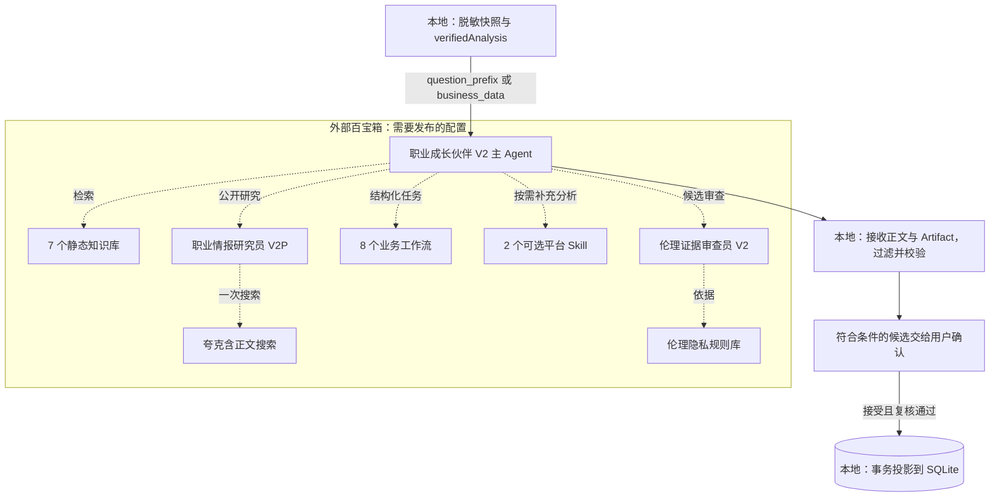
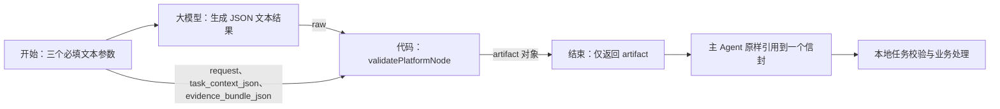

# CareerMate 百宝箱架构

校准日期：2026-09-12。本文对照仓库的主 Agent 提示词、8 个工作流、2 个 Skill、7 份知识库资产及本地调用代码。它描述**可从源码复现的集成架构**，不声明平台当前模型、资源 ID、挂载数量、记忆条数或发布版本已核验。

## 组件与运行边界

实线表示本地代码中的数据处理或工作流节点传递；虚线表示平台 Prompt 约定的按需调用，需要实际挂载与发布才能生效。虚线不是每轮必经步骤。

图中伦理库是 7 个知识库中的同一份资产，单列是为了展示审查员依赖。组件结果返回主 Agent 的边省略；主 Agent 返回内容仍需本地校验，平台审查通过不能代替用户确认。

主产品调用由 `src/lib/chat/stream-service.ts` 和专用生成服务发起，经 `src/lib/tbox/client.ts` 访问配置的 chat endpoint。当前 V2 主链路使用业务快照，不把 `/api/mcp/v2` 画成必经节点。专用训练、计划和引导服务还有自身生成/校验协议，不能将所有调用都描述成同一个聊天工作流。

## 主 Agent 与子智能体

| 组件 | 源文件 | 职责和约束 |
|---|---|---|
| 职业成长伙伴 V2 | [main.md](../../src/agentic-v2/platform/prompts/main.md) | 理解本轮快照、路由知识/研究/工作流、组织答复及单个 Artifact 信封；不能直接改正式数据库 |
| 职业情报研究员 V2P | [researcher.md](../../src/agentic-v2/platform/prompts/researcher.md) | 公开职业、机会与资源时效研究；提示词要求一次夸克含正文搜索，尽量比较两个独立来源；不读取私人画像或职业知识库 |
| 伦理证据审查员 V2 | [reviewer.md](../../src/agentic-v2/platform/prompts/reviewer.md) | 审查证据、隐私、偏见、承诺和确认边界，返回 pass/revise/reject；不联网、不产生新职业决定 |

公开研究只应接收主题、地区、经验层级、时间范围和当前时间，不传完整个人档案。研究结果为 `ResearchReportV1`，主 Agent 映射为 `marketEvidence`；来源缺失、时间未知或覆盖不足应显式保留。当前 Prompt 指向研究员 **V2P**，没有把历史研究员 V2 描述为已启用的回退资源。

主 Prompt 要求候选输出前审查；`revise` 最多修订一次并复审，`reject` 或仍不通过则不输出可写候选。这属于模型编排约定，后端并没有把审查员调用日志作为每次候选写入的强制凭证。真正的写入边界是本地鉴权、契约、用户确认与事务。

## 工作流结构与契约

8 个工作流的源码位于 [platform/workflows](../../src/agentic-v2/platform/workflows)，共同约束见 [COMMON.md](../../src/agentic-v2/platform/workflows/COMMON.md)。

三个开始参数是 `request`（自然语言任务）、`task_context_json`（任务上下文 JSON 文本）、`evidence_bundle_json`（证据包 JSON 文本）。大模型节点消费这三个值；代码节点还要以 `raw` 接收大模型输出。代码返回 `{ artifact }`，结束节点输出其 `artifact`，不要再包装第二个信封。

导出脚本从 [platform-node.ts](../../src/lib/agentic-v2/platform-node.ts) 打包代码，入口为 `exports.main = async (event) => ...`。当前校验包括输入 Schema、任务/状态对应数据、版本、学习路线预算与任务索引、计划质量、模拟会话及轮次等，已不只是旧文档所称的 `JSON.parse` 和少量字段检查。校验结构不证明来源事实真实。

| 工作流 | `taskType` | 当前输出和消费边界 |
|---|---|---|
| V2画像评估 | `profile_assessment` | 画像 patch、能力证据和六维评分；默认待确认，基于真实画像版本 |
| V2职业探索 | `career_exploration` | 职业选项与比较，默认只读 success；提供符合契约的职业标识时可形成模板草稿候选 |
| V2职业规划 | `career_plan` | `data.plan` 中的完整 Plan V2；按用户确定周期，不固定 3–5 年 |
| V2学习路线 | `learning_route` | 阶段任务、资源、成果和验收标准；校验每周预算、计划版本与 `baseRouteVersion` |
| V2职场模拟 | `simulation_turn`、`simulation_report` | 追问或完整报告，正常为 success；使用已保存 session/scenario 和 `expectedRound`，不得自行再加一 |
| V2场景生成 | `simulation_scenario` | 只读场景预览，返回场景快照；用户开始后才保存训练 |
| V2简历作品 | `resume_review` | 当前消费契约以 `abilityEvidence` 为主，不能宣称支持完整简历审阅报告入库 |
| V2成长复盘 | `growth_review` | 完整修正计划及相应父计划信息，形成 `growth_replan` 候选；只有 planPatch 不够 |

**调用范围要区分：**平台主 Agent 接到场景生成任务时，Prompt 要求用 V2场景生成；本地 `/api/simulations/scenarios` 的推荐和岗位预览实际直接从模板/样本构造。自定义预览调用 `generateSimulationScenario`；真实 API 分支解析 `simulation_scenario`，Mock 分支使用本地生成。它们并不矛盾，也不能在图中合并为“所有预览都调用工作流”。

## 证据、Skill 与知识

四路证据始终区分：已确认个人画像 `profileSnapshot`、个人成长历史 `historySnapshot`、静态职业要求 `careerBaseline`、公开市场研究 `marketEvidence`。市场平均水平和岗位要求不能自动成为个人能力证据。本地岗位样本另有来源与有效性标识，不能冒充实时查询。

| Skill | 可执行源码 | 功能 |
|---|---|---|
| CareerMate职业证据解析 | [parser.ts](../../src/agentic-v2/skills/evidence-parser/parser.ts) | 结构化证据归一化、来源区分、去重与脱敏 |
| CareerMate成长数据分析 | [analyzer.ts](../../src/agentic-v2/skills/growth-analyzer/analyzer.ts) | 基于计划、进度和训练记录计算成长指标 |

本地 [verified-analysis.ts](../../src/lib/agentic-v2/verified-analysis.ts) 已直接调用两者，结果作为 `evidenceBundle.verifiedAnalysis` 交给模型解释。平台 Skill 是按需补充的同源执行资产，不是当前每次调用都必须启动的沙箱。`npm run package:skills` 生成包含独立 `run.mjs` 的包；执行能力以核心函数输出判断，不能用加载 Skill 或运行示例验证脚本代替。

七份知识库源资产：

| 名称 | 文件 | 用途 |
|---|---|---|
| V2职业能力模板库 | [Markdown](../../src/agentic-v2/knowledge-bases/V2职业能力模板库.md) | 稳定岗位能力基线 |
| V2学习资源库 | [CSV](../../src/agentic-v2/knowledge-bases/V2学习资源库.csv) | 学习材料及实践方法 |
| V2训练场景库 | [Markdown](../../src/agentic-v2/knowledge-bases/V2训练场景库.md) | 场景、追问和评分方法 |
| V2伦理隐私规则库 | [Markdown](../../src/agentic-v2/knowledge-bases/V2伦理隐私规则库.md) | 证据、隐私与确认规则 |
| V2职业趋势研究库 | [Markdown](../../src/agentic-v2/knowledge-bases/V2职业趋势研究库.md) | 历史及趋势背景 |
| V2简历作品方法库 | [Markdown](../../src/agentic-v2/knowledge-bases/V2简历作品方法库.md) | 简历与作品表达方法 |
| V2认证机会库 | [CSV](../../src/agentic-v2/knowledge-bases/V2认证机会库.csv) | 证书与机会背景 |

以上源文件不代表平台已建立同名资源，也不与本地 `ResourceItem`、`RoleTemplate` 自动双向同步。本地资源导入数据在 `data/resources`，需通过导入脚本写入 SQLite。

## 本地传输、结果与状态

[客户端](../../src/lib/tbox/client.ts) 实际发送 `agent_id`、`question`、`user_id`、`search_engine`、`stream`；按需追加 `agent_version`、`conversation_id`、`history` 和字符串化的 `business_data`。聊天请求没有发送 `app_id`，因此不能把 `TBOX_APP_ID` 列为该请求的必需字段。

V2 默认把快照嵌入问题前缀；如果显式选择其他传输配置，普通 V2 分支将其作为结构化 context 交给客户端。业务快照不包含 MCP context token，但上游请求仍使用本地用户标识 `user_id`。远端会话绑定和上下文裁剪详见 [技术架构](../architecture.md)。

主 Agent 的输出协议为可读正文和最多一个 `<CAREERMATE_ARTIFACT>...</CAREERMATE_ARTIFACT>` 信封；普通聊天可以不带信封。工作流自己只输出 JSON。Artifact 顶层包括 `schemaVersion="1.0"`、`taskType`、`status`、`summary`、`data`、证据/来源/假设/警告数组、`requiresUserConfirmation`、`baseVersion` 和 `nextActions`。

| 状态 | 后端含义 |
|---|---|
| `success` | 任务结果有效；具体服务消费，不自动创建候选 |
| `pending_confirmation` | 必须同时 `requiresUserConfirmation=true`，再按任务映射摄入候选 |
| `needs_input` | `data` 至少有问题或非空缺失字段列表，无正式投影 |
| `error` | `data` 至少有错误消息或错误码，无正式投影 |

模拟报告的 success 与派生能力候选是两步：完成服务校验报告、过滤实际回答不能支持的证据，再在满足条件时创建能力候选。旧终端 `structured` 输出开关与 V2 文本信封不是同一协议。

## MCP、记忆和发布边界

`/api/mcp`、`/api/mcp/v2` 和旧 REST 工具入口仍有实现。MCP V2 接受外层插件 Bearer 与工具参数中的短时 `context_token`；支持读取、创建候选和受限训练追加，没有用户接受候选的工具。当前 V2 主聊天使用快照，不要求配置这些 MCP 凭据，也没有实现把平台资源自动发布为当前应用的一部分。

本地 `MemoryItem` 与百宝箱平台记忆分属两个存储系统。本地记忆开关、编辑、清除和隐私导出不能证明远端记忆关闭或删除。仓库没有最新平台记忆配置的权威快照，本文不把旧条数和开关值写为现状。

平台资源的可复现入口是 [BINDINGS.md](../../src/agentic-v2/platform/BINDINGS.md)、[导出脚本](../../scripts/export-tbox-bundle.mjs) 和 [Skill 打包脚本](../../scripts/package-skills.mjs)。导出目录中的 manifest 明确将 `bindingVerifiedOnPlatform` 设为 false；本地打包成功只证明产物可生成，不证明平台节点绑定、主 Agent 引用和发布渠道生效。部署运行说明保留在 [deploy/DEPLOY.md](../../src/agentic-v2/deploy/DEPLOY.md)。

源码、生成交付包、平台草稿和渠道发布版本应分别核对。本文不重复记录一次性配置步骤与历史诊断；真实链路成功需结合上游执行、本地元信息、有效 Artifact 和最终业务记录判断。
