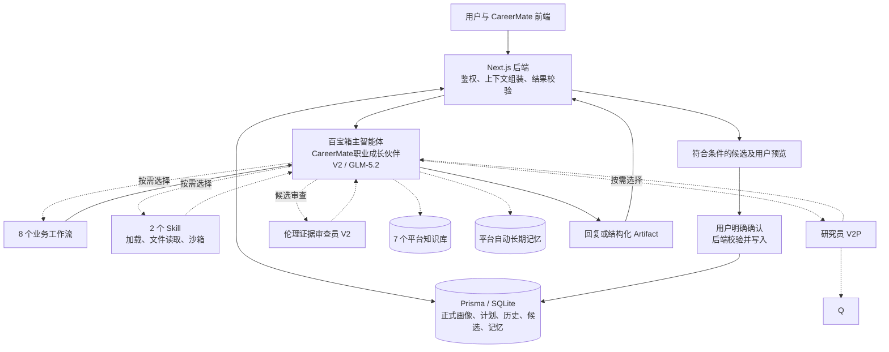
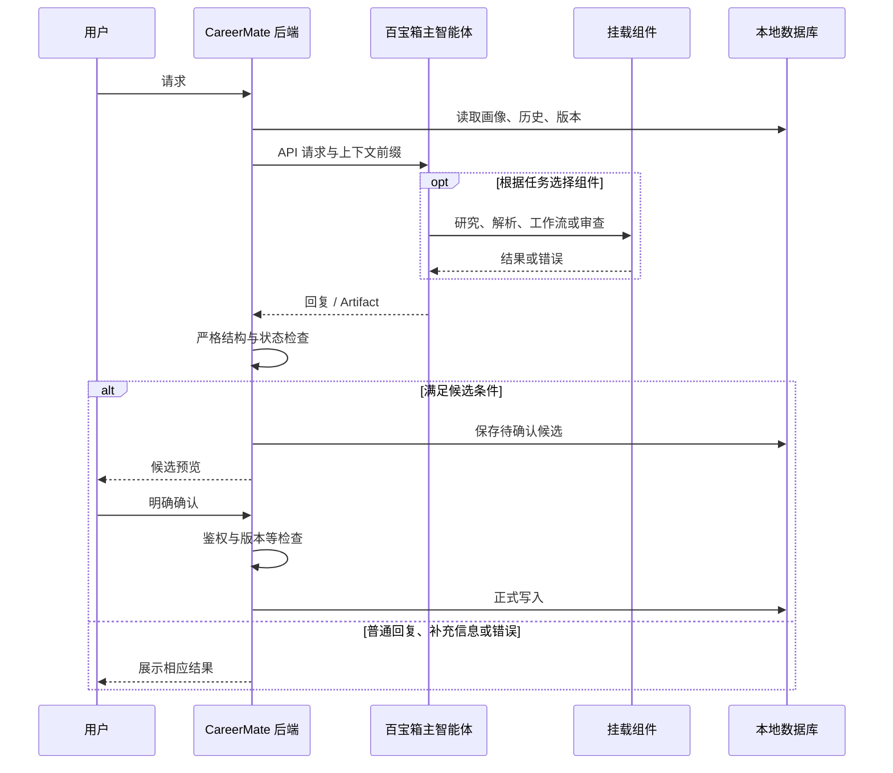
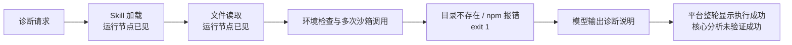

# CareerMate 百宝箱架构与运行现状

> 历史平台记录（2026-09-09）。当前应用实现见 [技术架构](../architecture.md)，平台操作以当前发布日志和源码生成包为准。

初始记录：2026-09-09；最近校准：2026-09-10。范围：CareerMate V2 的百宝箱配置、与本地应用的接口、子智能体、工作流、Skill、知识与记忆，以及已收集到的运行证据。

本文件记录实际状态和证据边界，不是目标架构或完成承诺。9 月 9 日的历史诊断、错误和配置截图继续保留；9 月 10 日补充了当前源码交付包、代码节点入口修复、审查员提示词更新，以及用户报告的百宝箱更新结果。平台当前发布版本、每个资源的版本号和端到端业务结果仍以控制台执行记录为准，不能只凭本地文件或“已更新”描述确认。

## 1. 阅读约定与结论

证据分为四类：**配置已见**（截图/粘贴配置）、**源码已核对**（本地文件/ZIP）、**运行已见**（节点或原始输出）、**待验证**（目前无直接证据）。提示词要求做某件事，不等于运行时已经做到。

当前交付结构为：本地 CareerMate 应用管理用户与正式数据，通过百宝箱主智能体进行语义处理；本地交付包定义 8 个业务工作流、2 个 Skill 和 2 个当前路由子智能体（研究员 V2P、伦理证据审查员 V2），并使用 7 个知识库。研究员 V2 是历史兼容组件，是否仍挂载作为回退需要以平台当前配置确认。工作流生成结构化结果，本地后端负责校验与候选处理，用户确认后进入正式写入流程。

配置层结构已经清楚；运行层仍不能视为整体验收通过。旧成长分析诊断出现 Skill 加载、文件读取和沙箱调用，但依赖安装与工作目录处理失败，没有核心函数成功输出。新版本地 Skill 包已经提供独立 `run.mjs`，不需要运行时安装依赖；其平台核心函数实际输出尚待单独记录。学习路线代码节点在替换入口后已通过一次平台冒烟测试；完整工作流、其他工作流和主 Agent 联调仍未全部验收。另一次本地聊天出现 `TBOX_UNAVAILABLE`，根因尚未核实。

## 2. 总体组件图

图中实线表示源码或配置支持的连接，不表示每条连接都已实测；虚线表示按需调用或尚未验证的运行连接。



平台自动长期记忆与本地正式数据是两套机制。图中的后端确认流程不能视为已经控制平台自动记忆的提取和保存。

## 3. 应用与发布边界

| 应用 | ID | 当前已见模型 | 角色 |
|---|---|---|---|
| CareerMate职业成长伙伴V2 | `202607APw5p820466728` | GLM-5.2 | 主入口与编排 |
| CareerMate职业情报研究员V2P | `202607APsZrH20492065` | DeepSeek-V3.2 | 一次搜索的外部职业研究 |
| CareerMate职业情报研究员V2 | `202607APbOAM20433465` | DeepSeek-V3.2 | 外部职业研究，职责与 V2P 重叠 |
| CareerMate伦理证据审查员V2 | `202607APDOFG20469063` | Qwen3.7-plus | 候选的伦理、隐私和证据审查 |

历史审计还记录旧版 CareerMate职业导航 V1；本次不将它纳入 V2 活跃调用链，也未删除它。

历史截图仍显示过“已发布，有草稿未更新”。“当前配置为最新”和自动保存时间只能说明编辑状态，不能证明草稿已发布。历史审计的发布 26.0 / 草稿 27.0 是历史快照，不作为 9 月 9 日实时版本结论。用户在 2026-09-10 报告百宝箱侧已完成本轮更新，但尚未提供每个应用、工作流和 Skill 的发布版本号；因此该状态在本文件中标为用户报告，不能替代发布页或 API 证据。

本地配置中的 agent ID 指向主应用，agent version 已于 2026-09-10 固定为用户提供的平台已发布版本 29.0。发布页同时显示主应用当前版本 29.0、Web 服务渠道已上架版本 28.0（2026-09-10 00:32），并存在未发布草稿；因此本地 API 固定的是 29.0，不代表草稿内容已进入测试，也不代表 Web 服务渠道已更新。9 月 9 日 Skill 诊断标注的“智能体版本：调试运行”“渠道：控制台”仍不能替代发布版本 API 验证。

2026-09-10 真实链路诊断补充：本地 `question_prefix` 原 12k 预算不足，当前演示账号业务快照结构化裁剪后仍约 16.6k，`ContextBudgetError` 被旧兜底误报为 `TBOX_UNAVAILABLE`。平台 29.0 实测可接受 24k/30k 问题长度；使用真实快照构造的 19,316 字问题已成功返回目标岗位“AI 产品经理”和每周 6 小时。本地已把默认预算提高到 24k，并新增 `CONTEXT_BUDGET_EXCEEDED` 错误码，避免再把本地裁剪失败记成平台不可用。

## 4. 主智能体配置与编排

| 配置 | 已确认状态 | 解释 |
|---|---|---|
| 分段模型 | 未勾选 | 当前截图使用主模型 |
| 夸克搜索（含正文） | 研究员 V2P 使用 | 主 Agent 当前提示词要求由 V2P 统一负责公开市场搜索 |
| 内置联网搜索 | 当前交付提示词要求关闭 | 早期截图曾显示开启；平台当前开关仍需一张最新配置截图或运行记录确认 |
| Skill | 2 个已生成独立运行包；平台启用状态由用户报告已更新 | 已挂载或上传不等于核心函数实际执行成功 |
| 工作流 | 本地交付包包含 8 个 | 平台是否全部发布、引用到哪个版本仍需逐项记录 |
| 子智能体 | 当前交付路由为 2 个；研究员 V2 保留作历史回退 | 早期截图曾显示 3 个；平台当前是否解除 V2 挂载仍需确认 |
| Plan任务自动拆解 | 关闭 | 不等于禁止职业规划业务，也不代表不存在自主规划运行节点 |
| 自动长期记忆 | 开启；截图为 322 条 | 条数是截图快照，不是实时查询值 |
| 文件上传 | 关闭 | 当前对话界面配置 |
| 固定回复、兜底回复 | 关闭 | 当前对话界面配置 |

主 Prompt 同时承担任务路由、四路证据区分、搜索调用、候选确认和输出格式约束。开头存在 `business_data.executionMode=structured_api` 分支，要求结构化 API 模式限制工具调用；后文还有普通对话和具体任务输出规则。现有本地调用以 question_prefix 传上下文，尚不能证明该分支实际触发。

当前主 Prompt 明确指定研究员 V2P 路由，并要求主 Agent 关闭直接夸克/内置联网入口；研究员 V2 仅作为历史回退保留在旧配置记录中。具体调用仍以运行记录为准，不能仅凭提示词断言某组件已经实际运行。

## 5. 子智能体（当前交付 2 个，历史保留 1 个）

| 组件 | 输入/职责 | 输出 | 工具与约束 |
|---|---|---|---|
| 研究员 V2P | 研究主题、地区、经验层级、时间范围；只研究公开市场 | ResearchReportV1：findings、sources、conflicts、confidence、limitations 等 | 夸克含正文开启；要求一次搜索比较至少两个独立来源；currentTime 未提供时采集/访问时间为 null |
| 研究员 V2 | 历史兼容的同类外部市场研究 | ResearchReportV1 | 不属于当前本地主 Prompt 的首选路由；是否仍作为平台回退挂载待确认 |
| 审查员 V2 | 接收候选，审查来源、评分依据、偏见、隐私、承诺及确认边界 | `schemaVersion`、`verdict`、`issues`、`requiredChanges`、`riskFlags`、`confirmationRequired`；verdict 为 pass/revise/reject | 当前优化提示词要求不联网、挂载伦理知识库、`confirmationRequired` 始终为 true |

主智能体的子智能体设置弹窗只显示名称与描述，没有工作流式参数表。实际传入研究范围、currentTime 和待审候选的方式仍需运行记录确认。

历史 V2 的挂载描述曾写“使用夸克搜索MCP和V2知识库”，与其角色指令禁止检索知识库冲突。当前交付主 Prompt 已将公开搜索集中到 V2P；该历史冲突保留作回退配置风险，不推断已经发生错误检索。

V2P 截图中问题建议、历史会话摘要、多轮改写、内置搜索关闭；此前含正文插件开启。历史会话摘要不是长期记忆，这些截图不能证明子智能体长期记忆关闭。用户报告已完成平台更新，但各子智能体知识库、插件和发布版本的最新展开配置尚未完整验证，历史审计的绑定数量不当作当前确认值。

### 5.1 审查员优化提示词的版本边界

用户本轮单独粘贴的 审查员优化提示词临时稿（历史材料，未随仓库分发） 为 8,761 字节，增加了缺少候选时 reject、问题分级、字段定位和 `confirmationRequired` 始终为 true 等约束。用户此前提供的两次平台测试分别识别了过度承诺/无证据高分并返回 revise，以及缺少候选并返回 reject；这证明了当时测试输入下的审查行为。最终 TXT 版本粘贴后的同样测试结果尚未单独留存。

该 TXT 不等于本地交付包中的 `agents/审查员V2.txt`：后者目前为 1,869 字节，内容仍是旧版短提示词；仓库源文件 `src/agentic-v2/platform/prompts/reviewer.md` 也仍对应旧版。平台已按用户报告使用优化 TXT，但从源码重新运行 `npm run tbox:bundle` 会再次导出旧版审查员文件。要让平台配置可复现，后续应把最终确认版本同步回源文件后重新生成交付包；在同步完成前，本地包与平台审查员配置存在可追溯的版本漂移。

## 6. 八个业务工作流

共同形态是“开始 → 大模型 → 代码 → 结束”。当前交付目录包含 8 个工作流，每个工作流都有自己的大模型提示词、代码节点、绑定步骤和冒烟测试样例。大模型输出文本“结果”，代码节点接收 `raw` 以及三个开始参数，返回 `{artifact}`，结束节点引用代码的 artifact。


代码检查不是完整业务校验，也未将平台数据转换成后端要求的结构。用户粘贴文本中的加粗标记和转义可能来自复制格式，不直接判定平台代码包含同样语法错误。

| 工作流 | taskType | 当前输入 | 主要产物/规则 |
|---|---|---|---|
| V2画像评估 | profile_assessment | request、task_context_json、evidence_bundle_json | 目标职业、评分、优势、差距、证据候选、缺失信息；个人证据不得引用市场/职业基线 |
| V2职业探索 | career_exploration | request、task_context_json、evidence_bundle_json | 职业选项、匹配依据、差距、风险、验证实验、顺序 |
| V2职业规划 | career_plan | request、task_context_json、evidence_bundle_json | 3–5 年阶段计划、90 天行动、里程碑、风险、时间预算 |
| V2学习路线 | learning_route | request、task_context_json、evidence_bundle_json | 阶段、任务、资源、成果、验收标准；缺目标/周期/预算需补充 |
| V2职场模拟 | simulation_turn / simulation_report | request、task_context_json、evidence_bundle_json | 下一轮问题或训练报告，必须依据真实历史 |
| V2场景生成 | simulation_scenario | request、task_context_json、evidence_bundle_json | 推荐/自定义/岗位样本场景预览；启动前固定场景和评分依据 |
| V2成长复盘 | growth_review | request、task_context_json、evidence_bundle_json | 能力变化、偏差、证据候选与基于版本的计划补丁 |
| V2简历作品 | resume_review | request、task_context_json、evidence_bundle_json | 已用事实、缺失事实、问题、改写、作品集与关键词映射 |

本地绑定说明统一要求三个开始参数为必填文本，代码节点为四个输入：`raw` 引用大模型结果，另外三项分别引用开始节点。统一参数名是当前交付包的契约；此前使用单个“提问”的旧工作流配置仍可读取，但不能与新提示词混用。用户报告百宝箱侧已完成更新，平台每个工作流的变量选择器和发布版本仍需逐项执行记录确认。

### 6.1 代码节点入口修复与平台冒烟结果

旧交付代码使用 Node 风格的 `module.exports`，在百宝箱 IDE 测试时返回 `No fetch handler defined`。当前导出脚本 `scripts/export-tbox-bundle.mjs` 已将代码节点包装为显式 `exports.main = async (event) => { ... }`，并保留独立打包的校验器；8 个工作流的代码文件大小约 85 KB，均不依赖平台运行时 `npm install`。本地 `src/lib/agentic-v2/platform-delivery.test.ts` 的两个测试已通过，包含 exports-only 宿主加载检查。

2026-09-09，用户在百宝箱 V2学习路线代码 IDE 中替换新版文件并使用冒烟 JSON 运行，返回：`artifact.taskType=learning_route`、`artifact.status=needs_input`、`artifact.data.question=请补充本轮训练或规划目标`。这证明该代码节点入口和该次测试输入在平台可运行；`needs_input` 是样例预设，不代表完整学习路线生成成功。其余 7 个工作流、变量绑定和完整主 Agent 链路尚无同等运行记录。

### 6.2 平台产物与后端契约差异

以下是静态差异，不能直接等同于每次调用都失败：主智能体可能重新组织工作流结果，但这一适配是否可靠尚未验证。

| 任务 | 平台配置形态 | 当前后端关键要求/差异 |
|---|---|---|
| 画像评估 | scores 数组；score 数值，confidence 字符串，evidence 数组 | scores 为六维键对象，条目 value/evidence 字符串/数值 confidence；evidenceCandidates 与 abilityEvidence 不同 |
| 职业规划 | targetRole、durationYears、stages 等平铺 data | data.plan 为 AiCareerPlanV2 灵活计划结构 |
| 学习路线 | period、weeklyBudgetHours、stages 等 | 另有 targetRole、baseRouteVersion 等要求，版本不能凭空补齐 |
| 成长复盘 | 只输出 planPatch 等 | 当前消费契约要求完整 plan；仅有补丁不够 |
| 职业探索 | 顶层 fitEvidence、gaps 等 | 后端严格字段集合不同，选项须有 roleName；只读比较与职业模板候选也有不同用途 |
| 简历作品 | factsUsed、rewriteSuggestions 等完整审阅报告 | 当前 success/pending 消费结构以能力证据为主，尚非完整简历报告契约 |
| 职场模拟 | 提示词按当前轮次推下一轮 | 后端 generation 已传 expectedRound，存在再次加一的风险；success 报告与 pending 证据候选不能混用 |

公共状态同样需要对齐：后端 needs_input 要求 question/missingFields/context 中符合规则的内容；error 要求 message/code/recoverable 对应结构。仅将状态改为 needs_input 而保留空业务 data，不保证可通过校验。

## 7. 两个 Skill 的实际包装与职责

| Skill | 核心函数 | 输入 | 产物 |
|---|---|---|---|
| CareerMate职业证据解析 | parseEvidenceBundle | evidenceBundle 包装四路证据 | 来源标记、归一化声明、去重、正则脱敏、冲突项 |
| CareerMate成长数据分析 | analyzeGrowthData | profileSnapshot、planHistory、progressLogs、simulations、historicalScores | 能力变化、完成率、模拟统计、连续天数、薄弱项 |

核心代码没有联网或正式数据库写入逻辑；调用方负责提供数据。二者输入输出不是天然串接兼容接口，需要显式转换。它们也不是自行查询用户数据库的服务。

本地当前构建脚本 `scripts/package-skills.mjs` 为两个 Skill 生成独立 `run.mjs`，把运行依赖打进单文件，并附带 `manifest.json`、`validate.mjs` 和四个示例。`dist/skills/.staging/evidence-parser` 与 `dist/skills/.staging/growth-analyzer` 均已生成这些文件，运行入口是 `node run.mjs <input.json>` 或 stdin，不依赖运行时 `npm install`。平台上传的 ZIP 文件名、包内根目录和平台实际解压路径仍应以本次上传记录为准，不能沿用旧 ZIP 的路径结论。

本地验证器已实际执行：证据解析 Skill 的四个示例均返回 PASS；成长分析 Skill 的 `corrupt.json` 按契约拒绝，其余示例执行并返回合法 JSON，其中空数据会返回 `insufficient_data`。验证器通过只证明打包入口和示例流程可运行，不证明平台真实输入已映射正确，也不证明业务数据统计语义符合用户快照。

统计口径需保留：archived 计划被计为完成；连续天数是历史最长连续天数；输入 schema 失败时成长分析返回失败结果；画像证据部分置信度固定；历史解析要求 historySnapshot.data 为数组。与实际快照结构和业务语义的适配尚未完成验证。9 月 9 日旧诊断中的目录不存在和 npm 安装失败属于旧调用路径，不能直接推断新版 `run.mjs` 仍有同一问题。

详细文件哈希和源码行为见 Skill 包核对记录（历史材料已移出工作目录）。

## 8. 知识、市场与记忆

主应用已见 7 个知识库开启：V2认证机会库、V2学习资源库、V2简历作品方法库、V2职业趋势研究库、V2伦理隐私规则库、V2训练场景库、V2职业能力模板库。认证机会与学习资源显示表格图标，其余显示文档图标。内容版本、索引质量和实际召回需另行验证。

四路证据应分别解释：profileSnapshot 是已确认个人画像，historySnapshot 是个人成长历史，careerBaseline 是职业要求，marketEvidence 是外部市场证据。后两路不能作为用户已经具备某项能力的证明。静态职业趋势库不能代替实时搜索结果。

历史源码/配置核对显示，本地直连检索的部分 dataset 与平台绑定库不一致。按主智能体检索与直连/诊断路径可能得到不同版本内容，需结合实际请求确认，不能视作单一知识源。

平台自动记忆管理页面支持用户 ID、类型、内容、搜索、添加、导入、编辑与删除；类型包括用户画像、事实信息、用户偏好、用户目标、补充指令。存在任务级“严格 JSON、禁止 Markdown”一类补充指令记录，但不知道由自动提取还是人工导入产生，也未验证是否被召回。

本地 MemoryItem 的开关和增删改不能直接等同于平台记忆控制；按用户显示的管理列表也不能代替运行时隔离测试。提示词中的“不得写入记忆”不是平台后台自动提取已关闭的证据。

## 9. 本地调用与确认数据流

本地应用采用 Next.js、React、Prisma/SQLite、Zod。相关实现集中于 `src/lib/tbox/`、`src/lib/agentic-v2/` 与对应 Route Handlers。仓库平台镜像不是在线配置的自动同步来源。



候选关键条件是 pending_confirmation 与 requiresUserConfirmation=true；并非任何 success 都创建候选。模拟完整报告的 success 与后续完成接口派生证据候选是不同步骤。伦理 pass 也不能代替用户确认和后端鉴权。

已有源码核对还发现上下文长字符串截断可能破坏 JSON、部分学习路线/完整计划信息未纳入快照、V2 汇总完整回复后再处理等问题。这些是后续验证点，不能把前端使用 SSE 等同于所有业务分支都逐字流式呈现。

## 10. 已收集运行证据

### 10.1 本地聊天请求

用户在 localhost:3000/chat 发送诊断请求，页面显示 TBOX_UNAVAILABLE、回复未完成。只能确认本地未正常取得回复；未取得对应服务端异常，不能确定鉴权、网络、超时或平台错误中的具体原因。

### 10.2 百宝箱控制台成长分析诊断

请求发起时间：2026-09-09 08:13:12（平台显示）；整体耗时 72000ms；版本为调试运行。平台顶部显示执行成功。

节点截图可见 Skill加载、Skill文件读取、模型推理、多个沙箱运行、强制结束生成、结束与安全校验。输入安全校验 PASSED 与核心函数正确执行无关；强制结束生成出现的原因尚未提供。

环境检查原始输出能确认 PATH 中找到 ts-node，没有找到 tsx 和 esbuild。最后一次沙箱原始输出由用户复制提供：

```text
stdout:
npm error Tracker "idealTree" already exists
npm error A complete log of this run can be found in: /dev/shm/.npm_cache/_logs/2026-09-09T00_14_15_485Z-debug-0.log
exit: 1
stderr:
[平台生成脚本路径已省略]: line 1: cd: /dev/shm/skill_test: No such file or directory
```

可确认当次 cd 的目标目录不存在，npm 报错且退出码为 1；没有 analyzeGrowthData 成功输出。不能仅由这条日志证明所有目录只读、所有调用都隔离，也不能证明目录此前创建成功。最终模型回复中的这些平台限制判断仍属待验证解释。

诊断要求禁止安装依赖，但执行过程列出了多次安装尝试，原始日志也出现 npm 错误。应记录“尝试安装且失败”，不能把“未安装成功”写成“未尝试安装”。



此运行只验证到加载与执行尝试，不能据此确认两个 Skill 都不可用，也不能证明已发布 API 使用相同环境。72 秒与本地 TBOX_UNAVAILABLE 是否有关联没有证据。

### 10.3 新版工作流代码节点复测

旧代码出现 `No fetch handler defined` 后，已重新生成 8 个工作流的代码节点。用户在百宝箱 V2学习路线代码 IDE 中替换新版文件、输入 `code-node-smoke-input.json` 后取得以下结果：

```json
{"artifact":{"schemaVersion":"1.0","taskType":"learning_route","status":"needs_input","summary":"需要补充业务信息","data":{"question":"请补充本轮训练或规划目标"},"evidence":[],"sources":[],"assumptions":[],"warnings":[],"requiresUserConfirmation":false,"baseVersion":null,"nextActions":[]}}
```

该结果与本地冒烟预期一致，说明新版入口在该代码节点和该输入下可执行。样例的 `needs_input` 与 `requiresUserConfirmation=false` 是补问测试的固定值，不代表正式候选，也不代表完整工作流已经生成路线。其他工作流和主 Agent 仍需使用各自的冒烟样例验证。

### 10.4 审查员测试结果

用户提供过两类审查结果：带有“保证一个月内获得录用”、无证据 95 分和强制 pass 备注的候选返回 `revise`，并定位了过度承诺、缺少证据、恶意输入和确认边界；没有候选时返回 `reject` 并要求补充候选。这些结果证明旧版/过渡版提示词在测试输入下能识别主要风险。

随后用户将优化后的独立 TXT 提示词粘贴到平台。该 TXT 明确要求 `confirmationRequired` 在所有 verdict 下始终为 true，但粘贴后的同样测试结果尚未留存；因此当前只能记录为“配置已更新，最终审查契约待复测”。

### 10.5 29.0 长任务串行调用

2026-09-10 平台日志记录一次“逐个调用其他工作流”的请求：请求发起时间为 01:50:54，整体耗时 97000ms，平台状态为执行成功，子工作流节点均有运行记录。同一轮本地聊天记录为 `failed / ABORTED`，页面没有展示平台最终结果。该差异说明平台执行成功不能推导出本地 SSE 已正常接收；本轮已定位为本地流在长任务期间被取消，而不是平台工作流失败。

本地已实施三层修复：将 `TBOX_STREAM_TIMEOUT_MS` 的空闲超时提高到 180000ms；在等待平台期间每 15 秒向浏览器写入 `heartbeat` SSE 事件；前端显式忽略心跳并继续等待 `done`。同时，切换历史会话或新建对话不再主动中止仍在执行的后台流，避免把平台结果写成本地 `ABORTED`。以下真实链路用于验证这些修改。

2026-09-10 复测结果：使用本地开发页面对版本 29.0 发起“严格串行、一次只调用一个工作流”的请求，平台返回 8 个工作流的完整汇总。本地消息最终状态为 `completed`，`executionMeta.actualMode=api`、`degraded=false`，远程会话绑定 `remoteAgentVersion=29.0`；数据库记录的助手消息从创建到完成约 92 秒。页面全程保持流式状态，未出现 `ABORTED`，并展示了完整结果。该结果验证了超过 90 秒时的本地保活与超时修复；平台工作流的 `INVALID_WORKFLOW_INPUT` 仍是链路测试参数的预期校验结果，不代表真实业务任务成功。

同一轮还复测了自定义场景生成。平台 V2场景生成工作流曾返回 `INVALID_JSON`，主 Agent 随后自行构造了根层 `scenarioSnapshot`，并出现缺失 `schemaVersion`、未转义引号、`prompts`/`scoringDimensions` 对象数组和公共外壳字段缺失等形态。本地已增加只针对 JSON 语法和 `simulation_scenario` 结构的保守兼容层：不新增职业事实，只修复字符串引号、补齐协议元数据、把对象数组中的已有文本提取为字符串，并继续执行严格 schema 校验。修复后浏览器端自定义场景预览成功，页面不再显示“已降级为本地模板”。平台侧仍应重新上传新版 `V2场景生成/code-node.js` 和 `agents/主Agent.txt`，让修复在平台代码节点内前置完成，而不是长期依赖本地兼容。

2026-09-10 服务重启复测补充：本地六个主页面、聊天 API 和知识库检索均返回 200；自定义场景生成再次显示“场景生成已降级为本地模板”。直接检查接口元数据后确认请求本身为 `actualMode=api`、`degraded=false`，但主 Agent 返回的是“V2场景生成工作流连续 3 次返回 `INVALID_JSON`”的 error artifact，因此本地才按既有设计回退到本地模板。根因不是百宝箱 API 不可达，而是平台代码节点只接受整段纯 JSON；模型输出带前后说明、代码围栏或信封标签时会被拒绝。已在 `src/lib/agentic-v2/platform-node.ts` 增加保守提取：从说明文字、Markdown 围栏、`<CAREERMATE_ARTIFACT>` 标签和结构化对象中提取 artifact，再继续执行原有 Zod、版本和业务校验；已新增 3 条回归测试并通过。新版 `workflows/V2场景生成/code-node.js` 已重新打包到 `/tmp/careermate-tbox-delivery`，平台仍需手动上传并重新发布该工作流后复测。

2026-09-10 32.0 复测通过：平台更新后本地 `.env` 的 `TBOX_AGENT_VERSION` 从 31.0 改为 32.0，并重启开发服务。再次在 `/simulation` 自定义场景入口提交“AI 简历分析功能交付周期与风险沟通”测试，`POST /api/simulations/scenarios` 返回 200，耗时约 22.2 秒；页面展示平台返回的标题“AI简历分析功能交付范围与风险对齐”、角色、目标、情境说明和评分标准，未再出现“场景生成已降级为本地模板”。本轮只验证本地 API 到 32.0 主 Agent 与 V2场景生成工作流的真实链路，未再修改百宝箱平台配置。

2026-09-10 33.0 复测通过：本地 `.env` 的 `TBOX_AGENT_VERSION` 更新为 33.0 并重启后，自定义场景生成再次返回真实平台结果。页面展示标题“AI简历分析功能交付范围澄清”，并包含角色“AI 产品经理”、对话对象“业务负责人”、目标、情境说明和评分标准“事实清晰、风险意识、推进能力、复盘意识”；未出现本地降级提示。当前平台公开渠道仍显示已上架 31.0，本轮测试走的是 33.0 主 Agent API。

## 11. 现状问题与后续验证顺序

| 优先级 | 待确认事项 | 验收证据 |
|---|---|---|
| 1 | 当前发布版本与草稿的对应关系 | 2026-09-10 用户提供发布页：主应用当前版本 29.0，Web 服务渠道已上架 28.0，存在未发布草稿；本地 `.env` 已固定 `TBOX_AGENT_VERSION=29.0`，仍需 API 返回版本与草稿发布结果 |
| 1 | 两个 Skill 在平台上的核心执行 | 明确调用器、真实脱敏输入、核心原始输出与退出码；不能只看上传/加载成功 |
| 1 | 工作流与后端契约是否存在可靠适配 | 一条端到端 Artifact 及后端校验结果 |
| 1 | 本地 TBOX_UNAVAILABLE / 长任务 ABORTED 根因 | 同次请求服务端错误、平台关联标识，以及超过 90 秒任务的本地 completed 记录 |
| 2 | V2P 与审查员实际路由及审查员最终确认字段 | 脱敏入参、工具结果、调用顺序；最终 TXT 版本的 `confirmationRequired=true` 复测结果 |
| 2 | 本地交付包与平台审查员提示词版本一致性 | 将优化 TXT 同步到 `reviewer.md` 后重新生成，记录 SHA-256 和平台版本 |
| 2 | 候选确认和版本冲突处理 | 生成、预览、确认、正式保存的完整记录 |
| 2 | 平台记忆与本地隐私操作的关系 | 提取、召回、删除/关闭行为的受控验证 |
| 3 | 知识库版本及来源质量 | dataset 对应、召回来源与时间范围 |

现阶段不需要为了完成文档继续反复付费诊断。下一轮应按上述单项验收目标执行，避免把“工具可挂载”“整轮完成”和“业务结果正确”混为一个成功状态。

## 12. 依据与维护

- [平台架构历史审计](平台架构现状审计-2026-09-08.md)：提供历史接口与仓库核对；本文件中的较新截图结论优先。
- [平台 Prompt 原文快照](平台Prompt原文快照-2026-09-08.md)：历史正文，不自动代表当前发布版本。
- 用户截图逐批核对（历史材料已移出工作目录）：主应用、工作流、子智能体、记忆的配置证据。
- Skill ZIP 与运行核对（历史材料已移出工作目录）：包内容、哈希与诊断。
- 官方导出文档核对（历史材料已移出工作目录）：平台能力说明，不替代项目实测。
- [后端 Artifact 契约](../../src/lib/agentic-v2/contracts.ts)、[计划结构](../../src/lib/plans/schema-v2.ts)、[Skill 源码](../../src/agentic-v2/skills/)：本地消费和计算实现。

维护规则：新增运行证据时更新对应章节，保留日期与版本；推断升级为结论必须有直接证据。架构图是可编辑 Mermaid 源码，可随组件和边界变化同步维护。不得把本记录中的待验证事项改写为已完成优化。

## 13. 本轮后续实施状态（2026-09-09 晚至 2026-09-10）

对应本地实现、平台操作步骤和回退方式已集中到 [百宝箱优化实施指南](百宝箱优化实施指南.md)：

- 本地导出包现在包含 8 个工作流，每个工作流统一要求 `request`、`task_context_json`、`evidence_bundle_json` 三个开始参数；
- 交付目录 `manifest.json` 的 `generatedFrom` 为 `current-workspace`，并保留 `bindingVerifiedOnPlatform=false`；这个字段是导出时的本地元数据，未因用户随后完成平台更新而自动改变；
- 代码节点由 `npm run tbox:bundle` 从仓库源码生成，当前入口为显式 `exports.main`，已修复一次百宝箱 IDE 的 `No fetch handler defined`；
- 两个 Skill 由 `npm run package:skills` 生成独立 `run.mjs` 包，运行时不需要 `npm install`；本地示例验证已执行，平台核心函数仍需独立留存原始输出；
- 用户报告百宝箱侧已完成工作流、知识库、子智能体、Skill 和审查员提示词的更新；平台实际发布版本和完整端到端结果未提供可引用记录；
- 用户单独粘贴的优化审查员 TXT 尚未同步到仓库 `reviewer.md`，因此当前平台配置与本地可重建交付包存在版本漂移；
- 学习路线代码节点已有一次平台冒烟成功结果，不能扩展解释为 8 个工作流或主 Agent 链路全部成功。

## 14. 当前验收结论（2026-09-10）

截至本次校准，证据可以支持以下结论：本地交付结构已从 7 个工作流扩展为 8 个；工作流代码节点已改为百宝箱可识别的 `exports.main` 入口；V2学习路线代码节点在百宝箱中使用正确冒烟 JSON 后返回预期的 `learning_route / needs_input`；两个 Skill 的本地独立运行包和示例验证器已经存在；审查员优化 TXT 已包含更完整的拒绝、修订和确认边界规则。

仍不能确认以下事项：8 个工作流是否都绑定到各自开始参数并发布；两个 Skill 在平台上是否真正执行核心函数；主 Agent 是否只通过 V2P 进行一次外部搜索；最终审查员 TXT 粘贴后 `confirmationRequired` 是否在所有结果中为 true；主 Agent、子智能体、工作流和 Skill 的线上版本是否与本地交付一致；本地应用旧 `TBOX_UNAVAILABLE` 的根因是否已消除。长任务超过 90 秒时的本地 `ABORTED` 已在 2026-09-10 的真实 29.0 链路中复测为 `completed`。

后续验收应以每项原始输入、节点调用记录、原始输出、退出码、平台版本号和本地后端校验结果为一组证据保存。平台的“执行成功”、资源“已加载”或配置页面的“已更新”只能证明对应阶段完成，不能替代业务结果验收。
