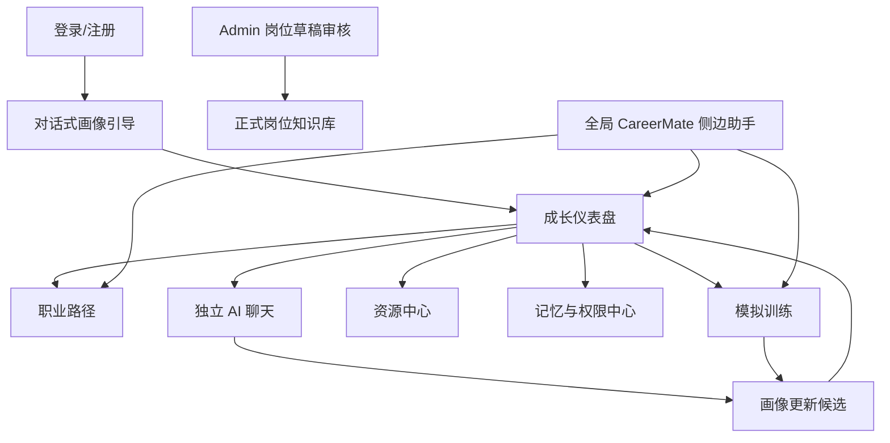

# CareerMate 产品需求文档 PRD

> 版本：v1.0  
> 项目：CareerMate AI 职业导航与终身学习伙伴系统  
> 关联文档：`AI职业导航项目方案.md`、`百宝箱平台适配分析.md`、`百宝箱配置清单.md`、`接口设计文档.md`  
> 当前目标：用于初赛冲奖版本的产品范围、页面需求、流程验收和测试口径。

## 1. 产品定位

CareerMate 是面向高校生与职场新人的 AI 职业导航与终身学习伙伴。系统通过对话式画像采集、职业能力评估、3 年路径规划、月度行动计划、职场模拟训练、资源推荐和长期记忆管理，帮助用户把抽象职业目标拆成可执行、可追踪、可调整的成长路径。

项目基于蚂蚁百宝箱企业版实现 AI 主链路。Web 端负责完整可视化体验、本地多用户数据、权限中心和 Admin 审核；百宝箱负责主智能体、工作流、知识库、插件/MCP 工具、Web 服务发布和小程序发布验证。

当前百宝箱应用已发布：应用名为 CareerMate职业导航，APP ID 为 `202607APRX0a19730150`，Web 服务链接为 `https://b.tbox.cn/inc/share/202607APRX0a19730150?platform=WebService`。API-Key 已创建但不写入文档和前端代码，只保存到服务端环境变量。

## 2. 目标与成功标准

### 2.1 业务目标

- 让用户在 10 分钟内完成初始画像采集，并得到一个可理解的职业能力雷达图。
- 让用户生成一份 3 年职业路径，包含年度目标、季度里程碑、36 个月行动计划和当前月任务。
- 让用户完成至少 1 个职场模拟训练，并收到可操作的反馈和画像更新候选。
- 让用户能查看、编辑、删除、导出画像和长期记忆，体现隐私与伦理设计。
- 让评委能看到百宝箱平台的智能体、工作流、知识库、插件/API、发布和评测配置。

### 2.2 初赛演示成功标准

- 5 个演示账号可登录，数据互相隔离。
- 主演示用户“小林”能完整跑通：注册/登录 → 画像引导 → 仪表盘 → 路径生成 → 模拟训练 → 画像更新确认 → 记忆中心 → Admin 审核 → 百宝箱发布截图。
- AI 主链路优先真实调用百宝箱；如果 API-Key/白名单未开通，系统清晰标识 `manual` 或 `mock` 模式，不伪装为真实 API。
- 至少 3 个岗位模板可用：AI 产品经理、数据分析师、AIGC 内容运营。
- 至少 3 个模拟训练模块可用：跨岗位沟通、AI 辅助办公、远程协作。

## 3. 用户与角色

### 3.1 目标用户

| 类型 | 典型用户 | 核心需求 |
|---|---|---|
| 高校生 | 大二至大四学生 | 不知道目标岗位要学什么，需要职业方向、路径和实践任务 |
| 职场新人 | 入职 0-3 年 | 想补齐能力短板、形成作品和晋升路径 |
| 转岗用户 | 非目标岗位背景 | 想判断转岗可行性和阶段任务 |
| 管理员 | 团队成员/材料组 | 维护岗位知识库、审核 AI 生成岗位草稿、准备演示数据 |

### 3.2 演示用户

| 账号 | 身份 | 目标岗位 | 演示价值 |
|---|---|---|---|
| `student_lin` | 大三数字媒体技术学生 | AI 产品经理 | 完整主流程演示 |
| `student_chen` | 大二统计/经管学生 | 数据分析师 | 数据岗位对比 |
| `student_wu` | 新闻传播/新媒体学生 | AIGC 内容运营 | 文科/运营方向对比 |
| `worker_zhao` | 职场新人 | 数据分析师 | 职场补短板场景 |
| `career_switch_li` | 转岗用户 | AI 产品经理 | 转岗可行性与路径重规划 |

### 3.3 权限

| 权限项 | 普通用户 | 管理员 |
|---|---|---|
| 注册/登录 | 支持 | 支持 |
| 画像采集与编辑 | 只能操作自己 | 不能默认查看他人隐私 |
| 路径生成与任务更新 | 只能操作自己 | 可查看演示聚合数据 |
| 模拟训练 | 支持 | 支持 |
| 记忆查看/删除/导出 | 只能操作自己 | 不能默认查看他人记忆 |
| 岗位草稿审核 | 不支持 | 支持 |
| 正式岗位库维护 | 不支持 | 支持 |

## 4. 产品范围

### 4.1 P0 必须实现

- 本地账号登录/注册，区分普通用户和管理员。
- 对话式画像采集，保存基础画像、目标岗位、学习偏好、能力初始分。
- 成长仪表盘，展示岗位匹配度、能力雷达图、当前月任务和成长日志。
- 3 年职业路径页，展示年度目标、季度里程碑、36 个月计划和任务状态。
- 模拟训练页，支持 3 个训练模块，至少完整跑通 1 个模块的多轮互动与评分。
- 资源中心，展示课程、岗位样例、认证、实践项目，支持按岗位和能力短板筛选。
- 记忆与权限中心，支持查看、编辑、删除、导出、关闭长期记忆、清空账号数据。
- 独立 AI 聊天页，支持 SSE 流式或非流式兼容。
- 全局 CareerMate 侧边 AI 助手，支持状态切换：思考、鼓励、提醒、完成。
- Admin 岗位草稿审核页，支持查看、修改、通过、拒绝岗位草稿。
- 百宝箱接入模式：`api`、`manual`、`mock`，并在界面/日志中可区分。

### 4.2 P1 争取实现

- 画像更新候选的批量确认/拒绝。
- 路径重规划：目标岗位、每周可投入时间或训练表现变化后触发。
- 训练结果对能力维度影响建议。
- 百宝箱知识库召回结果展示来源。
- Admin 草稿生成时展示来源引用和结构化校验结果。

### 4.3 P2 可后置

- 完整移动端 H5 体验。
- 原生支付宝/微信小程序开发。
- 真实招聘平台授权 API 接入。
- 自部署 MCP Server。
- 多模型路由、复杂运营数据看板。

## 5. 信息架构

## 6. 核心用户流程

### 6.1 新用户首次使用

1. 用户注册/登录。
2. 系统检测没有完整画像，进入对话式画像引导。
3. CareerMate 依次追问专业/阶段、经历、兴趣、目标岗位、时间投入、学习偏好、当前能力。
4. 系统生成初始画像和能力分，展示“确认画像”页面。
5. 用户确认后进入成长仪表盘。
6. 仪表盘展示匹配度、能力雷达图、建议目标岗位和当前下一步。

验收标准：

- 用户未完成画像时不能直接进入完整仪表盘，应提示继续画像引导。
- 画像引导可以保存中间草稿，刷新后不丢失已填写内容。
- 目标岗位、能力分、长期目标写入前必须用户确认。

### 6.2 路径生成流程

1. 用户在仪表盘或路径页点击“生成 3 年路径”。
2. 服务端读取用户画像、目标岗位、能力短板和岗位模板。
3. 百宝箱工作流生成结构化 JSON。
4. Web 端保存 `CareerPlan`，渲染年度、季度、月度计划。
5. 用户可勾选任务完成状态，系统写入 `ProgressLog`。

验收标准：

- 计划必须包含 3 年、12 个季度、36 个月。
- 当前月必须有月目标、学习任务、实践产出、评估指标。
- 百宝箱输出 JSON 不合格时，不保存空计划，提示用户重试。

### 6.3 模拟训练流程

1. 用户选择训练模块：跨岗位沟通、AI 辅助办公、远程协作。
2. 系统展示场景背景、任务目标和评分维度。
3. AI 扮演职场角色，多轮对话。
4. 用户提交最终回答或完成对话轮次。
5. 系统生成训练评分、关键表现、改进建议、能力影响建议。
6. 系统生成画像更新候选，用户确认后写入画像。

验收标准：

- 每次训练必须保存会话记录、场景类型、评分、反馈。
- 训练结果不直接修改画像，必须进入候选确认。
- 评分解释必须避免绝对化评价和人格标签。

### 6.4 长期记忆流程

1. 任意聊天或训练可触发记忆更新候选。
2. 普通学习偏好可自动写入，重要目标/能力/敏感信息必须确认。
3. 用户在记忆中心查看记忆列表。
4. 用户可编辑、删除、导出、关闭长期记忆或清空账号数据。

验收标准：

- 用户关闭长期记忆后，系统不再写入新的 `MemoryItem`。
- 删除记忆后，后续对话不得继续引用该条记忆。
- 导出内容应包含画像、记忆、路径、进度日志，不包含密钥或系统内部日志。

## 7. 页面需求

### 7.1 登录/注册页

目标：提供本地多用户入口，支持演示账号快速登录。

核心组件：

- 登录表单：账号、密码。
- 注册表单：账号、密码、确认密码。
- 演示账号入口：显示 5 个预置用户。
- 管理员入口：管理员账号登录后进入 Admin 能力。

状态：

- 登录失败：账号不存在或密码错误。
- 注册失败：账号重复、密码不符合规则。
- 成功：根据画像完成状态跳转画像引导或仪表盘。

验收：

- 普通用户不能访问 Admin 页面。
- 密码不能明文保存。

### 7.2 对话式画像引导页

目标：让用户用自然对话完成初始画像。

核心字段：

- 基础信息：专业、年级/阶段、城市偏好。
- 经历：课程、项目、实习、作品。
- 兴趣：喜欢的任务类型、行业偏好。
- 目标：目标岗位、目标时间、长期职业目标。
- 约束：每周可投入时间、学习强度、设备/资源限制。
- 偏好：文本/视频/项目制学习偏好。
- 能力自评：6 个通用能力维度。

AI 行为：

- 一次只追问一个重点。
- 用户回答模糊时继续追问。
- 不要求用户提供身份证、手机号、真实姓名等无关隐私。
- 输出画像更新候选时说明依据。

验收：

- 采集过程支持跳过非关键问题。
- 用户可以在确认页修改关键字段。

### 7.3 成长仪表盘

目标：作为日常主入口，展示当前状态和下一步行动。

模块：

- 顶部用户状态：目标岗位、阶段、每周可投入时间。
- 匹配度卡片：当前目标岗位匹配度、主要短板、下一步建议。
- 能力雷达图：6 个通用能力维度。
- 当前月重点：月目标、3-5 个任务、完成状态。
- 成长日志：最近训练、任务完成、画像更新。
- CareerMate 侧边助手：当前状态提醒和快捷提问。

验收：

- 有计划时展示当前月任务；无计划时提示生成路径。
- 雷达图数据来自 `UserProfile.abilityScores`，不能写死。

### 7.4 职业路径页

目标：展示和管理 3 年路径。

模块：

- 年度视图：第 1/2/3 年目标。
- 季度里程碑：12 个里程碑。
- 月度计划：36 个月列表。
- 当前月详情：目标、学习任务、实践产出、评估指标。
- 重规划入口：目标岗位、时间投入、训练表现变化后触发。

验收：

- 任务状态支持未开始、进行中、已完成、延期。
- 重规划前提示会保留历史计划版本。

### 7.5 模拟训练页

目标：通过职场场景训练未来工作能力。

训练模块：

| 模块 | 场景 | 训练能力 |
|---|---|---|
| 跨岗位沟通 | AI 扮演技术负责人/业务方 | 需求表达、冲突澄清、沟通协作 |
| AI 辅助办公 | 用户完成会议纪要、竞品分析、需求文档 | AI 工具应用、业务理解、产出质量 |
| 远程协作 | 异步汇报、任务拆解、风险反馈 | 远程协作、任务管理、表达清晰度 |

输出：

- 场景得分：0-100。
- 关键表现：做得好的地方。
- 改进建议：最多 3 条。
- 能力影响建议：对应 6 个能力维度。
- 画像更新候选：用户确认后写入。

验收：

- 训练中断后可以看到已保存的历史记录。
- 评分解释必须和用户回答相关。

### 7.6 资源中心

目标：按岗位、阶段和短板推荐合规资源。

资源类型：

- 课程资源。
- 书籍/文章/文档。
- 岗位样例。
- 认证/竞赛。
- 实践项目。
- 外链参考资源。

筛选项：

- 目标岗位。
- 能力维度。
- 阶段：入门、进阶、作品集、求职准备。
- 资源类型。

验收：

- 招聘岗位使用脱敏模拟样例或授权 API，不爬取非授权数据。
- 第三方资源展示来源，不复制受限内容。

### 7.7 记忆与权限中心

目标：体现长期陪伴、可控记忆和隐私保护。

模块：

- 画像字段查看和编辑。
- 长期记忆列表。
- 待确认画像更新候选。
- 数据导出。
- 关闭长期记忆。
- 清空账号数据。

验收：

- 删除、清空类操作需要二次确认。
- 敏感字段标注敏感级别。

### 7.8 独立 AI 聊天页

目标：提供完整 CareerMate 对话能力。

能力：

- SSE 流式输出，未开通时非流式兼容。
- 展示引用的知识库来源。
- 支持快捷指令：生成路径、解释雷达图、推荐资源、开始训练。
- 聊天后生成画像更新候选。

验收：

- API 失败时保留用户输入。
- 明确展示当前 `TBOX_MODE`。

### 7.9 Admin 岗位草稿审核页

目标：展示知识库扩展能力和 AI 生成内容审核机制。

模块：

- 草稿列表：岗位名称、类别、状态、生成时间。
- 草稿详情：能力维度、权重、路径模板、资源、训练场景、来源。
- 操作：修改、通过、拒绝。
- 正式岗位库列表。

验收：

- 未审核草稿不能进入正式岗位库。
- 通过后写入 `RoleTemplate`，并记录管理员与时间。

## 8. AI 与百宝箱行为需求

### 8.1 输出格式

百宝箱输出优先 JSON，附带用户可读解释。Web 端只消费稳定字段。

路径规划输出必须包含：

- `years`
- `quarters`
- `months`
- `currentMonth`
- `assumptions`
- `riskNotes`

训练输出必须包含：

- `score`
- `strengths`
- `improvements`
- `abilityImpact`
- `profileUpdateCandidate`

### 8.2 失败处理

- `api` 模式失败：展示错误提示，允许重试，不保存假结果。
- 白名单未开通：提示“百宝箱开放平台权限未开通/待申请”。
- `manual` 模式：展示“手工导入百宝箱输出样例”标识。
- `mock` 模式：展示“开发测试数据”标识。

## 9. 非功能需求

### 9.1 性能

- 普通页面首屏本地加载控制在 2 秒内。
- 百宝箱 SSE 两次事件间隔 90 秒内保持连接。
- 长计划生成允许较慢，但必须有加载状态。

### 9.2 安全

- 百宝箱 API-Key 只保存在服务端环境变量。
- 前端不暴露 `TBOX_API_KEY`、`TBOX_AGENT_ID`、`dataset_id` 等敏感配置。
- 本地密码使用哈希保存。
- 导出数据不包含系统密钥和服务端日志。

### 9.3 合规

- 不爬取 BOSS、智联、前程无忧等非授权招聘数据。
- 岗位样例使用脱敏模拟数据或授权数据。
- AI 建议仅作为参考，不替代用户自主决策。
- 重要画像变化必须用户确认。

## 10. 验收清单

| 编号 | 验收项 | 优先级 |
|---|---|---|
| A01 | 新用户可完成画像采集并进入仪表盘 | P0 |
| A02 | 能力雷达图按 6 个维度展示 | P0 |
| A03 | 可生成并保存 3 年路径和当前月任务 | P0 |
| A04 | 至少 1 个训练模块完整跑通，3 个模块均可进入 | P0 |
| A05 | 训练后生成画像更新候选，用户确认后写入 | P0 |
| A06 | 记忆中心支持查看、删除、导出、关闭长期记忆 | P0 |
| A07 | Admin 可审核岗位草稿并写入正式岗位库 | P0 |
| A08 | 百宝箱 `api/manual/mock` 模式可区分 | P0 |
| A09 | 资源中心不展示非授权爬取数据 | P0 |
| A10 | 百宝箱配置截图、发布截图、评测截图可整理提交 | P0 |
