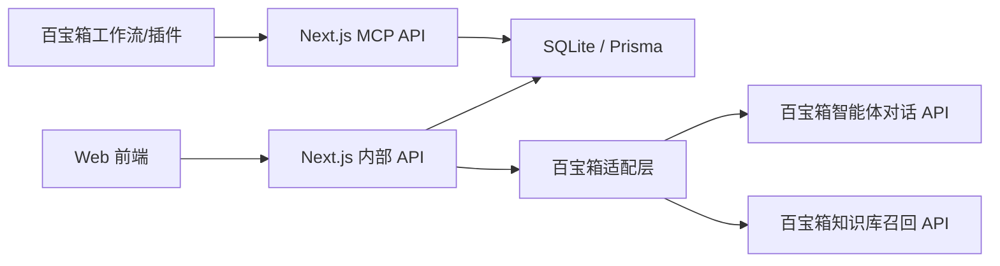

# CareerMate 接口设计文档

> 版本：v1.0  
> 项目：CareerMate AI 职业导航与终身学习伙伴系统  
> 技术栈假设：Next.js App Router + TypeScript + Prisma + SQLite + 百宝箱开放平台 API。  
> 关联文档：`AI职业导航项目方案.md`、`产品需求文档_PRD.md`、`百宝箱配置清单.md`。

## 1. 设计目标

接口层负责连接四类对象：

- Web 前端：页面、图表、聊天、管理端。
- 本地服务端：认证、SQLite 数据、规则评分、权限控制。
- 百宝箱开放平台：智能体对话、知识库召回。
- 百宝箱插件/MCP：课程查询、岗位查询、画像读写、进度更新。

核心原则：

- 前端只调用 Next.js 内部 API，不直接调用百宝箱。
- 百宝箱 API-Key、agent_id、dataset_id 只在服务端使用。
- 所有用户数据按 `userId` 隔离。
- AI 输出先进入结构化校验，重要画像更新必须用户确认。
- 支持 `TBOX_MODE=api|manual|mock` 三种模式。

当前百宝箱配置记录：

- 应用名称：CareerMate职业导航。
- `TBOX_APP_ID`：`202607APRX0a19730150`。
- `TBOX_AGENT_ID`：已确认 `202607APRX0a19730150`。
- `TBOX_WEB_SERVICE_URL`：`https://b.tbox.cn/inc/share/202607APRX0a19730150?platform=WebService`。
- `TBOX_API_KEY`：已创建，但完整值只允许保存到服务端环境变量，不写入本文档。

## 2. 接口分层



## 3. 通用约定

### 3.1 Base URL

开发环境：

```text
http://localhost:3000
```

生产/演示环境：

```text
https://<your-domain>
```

### 3.2 认证

Web 前端：

- 使用本地登录态 Cookie。
- 所有 `/api/*` 内部接口从 Cookie 识别当前用户。
- Admin 接口需要 `role=admin`。

百宝箱插件/MCP：

- 建议使用 Bearer Token 或固定 Header。
- 请求头示例：

```http
Authorization: Bearer <CAREERMATE_PLUGIN_TOKEN>
```

百宝箱开放平台：

```http
Authorization: Bearer <TBOX_API_KEY>
```

### 3.3 通用响应结构

成功：

```json
{
  "ok": true,
  "data": {},
  "meta": {
    "requestId": "req_20260706_001",
    "mode": "api"
  }
}
```

失败：

```json
{
  "ok": false,
  "error": {
    "code": "TBOX_PERMISSION_PENDING",
    "message": "百宝箱开放平台权限未开通或白名单待申请",
    "detail": "调用 chat/create 返回 403"
  },
  "meta": {
    "requestId": "req_20260706_002",
    "mode": "api"
  }
}
```

### 3.4 错误码

| 错误码 | HTTP | 说明 |
|---|---:|---|
| `UNAUTHORIZED` | 401 | 未登录或登录态过期 |
| `FORBIDDEN` | 403 | 无权限，例如普通用户访问 Admin |
| `VALIDATION_ERROR` | 400 | 请求参数不合法 |
| `NOT_FOUND` | 404 | 资源不存在或不属于当前用户 |
| `TBOX_PERMISSION_PENDING` | 503 | 百宝箱 API-Key/白名单未开通 |
| `TBOX_TIMEOUT` | 504 | 百宝箱调用超时 |
| `TBOX_BAD_OUTPUT` | 502 | 百宝箱输出无法解析或缺少必要字段 |
| `MEMORY_DISABLED` | 409 | 用户关闭长期记忆后尝试写入 |
| `INTERNAL_ERROR` | 500 | 未分类服务端错误 |

## 4. 核心数据结构

### 4.1 能力维度

```ts
type AbilityKey =
  | "aiTooling"
  | "roleFoundation"
  | "dataAnalysis"
  | "businessProduct"
  | "communication"
  | "projectPractice";

type AbilityScores = Record<AbilityKey, number>; // 0-100
```

维度说明：

| 字段 | 中文 |
|---|---|
| `aiTooling` | AI 理解与工具应用 |
| `roleFoundation` | 岗位专业基础 |
| `dataAnalysis` | 数据分析能力 |
| `businessProduct` | 业务/产品理解 |
| `communication` | 沟通协作表达 |
| `projectPractice` | 项目实践与作品沉淀 |

### 4.2 用户画像

```ts
interface UserProfileDTO {
  id: string;
  userId: string;
  educationStage: "freshman" | "sophomore" | "junior" | "senior" | "graduate" | "worker" | "career_switcher";
  major?: string;
  targetRole: "ai_product_manager" | "data_analyst" | "aigc_operator" | string;
  targetRoleLabel: string;
  weeklyAvailableHours: number;
  learningPreference: Array<"video" | "text" | "project" | "mentor" | "practice">;
  experienceSummary: string;
  interestTags: string[];
  constraints: string[];
  abilityScores: AbilityScores;
  memoryEnabled: boolean;
  updatedAt: string;
}
```

### 4.3 职业计划

```ts
interface CareerPlanDTO {
  id: string;
  userId: string;
  targetRole: string;
  version: number;
  status: "active" | "archived";
  years: YearGoalDTO[];
  quarters: QuarterMilestoneDTO[];
  months: MonthPlanDTO[];
  currentMonthIndex: number;
  assumptions: string[];
  riskNotes: string[];
  createdAt: string;
}

interface YearGoalDTO {
  yearIndex: 1 | 2 | 3;
  goal: string;
  expectedOutputs: string[];
}

interface QuarterMilestoneDTO {
  quarterIndex: number; // 1-12
  goal: string;
  milestone: string;
  evaluation: string;
}

interface MonthPlanDTO {
  monthIndex: number; // 1-36
  goal: string;
  learningTasks: TaskDTO[];
  practiceOutputs: string[];
  evaluationMetrics: string[];
}

interface TaskDTO {
  id: string;
  title: string;
  type: "learn" | "practice" | "review" | "simulation";
  status: "not_started" | "in_progress" | "done" | "delayed";
  dueWeek?: number;
}
```

### 4.4 画像更新候选

```ts
interface ProfileUpdateCandidateDTO {
  id: string;
  userId: string;
  source: "chat" | "simulation" | "plan" | "manual";
  field: string;
  oldValue: unknown;
  newValue: unknown;
  confidence: number;
  requiresConfirmation: boolean;
  reason: string;
  status: "pending" | "accepted" | "rejected";
  createdAt: string;
}
```

### 4.5 模拟训练结果

```ts
interface SimulationSessionDTO {
  id: string;
  userId: string;
  scenarioType: "cross_role_communication" | "ai_office_task" | "remote_collaboration";
  status: "active" | "completed" | "cancelled";
  messages: ChatMessageDTO[];
  score?: number;
  strengths?: string[];
  improvements?: string[];
  abilityImpact?: Partial<AbilityScores>;
  profileUpdateCandidateId?: string;
  createdAt: string;
  completedAt?: string;
}
```

### 4.6 聊天消息

```ts
interface ChatMessageDTO {
  id: string;
  role: "user" | "assistant" | "system" | "tool";
  content: string;
  createdAt: string;
  citations?: CitationDTO[];
}

interface CitationDTO {
  sourceType: "knowledge_base" | "resource" | "manual";
  title: string;
  url?: string;
  datasetId?: string;
  score?: number;
}
```

## 5. 内部 Web API

### 5.1 认证

#### `POST /api/auth/register`

请求：

```json
{
  "username": "student_lin",
  "password": "demo123456"
}
```

响应：

```json
{
  "ok": true,
  "data": {
    "user": {
      "id": "usr_001",
      "username": "student_lin",
      "role": "user",
      "profileCompleted": false
    }
  }
}
```

#### `POST /api/auth/login`

请求：

```json
{
  "username": "student_lin",
  "password": "demo123456"
}
```

响应同注册。

#### `POST /api/auth/logout`

响应：

```json
{ "ok": true, "data": { "loggedOut": true } }
```

#### `GET /api/auth/me`

响应：

```json
{
  "ok": true,
  "data": {
    "user": {
      "id": "usr_001",
      "username": "student_lin",
      "role": "user",
      "profileCompleted": true
    }
  }
}
```

### 5.2 用户画像

#### `GET /api/profile`

返回当前用户画像。

响应：

```json
{
  "ok": true,
  "data": {
    "profile": {
      "id": "profile_001",
      "userId": "usr_001",
      "educationStage": "junior",
      "major": "数字媒体技术",
      "targetRole": "ai_product_manager",
      "targetRoleLabel": "AI 产品经理",
      "weeklyAvailableHours": 6,
      "learningPreference": ["project", "text"],
      "experienceSummary": "做过课程项目，会基础办公和内容创作",
      "interestTags": ["AI 工具", "产品设计", "内容创作"],
      "constraints": ["项目经验不足"],
      "abilityScores": {
        "aiTooling": 58,
        "roleFoundation": 42,
        "dataAnalysis": 45,
        "businessProduct": 50,
        "communication": 62,
        "projectPractice": 38
      },
      "memoryEnabled": true,
      "updatedAt": "2026-07-06T10:00:00.000Z"
    }
  }
}
```

#### `PATCH /api/profile`

用于用户手动编辑画像字段。

请求：

```json
{
  "weeklyAvailableHours": 8,
  "learningPreference": ["project", "video"]
}
```

响应：

```json
{
  "ok": true,
  "data": {
    "profile": {}
  }
}
```

#### `GET /api/profile/candidates`

查询待确认画像更新候选。

#### `POST /api/profile/candidates/:id/accept`

确认候选，写入画像。

#### `POST /api/profile/candidates/:id/reject`

拒绝候选，不写入画像。

### 5.3 对话式画像引导

#### `POST /api/onboarding/chat`

请求：

```json
{
  "message": "我大三，数字媒体技术专业，想了解 AI 产品经理",
  "conversationId": "conv_local_001"
}
```

响应：

```json
{
  "ok": true,
  "data": {
    "assistantMessage": "很好，我先了解一下你的实践经历。你做过产品分析、项目策划或 AI 工具相关作品吗？",
    "conversationId": "conv_local_001",
    "profileUpdateCandidate": {
      "field": "targetRole",
      "newValue": "ai_product_manager",
      "confidence": 0.9,
      "requiresConfirmation": true,
      "reason": "用户明确表达想了解 AI 产品经理"
    },
    "profileCompleteness": 0.42
  }
}
```

### 5.4 职业匹配

#### `POST /api/match`

请求：

```json
{
  "targetRole": "ai_product_manager"
}
```

响应：

```json
{
  "ok": true,
  "data": {
    "matchScore": 64,
    "abilityScores": {
      "aiTooling": 58,
      "roleFoundation": 42,
      "dataAnalysis": 45,
      "businessProduct": 50,
      "communication": 62,
      "projectPractice": 38
    },
    "shortcomings": ["岗位专业基础", "项目实践与作品沉淀"],
    "explanation": "你具备一定 AI 工具兴趣和沟通表达基础，但产品方法论和作品集还需要补齐。",
    "nextActions": ["完成 1 份 AI 产品竞品分析", "学习 PRD 基础结构"]
  }
}
```

### 5.5 职业路径

#### `POST /api/plans/generate`

请求：

```json
{
  "targetRole": "ai_product_manager",
  "regenerate": false
}
```

响应：

```json
{
  "ok": true,
  "data": {
    "plan": {
      "id": "plan_001",
      "targetRole": "ai_product_manager",
      "version": 1,
      "years": [],
      "quarters": [],
      "months": []
    }
  },
  "meta": {
    "mode": "api"
  }
}
```

#### `GET /api/plans/current`

返回当前 active 计划。

#### `PATCH /api/plans/:planId/tasks/:taskId`

更新任务状态。

请求：

```json
{
  "status": "done"
}
```

响应：

```json
{
  "ok": true,
  "data": {
    "task": {
      "id": "task_m1_001",
      "status": "done"
    }
  }
}
```

### 5.6 模拟训练

#### `POST /api/simulations`

创建训练会话。

请求：

```json
{
  "scenarioType": "cross_role_communication"
}
```

响应：

```json
{
  "ok": true,
  "data": {
    "session": {
      "id": "sim_001",
      "scenarioType": "cross_role_communication",
      "status": "active",
      "openingMessage": "你是产品同学，我是技术负责人。你需要向我说明一个 AI 简历分析功能的需求。"
    }
  }
}
```

#### `POST /api/simulations/:sessionId/messages`

提交用户回答。

请求：

```json
{
  "message": "我希望这个功能能提取简历里的技能、项目经历和匹配岗位..."
}
```

响应：

```json
{
  "ok": true,
  "data": {
    "assistantMessage": "你说明了目标，但还需要补充优先级和异常情况。候选人上传 PDF 失败时怎么处理？"
  }
}
```

#### `POST /api/simulations/:sessionId/complete`

完成训练并评分。

响应：

```json
{
  "ok": true,
  "data": {
    "score": 82,
    "strengths": ["目标表达清晰", "能识别关键字段"],
    "improvements": ["补充边界条件", "明确优先级"],
    "abilityImpact": {
      "communication": 3,
      "businessProduct": 2
    },
    "profileUpdateCandidateId": "cand_001"
  }
}
```

### 5.7 资源中心

#### `GET /api/resources`

查询资源。

Query 参数：

| 参数 | 示例 | 说明 |
|---|---|---|
| `role` | `ai_product_manager` | 目标岗位 |
| `ability` | `roleFoundation` | 能力短板 |
| `stage` | `beginner` | 阶段 |
| `type` | `course` | 资源类型 |

响应：

```json
{
  "ok": true,
  "data": {
    "items": [
      {
        "id": "res_001",
        "title": "产品需求文档入门",
        "type": "course",
        "source": "人工整理公开信息",
        "url": "https://example.com",
        "roleTags": ["ai_product_manager"],
        "abilityTags": ["roleFoundation"],
        "reason": "适合作为 AI 产品经理第 1 月基础任务"
      }
    ]
  }
}
```

### 5.8 记忆与权限

#### `GET /api/memory`

返回当前用户记忆。

#### `PATCH /api/memory/:id`

编辑记忆。

#### `DELETE /api/memory/:id`

删除记忆。

#### `POST /api/memory/toggle`

开启或关闭长期记忆。

请求：

```json
{
  "enabled": false
}
```

#### `GET /api/privacy/export`

导出用户数据。

响应：

```json
{
  "ok": true,
  "data": {
    "profile": {},
    "memories": [],
    "plans": [],
    "progressLogs": [],
    "simulations": []
  }
}
```

#### `DELETE /api/privacy/account-data`

清空账号数据，不删除账号本身。

请求：

```json
{
  "confirm": "CLEAR_MY_DATA"
}
```

### 5.9 Admin

#### `GET /api/admin/role-drafts`

查询岗位草稿。

#### `POST /api/admin/role-drafts/generate`

生成岗位草稿。

请求：

```json
{
  "roleName": "AI 解决方案顾问",
  "category": "AI 应用",
  "sourceNotes": ["公开岗位描述摘要", "课程大纲摘要"]
}
```

#### `PATCH /api/admin/role-drafts/:id`

修改草稿字段。

#### `POST /api/admin/role-drafts/:id/approve`

通过草稿，写入 `RoleTemplate`。

#### `POST /api/admin/role-drafts/:id/reject`

拒绝草稿。

请求：

```json
{
  "reason": "来源不足，岗位能力权重缺少依据"
}
```

## 6. 百宝箱代理 API

### 6.1 `POST /api/tbox/chat`

用途：服务端代理百宝箱智能体对话非流式调用。

请求：

```json
{
  "question": "帮我解释一下我的能力雷达图",
  "conversationId": "conv_tbox_001",
  "context": {
    "intent": "explain_radar"
  }
}
```

百宝箱请求：

```http
POST https://o.tbox.cn/openapi/v1/chat/create
Authorization: Bearer <TBOX_API_KEY>
Content-Type: application/json
```

```json
{
  "agent_id": "<TBOX_AGENT_ID>",
  "question": "帮我解释一下我的能力雷达图",
  "user_id": "usr_001",
  "conversation_id": "conv_tbox_001",
  "stream": false
}
```

响应：

```json
{
  "ok": true,
  "data": {
    "conversationId": "conv_tbox_001",
    "message": "你的沟通表达和 AI 工具兴趣较好，当前短板是产品方法论和作品沉淀...",
    "raw": {}
  },
  "meta": {
    "mode": "api"
  }
}
```

### 6.2 `GET /api/tbox/chat/stream`

用途：SSE 流式转发百宝箱对话。

Query 参数：

| 参数 | 说明 |
|---|---|
| `question` | 用户问题，URL 编码 |
| `conversationId` | 可选，会话 ID |

服务端向百宝箱请求时需设置：

```http
Accept: text/event-stream
Authorization: Bearer <TBOX_API_KEY>
```

百宝箱请求体：

```json
{
  "agent_id": "<TBOX_AGENT_ID>",
  "question": "我想转 AI 产品经理，该怎么开始？",
  "user_id": "usr_001",
  "conversation_id": "conv_tbox_001",
  "stream": true
}
```

前端收到的事件格式建议：

```text
event: message
data: {"type":"delta","content":"你可以先从三个方向开始："}

event: message
data: {"type":"delta","content":"产品基础、AI 工具理解、作品集。"}

event: done
data: {"conversationId":"conv_tbox_001"}
```

超时：

- 服务端按 90 秒事件间隔约束设置超时。
- 如果百宝箱连接断开，前端展示“连接超时，请重试”，保留用户输入。

### 6.3 `POST /api/tbox/retrieve`

用途：服务端代理百宝箱知识库召回。

请求：

```json
{
  "datasetKey": "roleCompetency",
  "query": "AI 产品经理第一阶段要学什么？",
  "limit": 5
}
```

服务端映射：

```ts
const datasetMap = {
  roleCompetency: process.env.TBOX_DATASET_ROLE_COMPETENCY,
  learningResources: process.env.TBOX_DATASET_LEARNING_RESOURCES,
  simulationScenes: process.env.TBOX_DATASET_SIMULATION_SCENES,
  ethicsRules: process.env.TBOX_DATASET_ETHICS_RULES
};
```

百宝箱请求：

```http
POST https://api.tbox.cn/api/datasets/retrieve
Authorization: Bearer <TBOX_API_KEY>
Content-Type: application/json
```

```json
{
  "query": "AI 产品经理第一阶段要学什么？",
  "dataset_id": "<dataset_id>",
  "limit": 5
}
```

响应：

```json
{
  "ok": true,
  "data": {
    "items": [
      {
        "content": "AI 产品经理入门阶段需要理解岗位职责、PRD、AI 工具基本原理...",
        "source": "role-ai-product-manager.md",
        "score": 0.82
      }
    ]
  }
}
```

## 7. MCP/插件 API

这些接口主要供百宝箱“基于已有 API 创建插件”调用。建议部署到公网测试环境后再配置到插件。

### 7.1 通用插件认证

请求头：

```http
Authorization: Bearer <CAREERMATE_PLUGIN_TOKEN>
Content-Type: application/json
```

如果认证失败：

```json
{
  "ok": false,
  "error": {
    "code": "FORBIDDEN",
    "message": "插件调用令牌无效"
  }
}
```

### 7.2 `POST /api/mcp/courses/query`

用途：课程/学习资源查询。

请求：

```json
{
  "role": "ai_product_manager",
  "stage": "beginner",
  "abilityGap": "roleFoundation",
  "limit": 5
}
```

响应：

```json
{
  "ok": true,
  "data": {
    "items": [
      {
        "title": "PRD 写作入门",
        "type": "course",
        "source": "人工整理公开资源",
        "url": "https://example.com/prd",
        "estimatedHours": 3,
        "reason": "补齐 AI 产品经理入门阶段的产品表达基础"
      }
    ]
  }
}
```

### 7.3 `POST /api/mcp/jobs/query`

用途：返回脱敏岗位样例。

请求：

```json
{
  "role": "data_analyst",
  "city": "杭州",
  "abilityTags": ["dataAnalysis", "businessProduct"],
  "limit": 3
}
```

响应：

```json
{
  "ok": true,
  "data": {
    "items": [
      {
        "title": "数据分析师",
        "city": "杭州",
        "companyType": "互联网/电商",
        "requirements": ["SQL", "数据看板", "业务分析"],
        "description": "脱敏模拟岗位样例，用于能力要求展示",
        "source": "自建脱敏模拟数据"
      }
    ]
  }
}
```

### 7.4 `POST /api/mcp/profile/read`

用途：百宝箱工作流读取用户画像摘要。

请求：

```json
{
  "userId": "usr_001"
}
```

响应：

```json
{
  "ok": true,
  "data": {
    "profileSummary": {
      "targetRole": "AI 产品经理",
      "weeklyAvailableHours": 6,
      "abilityScores": {
        "aiTooling": 58,
        "roleFoundation": 42,
        "dataAnalysis": 45,
        "businessProduct": 50,
        "communication": 62,
        "projectPractice": 38
      },
      "constraints": ["项目经验不足"]
    }
  }
}
```

### 7.5 `POST /api/mcp/profile/update-candidate`

用途：写入画像更新候选，不直接改画像。

请求：

```json
{
  "userId": "usr_001",
  "source": "simulation",
  "field": "abilityScores.communication",
  "newValue": 72,
  "confidence": 0.8,
  "reason": "用户在跨岗位沟通训练中能清晰澄清需求"
}
```

响应：

```json
{
  "ok": true,
  "data": {
    "candidateId": "cand_001",
    "status": "pending",
    "requiresConfirmation": true
  }
}
```

### 7.6 `POST /api/mcp/progress/update`

用途：更新学习任务、训练结果和成长日志。

请求：

```json
{
  "userId": "usr_001",
  "eventType": "task_completed",
  "title": "完成 AI 工具竞品分析",
  "relatedPlanId": "plan_001",
  "relatedTaskId": "task_m1_001",
  "metadata": {
    "monthIndex": 1
  }
}
```

响应：

```json
{
  "ok": true,
  "data": {
    "progressLogId": "log_001"
  }
}
```

## 8. `TBOX_MODE` 行为

| 模式 | 行为 | 适用阶段 |
|---|---|---|
| `api` | 真实调用百宝箱开放平台 | API-Key/白名单开通后 |
| `manual` | 从手工导入的百宝箱输出样例读取 | 平台能跑通但 API 未开通时 |
| `mock` | 使用本地测试数据 | 开发 UI 和本地流程 |

### 8.1 `manual` 模式输入

建议建立本地 JSON 文件或数据库表保存百宝箱手工输出样例。

示例：

```json
{
  "scenario": "plan_generate_ai_product_manager",
  "source": "百宝箱平台手工复制输出",
  "capturedAt": "2026-07-06T12:00:00.000Z",
  "payload": {
    "years": [],
    "quarters": [],
    "months": []
  }
}
```

前端必须展示：

```text
当前为 manual 模式：结果来自手工导入的百宝箱输出样例。
```

## 9. JSON 校验规则

### 9.1 路径计划校验

保存 `CareerPlan` 前必须检查：

- `years.length === 3`
- `quarters.length === 12`
- `months.length === 36`
- 每个月包含 `goal`、`learningTasks`、`practiceOutputs`、`evaluationMetrics`
- 不包含空字符串任务

失败返回：

```json
{
  "ok": false,
  "error": {
    "code": "TBOX_BAD_OUTPUT",
    "message": "百宝箱返回的职业路径 JSON 缺少 36 个月计划"
  }
}
```

### 9.2 训练反馈校验

保存训练结果前必须检查：

- `score` 为 0-100 数字。
- `strengths` 最多 5 条。
- `improvements` 最多 5 条。
- `abilityImpact` 只能包含 6 个能力维度。
- `profileUpdateCandidate` 不能直接覆盖画像。

## 10. 安全与隐私

- 前端不得读取或展示 `TBOX_API_KEY`。
- 服务端日志不得记录完整 API-Key。
- 用户导出数据不包含密码哈希、API-Key、插件 Token。
- MCP 插件写接口必须鉴权。
- 画像更新候选必须校验 `userId` 属于当前用户或来自合法插件调用。
- 删除记忆、清空数据需要二次确认。

## 11. 测试用例

| 编号 | 接口 | 场景 | 期望 |
|---|---|---|---|
| API-01 | `/api/auth/login` | 正确账号密码 | 返回用户与登录态 |
| API-02 | `/api/auth/login` | 错误密码 | 返回 `UNAUTHORIZED` |
| API-03 | `/api/profile` | 未登录访问 | 返回 `UNAUTHORIZED` |
| API-04 | `/api/plans/generate` | 百宝箱 JSON 合法 | 保存计划 |
| API-05 | `/api/plans/generate` | 百宝箱 JSON 缺少月份 | 返回 `TBOX_BAD_OUTPUT` |
| API-06 | `/api/tbox/chat/stream` | SSE 正常 | 前端逐段显示 |
| API-07 | `/api/tbox/chat/stream` | 90s 超时 | 返回超时提示，保留输入 |
| API-08 | `/api/mcp/profile/update-candidate` | 插件写入候选 | 候选状态为 pending |
| API-09 | `/api/mcp/profile/update-candidate` | 无插件 Token | 返回 `FORBIDDEN` |
| API-10 | `/api/admin/role-drafts` | 普通用户访问 | 返回 `FORBIDDEN` |

## 12. 后续待实测确认

以下内容需要拿到实际百宝箱账号和 API 权限后确认：

- `agent_id`：已确认 `202607APRX0a19730150`。
- `conversation_id` 是否由客户端传入、平台返回或两者都支持。
- SSE 事件类型完整枚举。
- 知识库召回响应字段的完整结构。
- 插件发布后的工作流调用入参映射方式。
- WebSocket 是否需要本项目首期接入。


