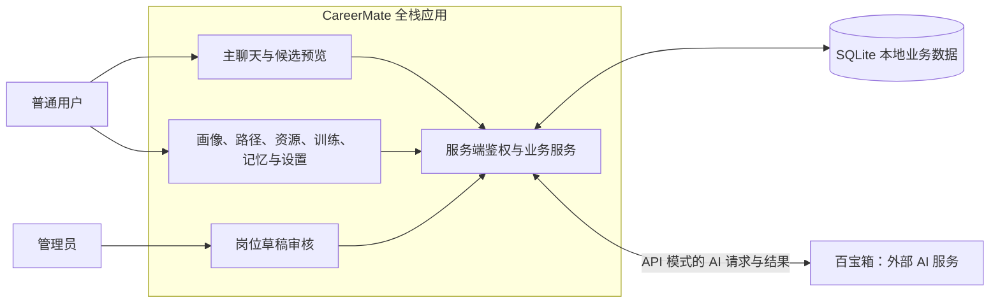
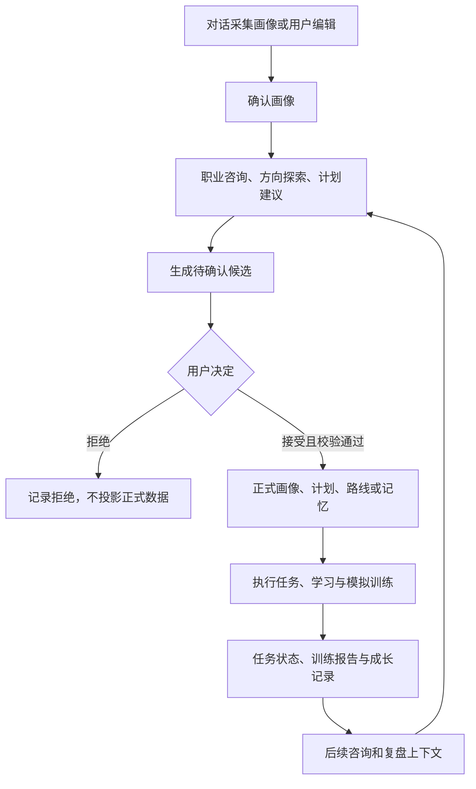

# CareerMate 项目架构

校准日期：2026-09-12。本文说明当前项目的系统和业务组织；实现细节见 [技术架构](architecture.md)，接口见 [API 文档](接口设计文档.md)。

## 系统定位与边界

CareerMate 将职业咨询、行动计划与成长记录放在同一工作台。普通用户管理自己的画像、会话、计划、训练和记忆，管理员审核公共岗位草稿。账号与业务记录由本地应用管理，百宝箱负责模型推理和平台内能力编排。

项目交付形态是一个 Next.js 全栈应用及配套的百宝箱配置源文件。浏览器、Next.js 服务端、SQLite 文件和外部百宝箱属于不同运行边界；代码中的业务目录并不是独立微服务。

图中 SQLite 由 Prisma 访问，未把 Prisma 另画成数据库。百宝箱不直接连接 SQLite，AI 生成内容经业务服务处理后才有持久化意义。

## 业务模块

| 模块 | 页面或入口 | 职责与数据 |
|---|---|---|
| 账号与画像引导 | `/login`、`/onboarding` | 本地登录会话、画像草稿与用户确认；`User`、`AuthSession`、`UserProfile`、`OnboardingConversation` |
| 职业聊天 | `/chat`、浮动助手 | 会话历史、上下文、来源、候选卡片；`ChatConversation`、`ChatMessage` |
| 成长概览 | `/dashboard` | 汇总画像、能力证据、计划、任务和成长日志，不是独立 AI Agent |
| 职业计划与学习路线 | `/path` | 版本化职业计划、具体学习路线、计划任务状态；`CareerPlan`、`LearningRoute`、`ProgressLog` |
| 模拟训练 | `/simulation` → `/chat` | 场景预览、固定场景、连续训练与报告；`SimulationSession` 关联独立会话 |
| 资源与岗位样本 | `/resources` | `ResourceItem`、`JobSample` 查询、筛选和业务上下文；样本有效性与来源单独标注 |
| 候选与记忆 | `/memory`、聊天卡片 | `AgentArtifactCandidate`、兼容画像候选、`AbilityEvidence` 与本地 `MemoryItem` |
| 账号与隐私设置 | `/settings` | 账号资料、密码、数据导出与成长数据清空；陪伴形象由前端外观状态管理 |
| 职业库维护 | `/admin` | `RoleDraft` 审核并维护 `RoleTemplate`；职业探索报告可提交草稿 |

职业探索、成长复盘和简历作品分析也可以通过聊天触发。仓库没有独立 `/resume` 或 `/growth-review` 页面，也没有通用简历文件上传解析 API；Skill 的结构化证据解析不能等同于 Word/PDF 原文件解析。

## 业务闭环与确认

这是业务循环，并非每个请求都按整张图执行。用户手动修改资料、任务状态和记忆属于直接业务操作；AI 建议则使用候选确认机制。训练报告先保存在训练记录中，可用且受回答支持的能力更新再成为候选。

职业探索报告或职业模板候选进入 `RoleDraft` 后，还需要管理员审核才能成为公共职业模板。普通用户接受模板草稿候选不会自动发布到百宝箱知识库。

## 三种 AI 运行模式

- `mock`：本地演示结果，用于无凭据启动和自动测试。
- `manual`：使用预置或人工样本，缺少样本时部分能力可回退 Mock。
- `api`：调用百宝箱；失败后是否降级由具体服务决定，响应附执行来源。关联聊天中的真实训练追问失败时，不保存该轮回答进度。

`CAREERMATE_AGENTIC_V2` 选择 V2 快照及 Artifact 协议，和 `TBOX_MODE` 是两个维度。V2 普通聊天 Mock 只提供演示正文，不自动合成业务候选；基础 Mock 的旧操作协议另受开关控制。

## 交付与权威来源

应用行为由 [src/app](../src/app)、[src/lib](../src/lib) 和 [Prisma Schema](../prisma/schema.prisma) 定义。百宝箱资源由 [src/agentic-v2/platform](../src/agentic-v2/platform) 维护，经脚本导出后配置到平台，不会因提交代码而自动发布。

本地个人记忆与百宝箱平台记忆是不同系统。当前隐私接口操作本地数据，没有实现远端百宝箱记忆清除联动。当前技术方案采用持久化 SQLite 文件；仓库没有独立向量数据库、消息队列、Redis 或微服务部署实现。
