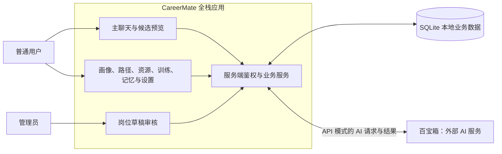
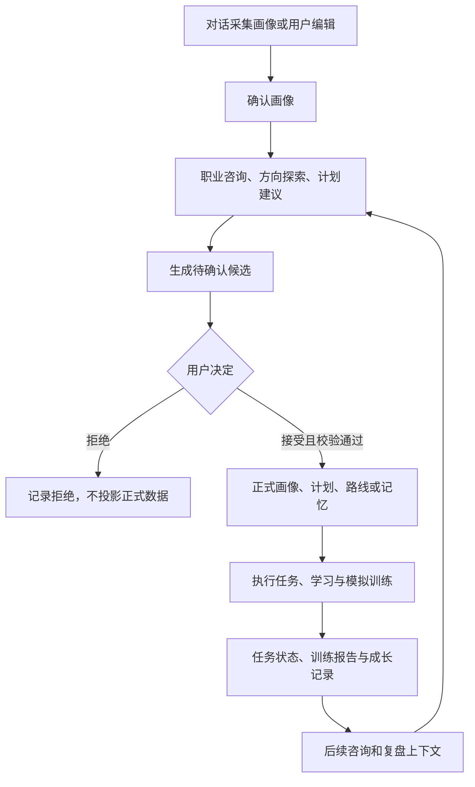

# CareerMate 项目架构

校准日期：2026-10-01。本文按当前页面入口、业务服务和 Prisma Schema 核对系统和业务组织；实现细节见 [技术架构](architecture.md)，接口见 [API 文档](接口设计文档.md)。平台提示词中的目标能力不作为已部署事实。

## 系统定位与边界

CareerMate 将职业咨询、行动计划与成长记录放在同一工作台。普通用户管理自己的画像、会话、计划、训练和记忆，管理员审核公共岗位草稿。账号与业务记录由本地应用管理，百宝箱负责模型推理和平台内能力编排。

项目交付形态是一个 Next.js 全栈应用及配套的百宝箱配置源文件。浏览器、Next.js 服务端、SQLite 文件和外部百宝箱属于不同运行边界；代码中的业务目录并不是独立微服务。

```mermaid
flowchart LR
  User["普通用户"]
  Admin["管理员"]
  subgraph Product["CareerMate 全栈应用"]
    Chat["主聊天与候选预览"]
    Workspace["画像、路径、资源、训练、记忆与设置"]
    Review["岗位草稿审核"]
    Backend["服务端鉴权与业务服务"]
  end
  DB[("SQLite 本地业务数据")]
  Platform["百宝箱：外部 AI 服务"]
  User --> Chat
  User --> Workspace
  Admin --> Review
  Chat --> Backend
  Workspace --> Backend
  Review --> Backend
  Backend <--> DB
  Backend <-->|"API 模式的 AI 请求与结果"| Platform
```

图中 SQLite 由 Prisma 访问，未把 Prisma 另画成数据库。百宝箱不直接连接 SQLite，AI 生成内容经业务服务处理后才有持久化意义。

## 业务模块

| 模块 | 页面或入口 | 职责与数据 |
|---|---|---|
| 产品介绍 | `/`（未登录） | 成长路径、产品能力和训练示例；演示交互只改变页面状态，不创建业务记录 |
| 账号 | `/login` | 登录与注册表单调用本地鉴权 API；`User`、`AuthSession` |
| 画像建立与维护 | `/chat?intent=profile`；`/onboarding` 重定向至此 | 未完成画像时恢复首次画像草稿并显式确认保存，已完成时进入普通聊天补充画像；`UserProfile`、`OnboardingConversation`、画像候选 |
| 职业聊天 | `/chat`、浮动助手 | 会话历史、上下文、来源、候选卡片；`ChatConversation`、`ChatMessage` |
| 成长概览 | `/dashboard` | 根据画像能力分、岗位权重、计划任务和成长日志生成概览；雷达缺失维度标为待评估，不补成零分 |
| 职业计划与学习路线 | `/path` | 版本化职业计划、具体学习路线、计划任务状态；`CareerPlan`、`LearningRoute`、`ProgressLog` |
| 模拟训练 | `/simulation` → `/chat` | 场景预览、固定场景、连续训练与报告；`SimulationSession` 关联独立会话 |
| 资源与岗位样本 | `/resources` | `ResourceItem`、已导入 `JobSample` 查询和筛选；岗位可进入差距分析、计划调整与训练预览，样本来源与有效性单独标注，不是实时招聘抓取 |
| 候选与记忆 | `/memory`、聊天卡片 | `AgentArtifactCandidate`、兼容画像候选、`AbilityEvidence` 与本地 `MemoryItem` |
| 账号与隐私设置 | `/settings` | 昵称、头像、密码、数据导出与成长数据清空；陪伴形象存于当前浏览器的 `localStorage` |
| 职业库维护 | `/admin` | `RoleDraft` 审核并维护 `RoleTemplate`；职业探索报告可提交草稿 |

职业探索、成长复盘和简历作品分析也可以通过聊天触发。仓库没有独立 `/resume` 或 `/growth-review` 页面，也没有通用简历文件上传解析 API；Skill 的结构化证据解析不能等同于 Word/PDF 原文件解析。

## 默认入口与公开界面

未登录访问 `/` 默认显示介绍界面，点击入口进入 `/login`。登录后访问 `/`，画像已完成的用户跳转 `/chat`，未完成的用户经 `/onboarding` 跳转 `/chat?intent=profile`。已登录访问 `/login` 先跳回 `/`，再使用同一画像判断。注册 API 返回 `nextPath: "/"`；登录 API 对已完成画像返回 `/`，未完成画像返回 `/onboarding`。这组入口由 [首页](../src/app/page.tsx)、[登录页](../src/app/login/page.tsx)、[引导兼容页](../src/app/onboarding/page.tsx) 和 [路由函数](../src/lib/onboarding-routing.ts) 定义。

当前介绍与登录页使用 `src/components/careermate-landing/`、`src/components/careermate-login/` 下的新组件。介绍页的功能切换、任务勾选、画像示例确认、对话播放和训练播放均为本地演示；真实登录与注册由新登录页中的 `AuthPanel` 调用 `/api/auth/login`、`/api/auth/register`。旧的 `src/components/landing-page.tsx`、`src/components/login-form.tsx` 不再被这两个页面入口引用。

公开页共享 [GrowthScene 插画](../src/components/marketing/growth-scene.tsx) 与 [动效初始化](../src/components/marketing/marketing-motion.ts)；默认启用完整装饰动效，没有共享动效设置按钮或持久化动效偏好，并响应系统 `prefers-reduced-motion`。介绍页、登录页和工作台侧栏统一使用 [BrandMark](../src/components/brand-mark.tsx) 四瓣标识。演示内容与装饰动效不代表真实模型生成或业务数据写入。

## 业务闭环与确认

```mermaid
flowchart TB
  Profile["对话采集画像或用户编辑"] --> ConfirmProfile["确认画像"]
  ConfirmProfile --> Advice["职业咨询、方向探索、计划建议"]
  Advice --> Candidate["生成待确认候选"]
  Candidate --> Decide{"用户决定"}
  Decide -->|"拒绝"| Rejected["记录拒绝，不投影正式数据"]
  Decide -->|"接受且校验通过"| Plan["正式画像、计划、路线或记忆"]
  Plan --> Action["执行任务、学习与模拟训练"]
  Action --> Records["任务状态、训练报告与成长记录"]
  Records --> Context["后续咨询和复盘上下文"]
  Context --> Advice
```

这是业务循环，并非每个请求都按整张图执行。用户手动修改资料、任务状态和记忆属于直接业务操作；AI 建议则使用候选确认机制。训练报告先保存在训练记录中，可用且受回答支持的能力更新再成为候选。

职业探索报告或职业模板候选进入 `RoleDraft` 后，还需要管理员审核才能成为公共职业模板。普通用户接受模板草稿候选不会自动发布到百宝箱知识库。

## 三种 AI 运行模式

- `mock`：本地演示结果，用于无凭据启动和自动测试。
- `manual`：使用预置或人工样本，缺少样本时部分能力可回退 Mock。
- `api`：调用百宝箱；失败后是否降级由具体服务决定，响应附执行来源。关联聊天中的真实训练追问失败时，不保存该轮回答进度。

`CAREERMATE_AGENTIC_V2` 控制普通聊天中的 V2 快照和 Artifact 分支，和 `TBOX_MODE` 是两个维度。模拟训练的专用生成服务在 API 模式直接使用 Artifact 协议，不以该开关作为入口。V2 普通聊天 Mock 只提供演示正文，不自动合成业务候选；基础 Mock 的旧操作协议另受开关控制。

## 交付与权威来源

应用行为由 [src/app](../src/app)、[src/lib](../src/lib) 和 [Prisma Schema](../prisma/schema.prisma) 定义。百宝箱资源由 [src/agentic-v2/platform](../src/agentic-v2/platform) 维护，经脚本导出后配置到平台，不会因提交代码而自动发布。仓库内 `evidence-parser` 和 `growth-analyzer` 的核心函数由本地 V2 上下文构建代码直接调用；这只能证明本地执行链存在，不能证明平台已挂载或执行对应 Skill。

评委启动器使用独立的 `prisma/review.db`，执行迁移和非破坏性的 `prisma/review-seed.ts`；已有账号和成长记录会保留。开发用 `npm run seed` 运行的是另一份重建脚本 `prisma/seed.ts`。跨系统启动脚本与源码评委包的使用方式见 [项目 README](../README.md) 和 [评委包说明](../scripts/submission/README.md)。

本地个人记忆与百宝箱平台记忆是不同系统。当前隐私接口操作本地数据，没有实现远端百宝箱记忆清除联动。当前技术方案采用持久化 SQLite 文件；仓库没有独立向量数据库、消息队列、Redis 或微服务部署实现。
