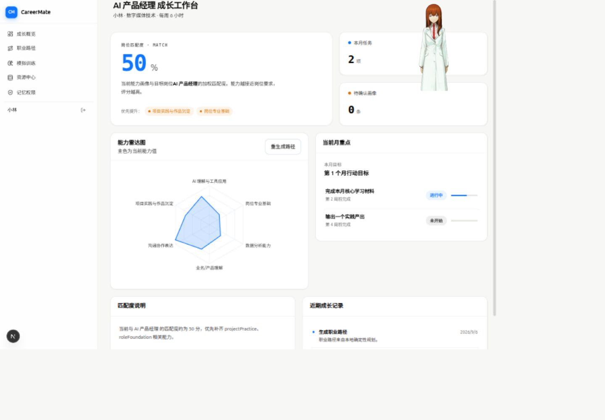
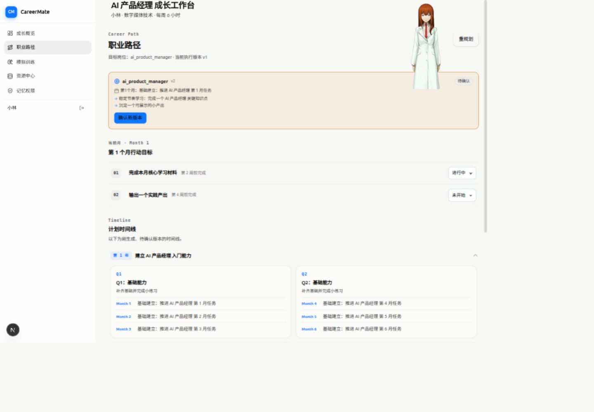
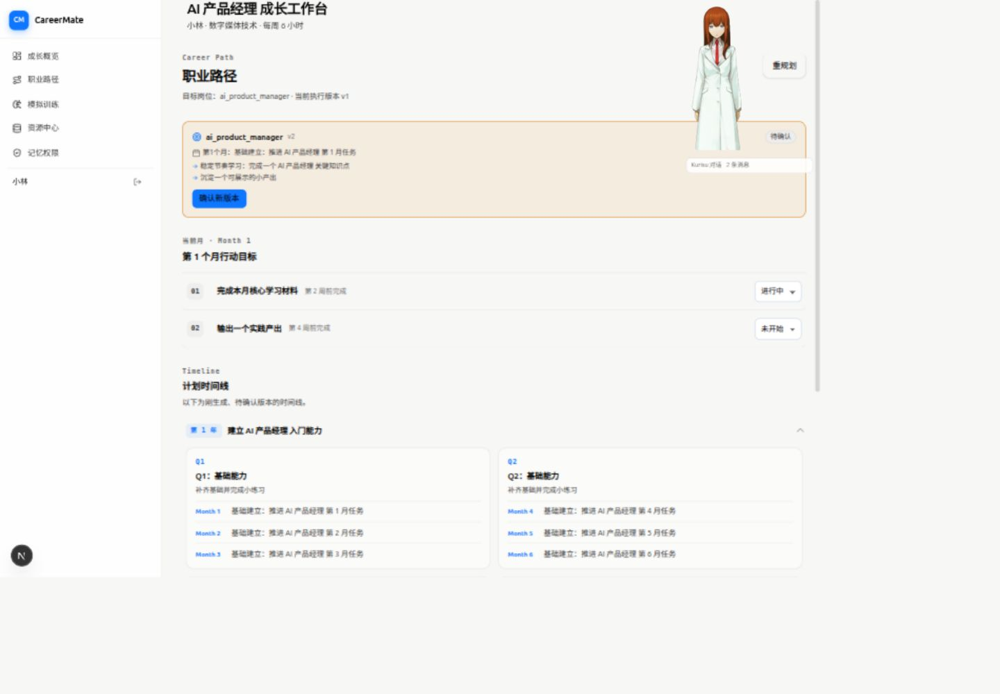
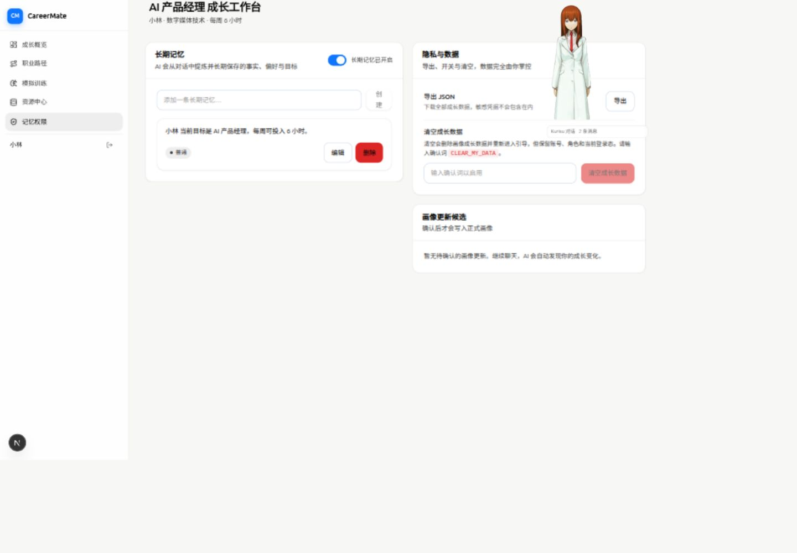
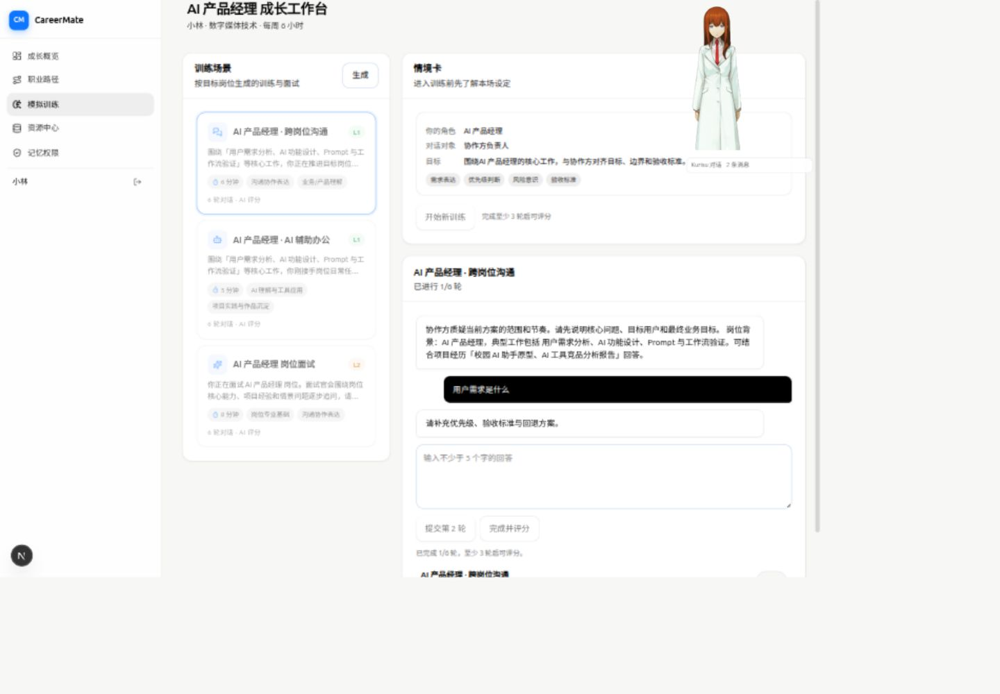
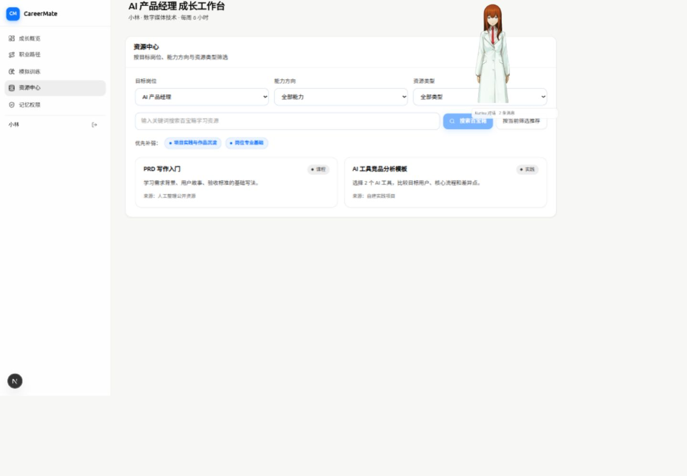
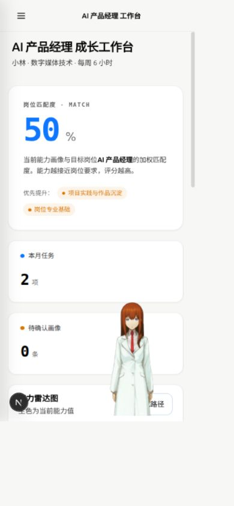

# CareerMate 项目经理评估

评估日期：2026-09-06。代码基线：`e6c14d7` 加当前工作区未提交改动。

## 1. 结论

CareerMate 已有较完整的业务底座：本地认证、画像、计划版本、模拟训练、资源、记忆、候选确认、管理员审核，以及 TBox 适配和大量测试。下一阶段的主要问题是：**核心能力已经存在，但用户入口、结果展示、数据刷新和验收标准没有跟上产品演进。**

建议把本轮目标收敛为：让一个目标明确的学生或职场新人，完成“确认背景 → 得到可执行任务 → 完成训练或产出 → 查看证据 → 确认成长变化 → 继续下一步”。先把这条流程做可靠，再增加岗位、智能体和装饰动效。

本报告中的产品定位和排期是建议，不是已经经过用户调研证明的结论。暂按“可稳定演示、可供第一批用户试用”的 MVP 目标规划；公开上线要求单独列出。

## 2. 评估范围与边界

- 阅读了 README、PRD、交接说明、运行配置、页面与主要前端组件、API、候选/计划/聊天相关服务、数据库结构、测试配置和评估记录。
- 使用当前已登录的本地浏览器访问成长概览、职业路径、记忆权限、模拟训练、资源中心；检查了桌面与 390px 手机视口。
- 仅导航和读取已有会话，没有生成新计划、发送 AI 消息、提交训练回答、接受候选或修改用户数据。
- 视觉截图来自本次检查，不复用仓库已有 debug 截图。角色位置可能包含当前浏览器保存的偏好，截图中的具体位置不能当成所有新用户的默认位置。
- 未完整走新用户注册/引导、管理员审核、候选提交、真实 TBox API、屏幕阅读器和生产部署。涉及这些部分的结论明确以代码证据或后续验证要求表述。
- 未运行 production build、完整 E2E 和迁移测试：本次为评估/计划任务，现有开发服务和工作区正在使用，不在此重建 `.next` 或重置数据库。

## 3. 问题清单与建议

证据等级：A = 页面复现且代码印证；B = 代码确认，未提交真实业务动作；C = 产品/工程建议，需要下一轮验证。

| ID | 优先级 / 证据 | 问题与影响 | 具体修改方向 |
|---|---|---|---|
| F01 | P0 / A+B | 唯一实际聊天入口依赖 Kurisu 右键菜单；`/chat` 重定向、`ChatHome` 未挂载。浮窗 `onArtifact` 丢弃卡片，历史只保留 role/content，用户可能收到文字但无法从对话审阅建议与来源。 | 保留 dashboard 首页，增加显式 AI 助手按钮与可展开面板；共享完整消息模型、引用和候选展示，保留 Kurisu 为可选入口。不要简单恢复另一套独立聊天状态。 |
| F02 | P0 / A | 首次从右键菜单打开历史，显示“2 条消息”但对话框不出现。`loadConversationMessages` 设置 dialogOpen，未初始化 dialogPos；渲染要求两者同时存在。 | 新会话/恢复历史共用 open/placement 路径，历史请求返回前后均有可见状态；加入首次挂载直接恢复历史的回归用例。 |
| F03 | P0 / B | `Workspace.loadAll` 把 `/api/me` 的任何业务错误都送到登录；`fetchApi` 直接 JSON 解析且不处理网络异常；全量 refresh 设置 loading 后卸载当前页面。 | 仅 401 跳登录，保留 status/code；首次加载与后台刷新分开；模块失败就地提示，保存操作只更新相关数据，保留输入与滚动位置。 |
| F04 | P0 / B | 记忆页 V1 候选不展示 oldValue/newValue，V2 列表只展示类型/时间即可确认；V1 operate 未检查返回 ok 就提示成功。后端有确认机制，但用户无法判断自己接受了什么。 | 建议中心展示“当前值 → 建议值”、理由、证据、影响、来源和版本状态；V2 从现有详情接口加载并验证，再启用确认，失败不得报成功。 |
| F05 | P0 / A+B | 概览“重生成路径”调用会创建 pending 计划，但页面提示“当前月任务已刷新”；概览未展示 pendingPlan，也未把它计入待确认数。 | 返回后显示“新计划待确认，当前计划仍在执行”，显示直达预览的按钮；统一聚合 V1 画像、V2 建议、pending 计划，避免漏数/重复数。 |
| F06 | P1 / A+B | 手机首屏被评分和计数占满，当前任务在雷达图之后；任务行不能直接继续；状态条使用固定 15%/60%/40%，并非真实完成进度。 | 首页主区域改为“继续当前任务”；任务状态保留标签，只有具备真实分子分母时展示进度条；计数合并紧凑区，雷达下移。 |
| F07 | P1 / A+B | 匹配分实际是能力值加权求和，UI 却写成“与岗位要求接近程度”的百分比；缺失值用 0，弱项取最低分，不按岗位权重；说明暴露英文 key。 | 首轮命名为“成长参考分 /100”，说明计算口径和信息缺失；不暗示就业概率。按真实权重展示建议优先级，统一中文 label，增加证据入口。 |
| F08 | P1 / A+B | 职业路径同时展示旧版当前任务、新版时间线、旧版假设风险，虽有文字提示，但跨版本阅读容易混淆；本地计划任务过于泛化。 | 默认展示当前计划；待确认版独立预览/对比，不混在同一时间线。近期任务明确时间、交付物、完成标准，长期计划保留为方向。 |
| F09 | P1 / A+B | LearningRoute 有模型和读取接口，但当前工作台未加载/展示；资源页与任务脱节，静态岗位标签表不覆盖所有种子 key，资源无链接时只能提示自行查找。 | 在职业路径里显示已确认学习路线；任务详情关联资源。复用岗位模板和 targetRoleLabel，缺资源提供明确实践指导，禁止虚构课程链接。 |
| F10 | P1 / A+B | 训练中依然把场景选择/情境卡放在显眼区域；“生成”实际是读取本地岗位场景接口；评分为空时 ScoreRing 显示 0。 | 区分选择、训练、评分三个阶段；训练中突出回答区和进度；“生成”改为符合实现的文案；null 评分显示未评分，不伪造 0 分。 |
| F11 | P1 / A+B | 每页先显示同一个“岗位成长工作台”标题，实际页面标题退居第二层；手机内容较拥挤，角色覆盖业务区；全局 `user-select:none` 阻止普通内容复制。 | 一个页面一个业务 h1，背景信息进入次级区；手机固定工具栏和可收起助手；正文允许选取，触摸和键盘均可打开助手。 |
| F12 | P0 / 实测 | 测试与 lint 不全绿；多份 E2E 仍假设登录后到聊天首页，验收文档数字和 UI 描述过时。 | 先建立可解释基线，按当前路由改行为测试；隔离 vendor lint 噪声，保留源码规则；报告区分通过、失败、未执行、环境阻断。 |
| F13 | P1 / B | 全局 CSS 5912 行且有 v14/v22 重复 token；Workspace 导入全部业务视图；浮窗 622 行、流式服务 1347 行；关键 DTO 大量 any。 | 先从聊天控制器和模块加载边界拆分，再按功能迁出 CSS；按真实依赖保留一个 token 真源。逐个业务 DTO 收紧类型，避免全仓大重写。 |
| F14 | P1 / C | 测试计划同时覆盖学生、新人、转岗人群，真实参与者迭代表仍空白。缺少可核实的激活、任务完成、回访证据。 | 首轮聚焦一个人群/岗位；招募 5–8 人完成固定任务，记录卡点与任务完成率。不要把样本很小的 NPS 或测试数量当产品成功证据。 |
| F15 | 公开上线前 / B+C | 仓库无 `.github` CI；登录/注册路由未见限流、请求体边界等应用层措施。是否已有部署层保护未知。 | 设置 CI 门禁，验证部署层/应用层的请求限制、会话和恢复流程；单实例 SQLite 可继续用于小规模试用，按部署与容量证据决定是否迁库。 |

### 关键代码索引

仓库相对路径，执行 agent 应先读当前版本再修改：

- F01/F02：`src/components/chat/kurisu-chat-window.tsx` 的 `loadConversationMessages`、`sendLocalMessage`、`dialogOpen && dialogPos`、`onArtifact`；`src/components/chat/global-kurisu.tsx`；`src/app/chat/page.tsx`；`src/app/page.tsx`。
- F03：`src/components/workspace.tsx` 的 `loadAll`、loading 分支；`src/lib/client-api.ts` 的 `fetchApi`；`src/lib/workspace-types.ts` 的 `ApiPayload`。
- F04：`src/features/memory/memory-view.tsx`；`src/components/chat/agent-artifact-candidate-card.tsx`；`src/app/api/agentic-v2/candidates/route.ts` 与 `[candidateId]/route.ts`。
- F05：`src/features/dashboard/dashboard-view.tsx` 的 `generatePlan`；`src/app/api/plans/generate/route.ts` 创建 `status: pending`；`src/components/workspace.tsx` 的 pendingCandidateCount。
- F06/F07：`src/features/dashboard/dashboard-view.tsx` 的 statusProgress；`src/lib/career.ts` 的 calculateMatch；`src/lib/types.ts` 的 abilityLabels。
- F08：`src/features/path/path-view.tsx` 的 `timelinePlan = pendingPlan ?? plan`；`src/lib/career.ts` 的 buildCareerPlan；`src/lib/tbox/plan.ts` 的现有 V1/V2 转换。
- F09：`src/app/api/learning-routes/current/route.ts`；`src/lib/agentic-v2/contracts.ts` 的 learningRouteDataSchema；`src/features/resources/resource-view.tsx` 的 roleLabels；`src/lib/types.ts` 的 seedRoleKeys。
- F10：`src/features/simulation/simulation-view.tsx` 的 ScoreRing、generateScenarios、start/send/complete；`src/app/api/simulations/scenarios/route.ts`。
- F11/F13：`src/components/workspace.tsx`；`src/components/shell/product-sidebar.tsx`；`src/app/globals.css` 的两处 `:root` 和全局选择规则。
- F12：`e2e/p0-flows.spec.ts`、`e2e/chat-home.spec.ts`、`e2e/unified-shell.spec.ts`、`scripts/e2e-server.mjs`、`eslint.config.mjs`、`docs/evaluation/competition-evidence.md`。

## 4. 当前检查结果

| 检查 | 本次结果 | 正确解读 |
|---|---|---|
| `npm run test` | 121 个文件：118 通过，3 失败；1065 个用例：1052 通过，2 失败，11 跳过 | 不是“3 个业务缺陷”；其中一个文件因环境无法创建 shell 子进程而初始化失败。 |
| `src/lib/simulation.test.ts` | 预期 5 个场景，实际已有第 6 个 career_interview | 测试契约落后于场景列表，先核对产品决定，再修断言，不能删新功能凑绿。 |
| `src/features/simulation/simulation-view.test.tsx` | 断言旧文案“训练得分：82 分”，实际为可访问名“综合得分 82 分”的新 UI | 改为验证用户可见/可访问的评分与候选状态语义。 |
| `src/lib/agentic-v2/contract-matrix-sqlite.test.ts` | `spawnSync /bin/sh EPERM` | 当前执行环境限制；在正常隔离 CI 环境重跑，不把异常改成测试通过。 |
| `npm run lint` | 4054 项：183 errors / 3871 warnings | 大量来自 `public/lib/*.min.js`；源码也有未使用变量、hook 依赖和 refs 规则报告。不能认为都是噪声。 |
| `tsc --noEmit --incremental false` | 通过 | 使用当前已有生成类型；不等同于完整 `npm run typecheck`（包含 Prisma generate 与 Next typegen）。 |
| build / migrations / E2E / real API | 未执行 | 必须在后续执行阶段补齐，不可在交付材料中标绿。 |

## 5. 本次页面检查过程

### 步骤 1：成长概览（可用，但行动优先级低）

评分和数据卡有一致视觉风格，角色、任务、能力信息可辨识。但任务需要进一步寻找，没有“继续任务”动作；评分说明存在英文 key。

### 步骤 2：职业路径（可用，但版本阅读容易混淆）

存在当前 v1 与待确认 v2；待确认计划有确认按钮，当前任务和新版时间线混排。岗位 key `ai_product_manager` 直接显示。

### 步骤 3：恢复历史对话（已复现缺陷）

进入角色右键菜单并选择已有会话后，显示消息计数，缺少对话框。此步骤没有发送新消息。

### 步骤 4：记忆权限（操作集中，但信息架构需调整）

隐私开关、导出、清空及候选混在一页。当前账号没有画像候选，具体候选预览不足来自代码检查，不是此截图复现。

### 步骤 5：模拟训练（已有训练可恢复，布局分散注意力）

已存在的 1/6 轮训练可见；选择场景的卡片仍占较大区域，当前回答区在下方。未提交回答，未验证评分完成。

### 步骤 6：资源中心（能浏览，行动闭环不足）

岗位、能力、类型筛选均有入口；现有资源样例未提供直接链接，用户仍需自行确定如何学习及如何完成对应任务。

### 步骤 7：390px 手机概览（单列可读，但首屏缺少任务）

菜单已折叠。首屏主要是参考分和计数，任务位于更下方；本次状态下角色覆盖雷达区域及附近操作。未据此声称所有手机断点通过或满足完整无障碍标准。

## 6. 应当保留的资产

1. 候选确认、所有权、Schema、版本校验、事务和幂等的后端原则。
2. Next.js + Prisma + SQLite 的现有架构，先修交付流程，不启动无依据的微服务化。
3. 已有蓝白 token、通用 Button/SurfaceCard/InlineAlert、消息 parts 渲染、V1/V2 计划转换。
4. Kurisu 的品牌辨识度；将其与核心操作解耦，角色资源不可用时仍能聊天。
5. 已有大量测试。修正落后契约并补关键真实行为，而不是重新搭一套测试框架。

详细执行方案：[plan.md](plan.md)。逐项任务清单：[todo.md](todo.md)。
